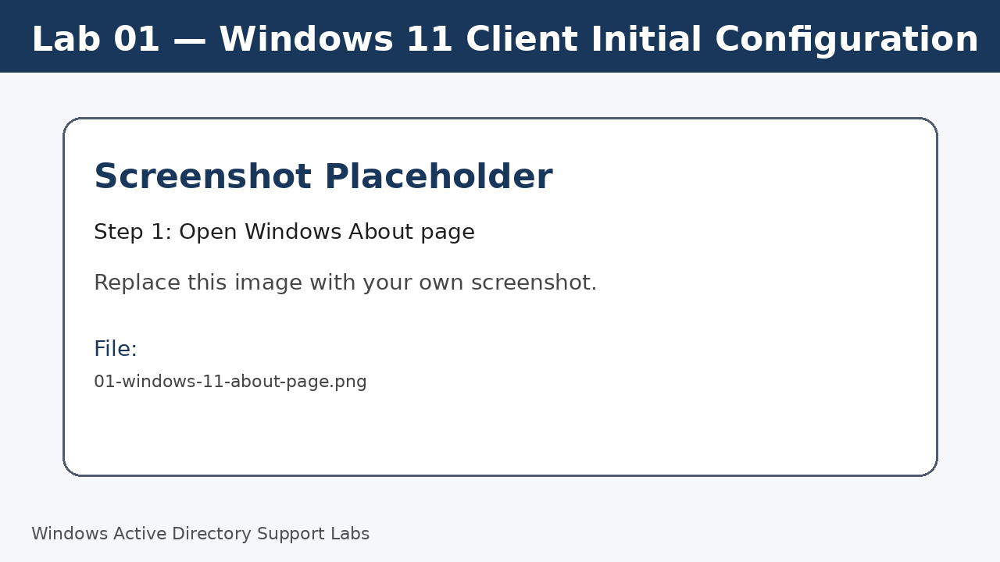
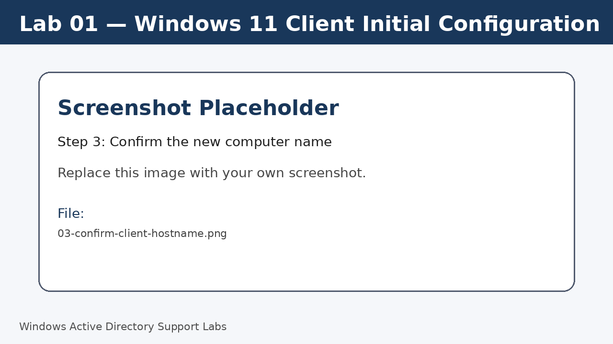
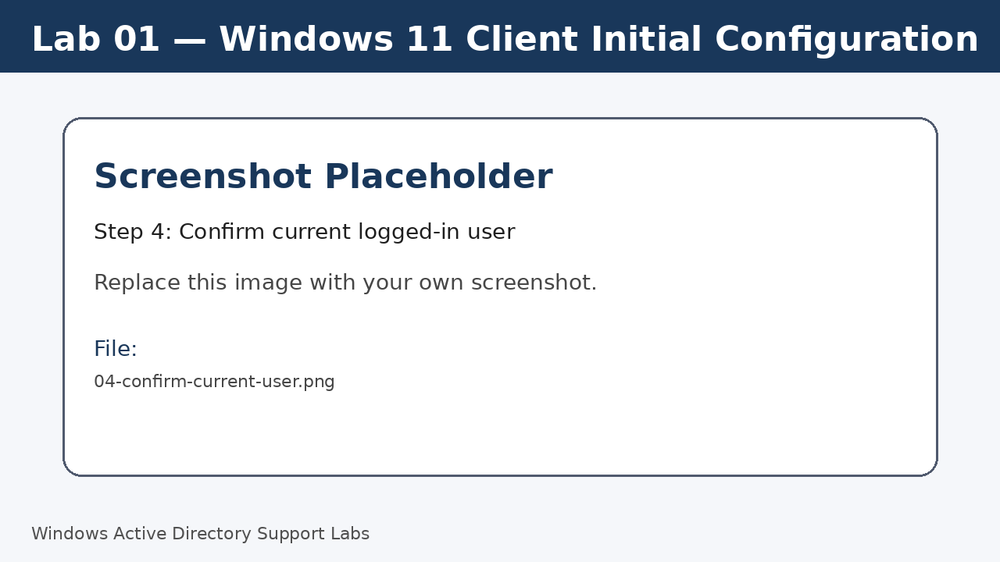
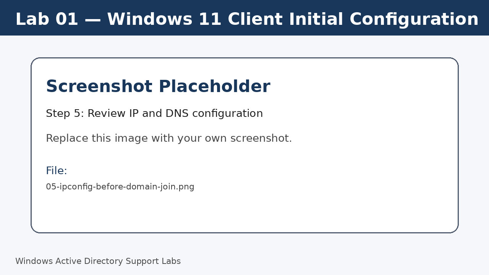
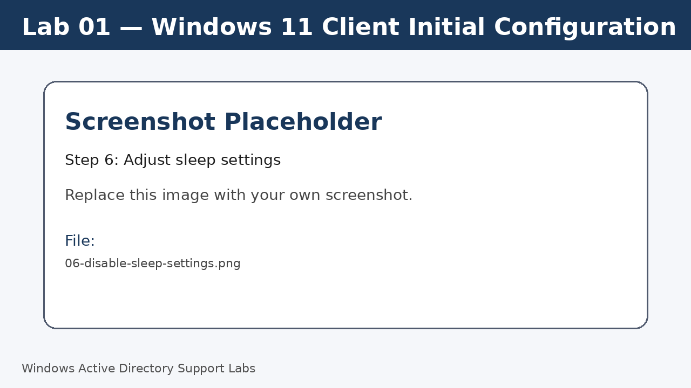
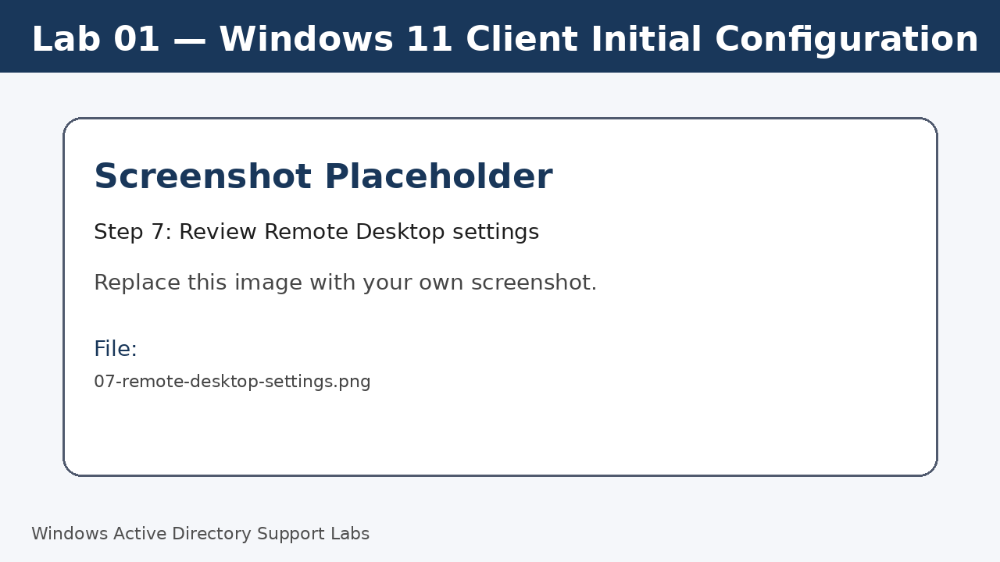
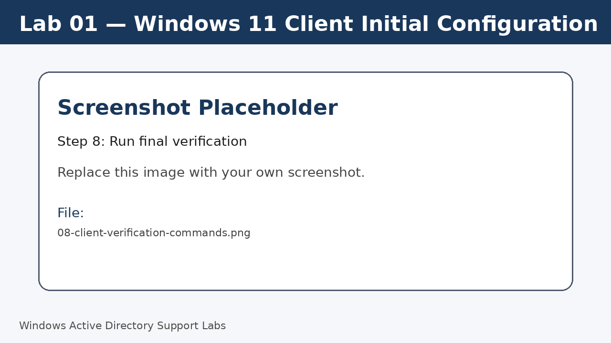

<a id="top"></a>

# Lab 01 — Windows 11 Client Initial Configuration

<p align="center">
  
  
  
  
  
  
</p>

<p align="center">
  <a href="../../README.md">🏠 Main README</a> | <a href="../02-windows-server-initial-configuration/README.md">Next Lab ➡</a>
</p>

---

## Overview

Prepare a Windows 11 client computer for a workplace-style IT support environment before it is connected to the domain.

---

## Objectives

- Review Windows 11 device information.
- Rename the client using a clear workstation naming standard.
- Confirm the current local user and device name.
- Review IP address, DNS and network adapter details.
- Adjust sleep settings to avoid interruptions during lab work.
- Review Remote Desktop availability for later support scenarios.

---

## Lab Values

| Item | Value |
|---|---|
| Client computer name | `W11-CLIENT01` |
| Client operating system | Windows 11 Pro, Enterprise or Education recommended |
| Domain status | Workgroup / local account before domain join |
| Screenshot folder | `assets/images/lab-01-windows-11-client-initial-configuration/` |

---

## Before You Start

- Complete the previous lab unless this is Lab 01.
- Use a lab environment only.
- Do not publish real passwords or private business information.
- Replace placeholder screenshots with your own screenshots after completing each step.

---

## Screenshot Files

| File name | Step |
|---|---|
| 01-windows-11-about-page.png | Open Windows About page |
| 02-rename-this-pc-w11-client01.png | Rename the Windows 11 client |
| 03-confirm-client-hostname.png | Confirm the new computer name |
| 04-confirm-current-user.png | Confirm current logged-in user |
| 05-ipconfig-before-domain-join.png | Review IP and DNS configuration |
| 06-disable-sleep-settings.png | Adjust sleep settings |
| 07-remote-desktop-settings.png | Review Remote Desktop settings |
| 08-client-verification-commands.png | Run final verification |

---

## Step 1 — Open Windows About page

Open **Settings > System > About**.

Review the device name, processor, installed RAM, system type, Windows edition and Windows version.

This confirms the baseline information before making changes.

Screenshot file:

```text
assets/images/lab-01-windows-11-client-initial-configuration/01-windows-11-about-page.png
```



[⬆ Back to top](#top)

## Step 2 — Rename the Windows 11 client

From **Settings > System > About**, select **Rename this PC**.

Set the computer name to `W11-CLIENT01`.

Restart the computer when prompted.

Screenshot file:

```text
assets/images/lab-01-windows-11-client-initial-configuration/02-rename-this-pc-w11-client01.png
```


[⬆ Back to top](#top)

## Step 3 — Confirm the new computer name

After restart, open Command Prompt and confirm the hostname.

Run:

```cmd
hostname
```

Expected result:

```text
W11-CLIENT01
```

Screenshot file:

```text
assets/images/lab-01-windows-11-client-initial-configuration/03-confirm-client-hostname.png
```



[⬆ Back to top](#top)

## Step 4 — Confirm current logged-in user

Check which local account is currently signed in.

Before the domain join lab, the result normally shows a local computer account such as `W11-CLIENT01\User`.

Run:

```cmd
whoami
```

Screenshot file:

```text
assets/images/lab-01-windows-11-client-initial-configuration/04-confirm-current-user.png
```



[⬆ Back to top](#top)

## Step 5 — Review IP and DNS configuration

Review the network adapter, IPv4 address, default gateway, DNS server and DHCP status.

Do not change DNS in this lab. DNS is configured in the later network lab.

Run:

```cmd
ipconfig /all
```

Screenshot file:

```text
assets/images/lab-01-windows-11-client-initial-configuration/05-ipconfig-before-domain-join.png
```



[⬆ Back to top](#top)

## Step 6 — Adjust sleep settings

Open **Settings > System > Power & battery > Screen and sleep**.

Set plugged-in sleep to **Never** or a long enough value for lab work.

Screenshot file:

```text
assets/images/lab-01-windows-11-client-initial-configuration/06-disable-sleep-settings.png
```



[⬆ Back to top](#top)

## Step 7 — Review Remote Desktop settings

Open **Settings > System > Remote Desktop**.

Enable Remote Desktop if the Windows edition supports it.

Windows Home may not support Remote Desktop host functionality.

Screenshot file:

```text
assets/images/lab-01-windows-11-client-initial-configuration/07-remote-desktop-settings.png
```



[⬆ Back to top](#top)

## Step 8 — Run final verification

Run a final check before moving to the server lab.

Run:

```cmd
hostname
whoami
ipconfig /all
winver
```

Screenshot file:

```text
assets/images/lab-01-windows-11-client-initial-configuration/08-client-verification-commands.png
```



[⬆ Back to top](#top)


---

## Completion Checklist

- [ ] Windows About page reviewed.
- [ ] Computer renamed to `W11-CLIENT01`.
- [ ] Computer restarted successfully.
- [ ] `hostname` output confirmed.
- [ ] Current local account checked.
- [ ] IP and DNS settings reviewed.
- [ ] Sleep settings adjusted or reviewed.
- [ ] Remote Desktop availability reviewed.
- [ ] Final verification commands completed.
- [ ] Screenshots saved in the correct folder.

---

## Key Takeaways

- Clear computer names make support, inventory, DNS lookup and remote access easier.
- `hostname`, `whoami` and `ipconfig /all` are essential first-line support commands.
- Client DNS must point to the domain controller before joining a domain.

---

## Author

**Xuan Toan Nguyen**  
IT Support | Service Desk | Desktop Support | System Administration  
Adelaide, South Australia

- LinkedIn: [www.linkedin.com/in/toan-nguyen-it-oz](https://www.linkedin.com/in/toan-nguyen-it-oz)
- GitHub: [github.com/toannguyenitoz](https://github.com/toannguyenitoz)

---

<p align="center">
  <a href="../../README.md">🏠 Main README</a> | <a href="../02-windows-server-initial-configuration/README.md">Next Lab ➡</a> |
  <a href="#top">⬆ Back to Top</a>
</p>
