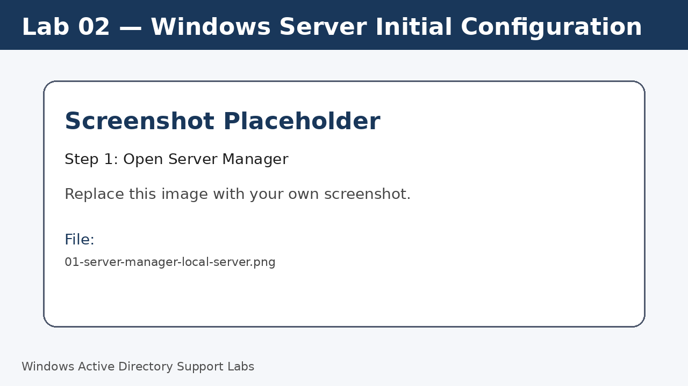
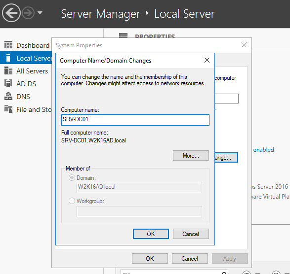
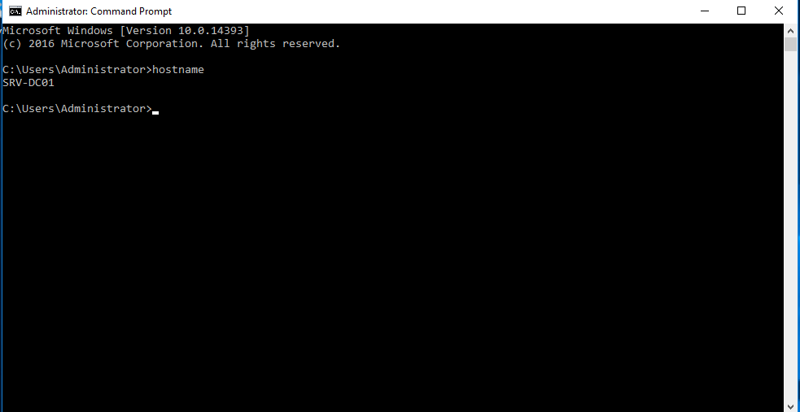
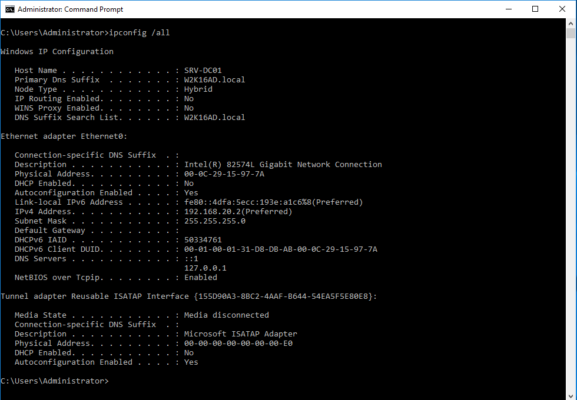
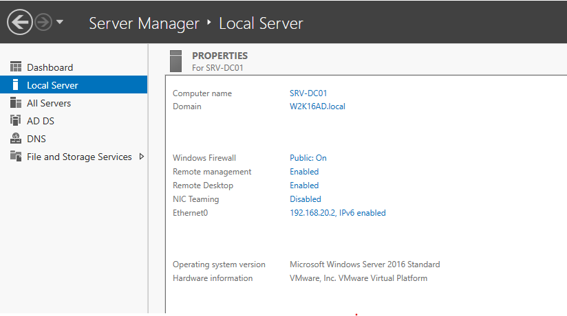
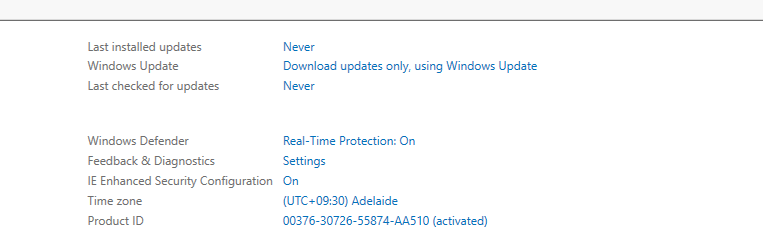
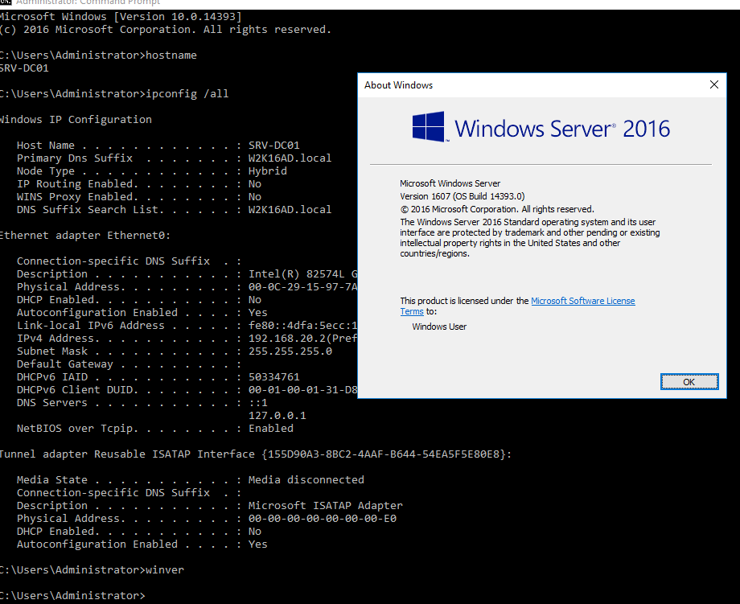

<a id="top"></a>

# 🖥️ Lab 02 — Windows Server Initial Configuration

<p align="center">
  
  
  
</p>

<p align="center"><a href="../01-windows-11-client-initial-configuration/README.md">⬅ Previous Lab</a> · <a href="../../README.md">🏠 Main README</a> · <a href="../03-network-and-dns-configuration/README.md">Next Lab ➜</a></p>

---

## 🎯 Lab Mission

Prepare a Windows Server machine for later networking, DNS and Active Directory configuration.

> [!NOTE]
> This lab is written as a user guide. Follow the steps in order and compare your result with the expected checks.

## ✅ What You Will Learn

- Open Server Manager and review the Local Server page.
- Rename the server using a clear naming standard.
- Review IP, DNS, Remote Desktop, firewall, time zone and update status.
- Run baseline verification commands.

## 🧱 Lab Values

| Item | Value |
|---|---|
| Server name | `SRV-DC01` |
| Future role | Domain controller, DNS, file and print support |
| Starting state | Standalone Windows Server |
| Later domain | `corp.local` |

## 🧩 Before You Start

- Sign in with a local administrator account.
- Keep the server powered on during the lab.
- Do not install Active Directory yet; that is covered in Lab 04.

> [!WARNING]
> Use a lab environment only. Do not publish real passwords, personal information, client data or internal business details.

## 🚀 Step-by-Step Guide

### 🖥️ Step 1 — Open Server Manager

Open **Server Manager > Local Server** and review computer name, workgroup/domain state, Ethernet, Remote Desktop, firewall, time zone and update status.

> [!TIP]
> Server Manager is the main dashboard for Windows Server administration.

**Demo screenshot:** Server Manager Local Server dashboard.



---

### 🏷️ Step 2 — Rename the server

Change the computer name to `SRV-DC01` and restart when prompted.

> [!TIP]
> A role-based name makes documentation and troubleshooting easier.

**Demo screenshot:** Rename the server to `SRV-DC01`.



---

### 💻 Step 3 — Confirm the server name

After restart, open Command Prompt and confirm the name.

Run:

```cmd
hostname
```

> [!TIP]
> Expected result: `SRV-DC01`.

**Demo screenshot:** `hostname` output confirming the server name.



---

### 🌐 Step 4 — Review network configuration

Record IPv4 address, subnet mask, default gateway, DNS servers and adapter name.

Run:

```cmd
ipconfig /all
```

> [!TIP]
> Do not finalize the network design until Lab 03.

**Demo screenshot:** `ipconfig /all` output on Windows Server.



---

### 🛰️ Step 5 — Review Remote Desktop

On the Local Server page, review the Remote Desktop status.

> [!TIP]
> Enable only in a controlled lab or approved environment.

**Demo screenshot:** Remote Desktop status on Local Server.



---

### 🕒 Step 6 — Review time zone and update status

Confirm time zone and update status from Local Server.

> [!TIP]
> Accurate time helps authentication and log analysis.

**Demo screenshot:** Time zone and Windows Update status.



---

### 🧪 Step 7 — Run final verification

Run final baseline checks.

Run:

```cmd
hostname
```

```cmd
ipconfig /all
```

```cmd
winver
```

> [!TIP]
> The server is ready for networking configuration.

**Demo screenshot:** Final verification commands for Lab 02.



> [!WARNING]
> Screenshots display on GitHub only after the image files are committed and pushed to the matching `assets/images/...` folder.

---

## 🧾 Command Reference

| Command | Run on | Purpose | Expected result |
|---|---|---|---|
| `hostname` | Windows Server | Confirms server name | Shows `SRV-DC01` |
| `ipconfig /all` | Windows Server | Displays full network configuration | Shows adapter, IP and DNS details |
| `winver` | Windows Server | Confirms OS version | Windows version dialog opens |

---

## ✅ Completion Checklist

- [ ] Server Manager opened.
- [ ] Local Server page reviewed.
- [ ] Server renamed to `SRV-DC01`.
- [ ] Server restarted successfully.
- [ ] Hostname confirmed.
- [ ] Network settings reviewed.
- [ ] Remote Desktop status reviewed.
- [ ] Time zone and update status reviewed.

---

## 🧠 Key Takeaways

| Key point | Why it matters |
|---|---|
| 1 | Server naming should clearly describe purpose. |
| 2 | Server Manager is the starting point for server administration. |
| 3 | Time, network and remote access settings should be checked before adding roles. |

---

## 👤 Author

**Xuan Toan Nguyen**  
IT Support | Service Desk | Desktop Support | System Administration  
Adelaide, South Australia

- 🔗 LinkedIn: [www.linkedin.com/in/toan-nguyen-it-oz](https://www.linkedin.com/in/toan-nguyen-it-oz)
- 💻 GitHub: [github.com/toannguyenitoz](https://github.com/toannguyenitoz)

---

<p align="center"><a href="../01-windows-11-client-initial-configuration/README.md">⬅ Previous Lab</a> · <a href="../../README.md">🏠 Main README</a> · <a href="../03-network-and-dns-configuration/README.md">Next Lab ➜</a> · <a href="#top">⬆ Back to Top</a></p>
