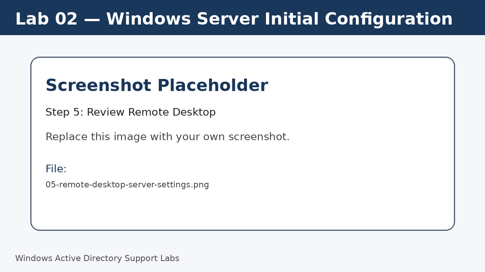
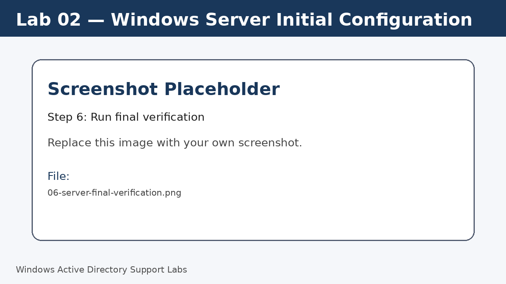

<a id="top"></a>

# Lab 02 — Windows Server Initial Configuration

<p align="center">
  
  
  
  
  
  
</p>

<p align="center">
  <a href="../01-windows-11-client-initial-configuration/README.md">⬅ Previous Lab</a> | <a href="../../README.md">🏠 Main README</a> | <a href="../03-network-and-dns-configuration/README.md">Next Lab ➡</a>
</p>

---

## Overview

Prepare a Windows Server machine to become the central server for directory, DNS, file, print and remote administration tasks.

---

## Objectives

- Review Server Manager and local server settings.
- Rename the server using a clear server naming standard.
- Confirm hostname and Windows Server version.
- Review network adapter details before applying static IP settings.
- Enable Remote Desktop if required for administration.

---

## Lab Values

| Item | Value |
|---|---|
| Server name | `SRV-DC01` |
| Server OS | Windows Server 2019 or Windows Server 2022 |
| Initial role | Member server before domain services are configured |
| Screenshot folder | `assets/images/lab-02-windows-server-initial-configuration/` |

---

## Before You Start

- Complete the previous lab unless this is Lab 01.
- Use a lab environment only.
- Do not publish real passwords or private business information.
- Replace placeholder screenshots with your own screenshots after completing each step.

---

## Screenshot Files

| File name | Step |
|---|---|
| 01-server-manager-local-server.png | Open Server Manager |
| 02-rename-server-srv-dc01.png | Rename the server |
| 03-confirm-server-hostname.png | Confirm server hostname |
| 04-server-ipconfig-before-static-ip.png | Review server IP configuration |
| 05-remote-desktop-server-settings.png | Review Remote Desktop |
| 06-server-final-verification.png | Run final verification |

---

## Step 1 — Open Server Manager

Sign in to the Windows Server and open **Server Manager**.

Select **Local Server** and review the current configuration.

Screenshot file:

```text
assets/images/lab-02-windows-server-initial-configuration/01-server-manager-local-server.png
```


[⬆ Back to top](#top)

## Step 2 — Rename the server

In **Local Server**, click the current computer name.

Rename the server to `SRV-DC01`.

Restart when prompted.

Screenshot file:

```text
assets/images/lab-02-windows-server-initial-configuration/02-rename-server-srv-dc01.png
```


[⬆ Back to top](#top)

## Step 3 — Confirm server hostname

After restart, open Command Prompt and verify the new name.

Run:

```cmd
hostname
```

Expected result:

```text
SRV-DC01
```

Screenshot file:

```text
assets/images/lab-02-windows-server-initial-configuration/03-confirm-server-hostname.png
```


[⬆ Back to top](#top)

## Step 4 — Review server IP configuration

Check the current IP address, adapter name, DNS server and DHCP status.

This is only a review step; static IP is configured in the next lab.

Run:

```cmd
ipconfig /all
```

Screenshot file:

```text
assets/images/lab-02-windows-server-initial-configuration/04-server-ipconfig-before-static-ip.png
```


[⬆ Back to top](#top)

## Step 5 — Review Remote Desktop

In **Server Manager > Local Server**, review the Remote Desktop setting.

Enable it for lab administration if needed.

Screenshot file:

```text
assets/images/lab-02-windows-server-initial-configuration/05-remote-desktop-server-settings.png
```



[⬆ Back to top](#top)

## Step 6 — Run final verification

Confirm the server baseline information.

Run:

```cmd
hostname
ipconfig /all
winver
```

Screenshot file:

```text
assets/images/lab-02-windows-server-initial-configuration/06-server-final-verification.png
```



[⬆ Back to top](#top)


---

## Completion Checklist

- [ ] Server Manager opened.
- [ ] Server renamed to `SRV-DC01`.
- [ ] Server restarted successfully.
- [ ] Hostname verified.
- [ ] Network adapter details reviewed.
- [ ] Remote Desktop setting reviewed.
- [ ] Final verification completed.

---

## Key Takeaways

- Servers should use predictable names that identify their role.
- A domain controller must use a stable IP configuration.
- Remote administration settings should be reviewed before continuing.

---

## Author

**Xuan Toan Nguyen**  
IT Support | Service Desk | Desktop Support | System Administration  
Adelaide, South Australia

- LinkedIn: [www.linkedin.com/in/toan-nguyen-it-oz](https://www.linkedin.com/in/toan-nguyen-it-oz)
- GitHub: [github.com/toannguyenitoz](https://github.com/toannguyenitoz)

---

<p align="center">
  <a href="../01-windows-11-client-initial-configuration/README.md">⬅ Previous Lab</a> | <a href="../../README.md">🏠 Main README</a> | <a href="../03-network-and-dns-configuration/README.md">Next Lab ➡</a> |
  <a href="#top">⬆ Back to Top</a>
</p>
