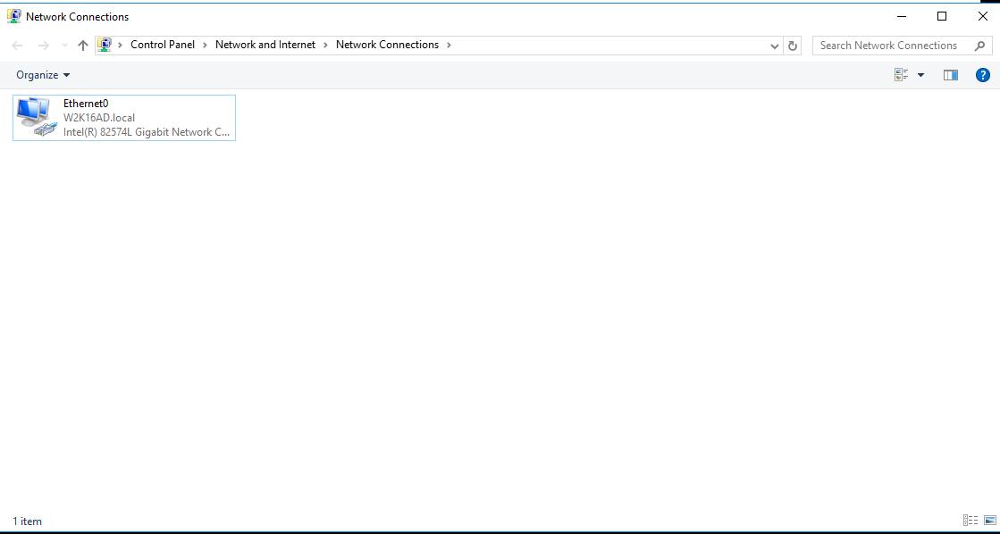
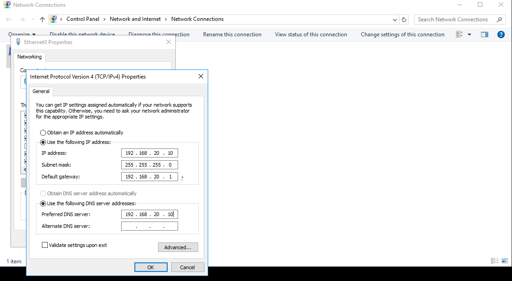
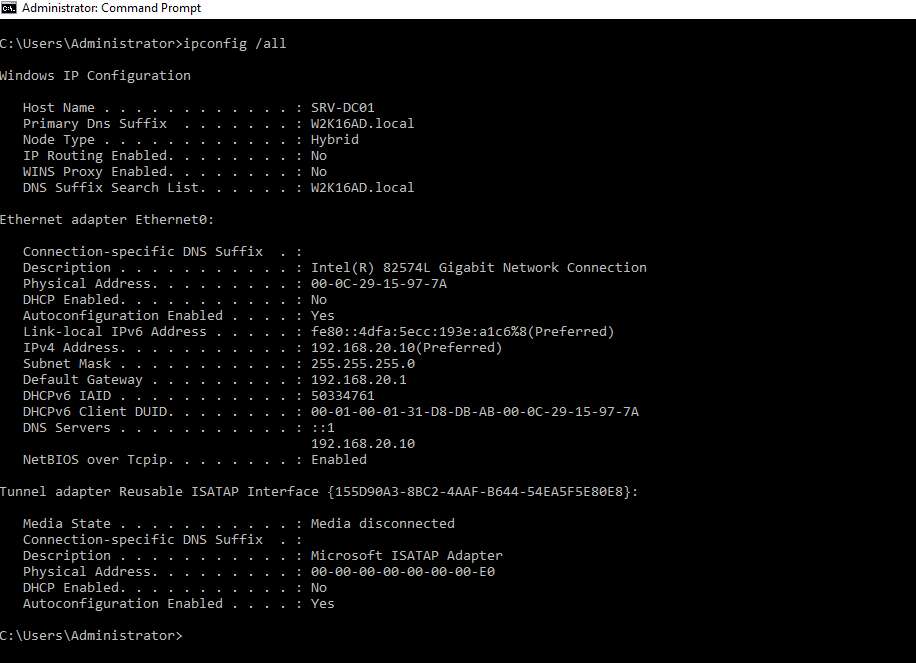
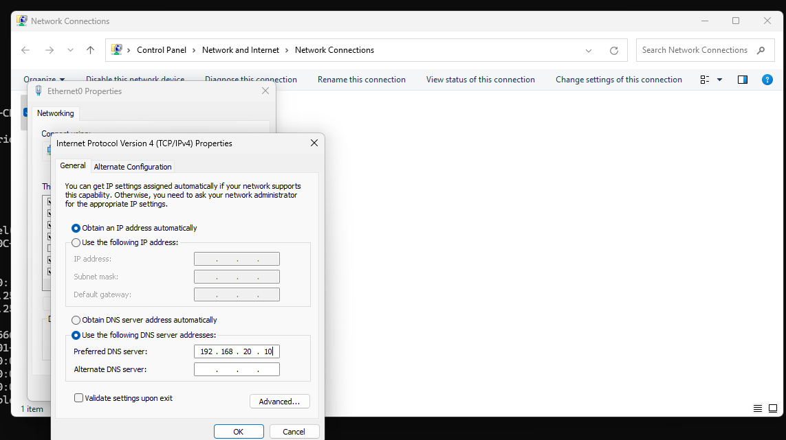
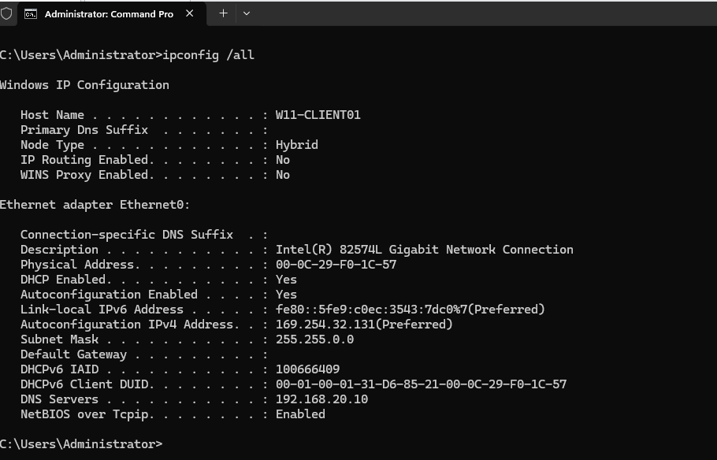
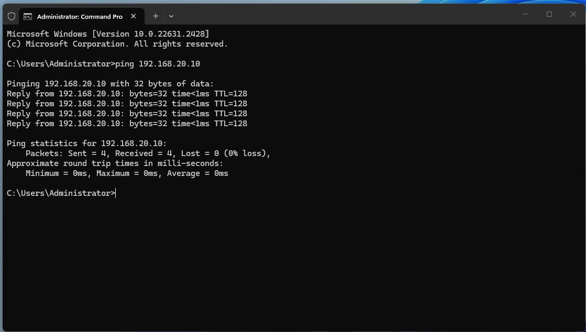
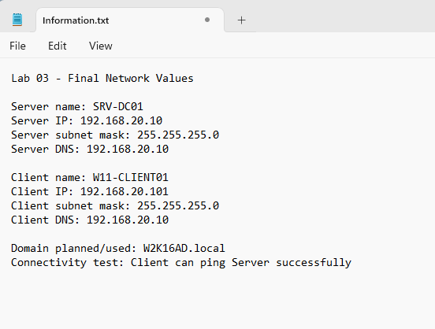

<a id="top"></a>

# 🌐 Lab 03 — Network and DNS Configuration

<p align="center">
  
  
  
  
</p>

<p align="center"><a href="../02-windows-server-initial-configuration/README.md">⬅ Previous Lab</a> · <a href="../../README.md">🏠 Main README</a> · <a href="../04-active-directory-domain-services-setup/README.md">Next Lab ➜</a></p>

---

## 🎯 Lab Mission

Configure the network and DNS foundation required before Active Directory and domain join can work reliably.

> [!NOTE]
> This lab is written as a user guide. Follow the steps in order and compare your result with the expected checks.

---

## ✅ What You Will Learn

- Review the active network adapter on Windows Server.
- Configure or confirm a static IPv4 address on the server.
- Configure Windows 11 client DNS to point to the server/domain controller.
- Confirm that client and server are on the same subnet.
- Test client-to-server connectivity.
- Record final network values for later labs.

---

## 🧱 Lab Values

| Item | Value |
|---|---|
| Server name | `SRV-DC01` |
| Client name | `W11-CLIENT01` |
| Lab domain | `W2K16AD.local` |
| Server IP | `192.168.20.10` |
| Client IP | `192.168.20.101` |
| Subnet mask | `255.255.255.0` |
| Client DNS server | `192.168.20.10` |
| Default gateway | Optional for Host-only lab, or use the gateway provided by your VMware network |

> [!IMPORTANT]
> Client and server must be on the same network/subnet. For this lab, both should use the `192.168.20.0/24` network.

---

## 🧩 Before You Start

- Complete Lab 01 and Lab 02.
- Know which network adapter is active on both client and server.
- In VMware, make sure the Windows Server VM and Windows 11 VM use the same network type or the same VMnet.

> [!WARNING]
> A very common mistake is placing the server and client on different VMware networks. Example: server `192.168.20.10`, client `192.168.80.128`. These are different subnets, so ping and domain access can fail.

---

## 🚀 Step-by-Step Guide

### 🔌 Step 1 — Review the server adapter

Open the server network adapter list and identify the active adapter.

Open quickly:

```text
Windows + R
ncpa.cpl
Enter
```

Review the active adapter, for example:

```text
Ethernet
Ethernet0
VMware Network Adapter
```

> [!TIP]
> Changing the wrong adapter is a common lab mistake. Always confirm which adapter is connected.

**Demo screenshot:** Server network adapter list or Ethernet status.



---

### 🧭 Step 2 — Configure server IPv4

Open the IPv4 settings for the active server adapter:

```text
Ethernet > Properties > Internet Protocol Version 4 (TCP/IPv4) > Properties
```

Set the server IP, subnet mask and preferred DNS according to the lab design.

Example values:

```text
IP address: 192.168.20.10
Subnet mask: 255.255.255.0
Default gateway: optional / VMware gateway if required
Preferred DNS server: 192.168.20.10
```

> [!TIP]
> A domain controller normally uses itself as DNS. In this lab, the server DNS value is `192.168.20.10`.

**Demo screenshot:** Server IPv4 properties with static IP and DNS values.



---

### 🧪 Step 3 — Verify server IP configuration

Confirm the server IPv4 and DNS values from Command Prompt.

Run:

```cmd
ipconfig /all
```

Expected values include:

```text
Host Name: SRV-DC01
IPv4 Address: 192.168.20.10
Subnet Mask: 255.255.255.0
DNS Servers: 192.168.20.10
```

> [!TIP]
> Check the adapter name to avoid reading the wrong interface.

**Demo screenshot:** Server `ipconfig /all` output showing IPv4 and DNS.



---

### 💻 Step 4 — Configure client DNS

On the Windows 11 client, open the IPv4 settings for the active adapter:

```text
Windows + R
ncpa.cpl
Enter
```

Then open:

```text
Ethernet > Properties > Internet Protocol Version 4 (TCP/IPv4) > Properties
```

Set the client IP and DNS to match the lab network.

Example values:

```text
IP address: 192.168.20.101
Subnet mask: 255.255.255.0
Default gateway: optional / VMware gateway if required
Preferred DNS server: 192.168.20.10
```

> [!IMPORTANT]
> Domain clients must use the domain DNS server. Do not use public DNS such as `8.8.8.8` for this lab.

**Demo screenshot:** Windows 11 client IPv4 DNS setting pointing to the server.



---

### 🔍 Step 5 — Verify client IP configuration

Confirm the Windows 11 client IP, subnet and DNS server.

Run:

```cmd
ipconfig /all
```

Expected values include:

```text
Host Name: W11-CLIENT01
IPv4 Address: 192.168.20.101
Subnet Mask: 255.255.255.0
DNS Servers: 192.168.20.10
```

> [!WARNING]
> If the client shows an address like `169.254.x.x`, it did not receive or use a valid network configuration. Configure the client IPv4 settings again or check the VMware network adapter.

**Demo screenshot:** Client `ipconfig /all` output showing DNS server as `192.168.20.10`.



---

### 📡 Step 6 — Test connectivity

From the Windows 11 client, test connectivity to the server.

Run:

```cmd
ping 192.168.20.10
```

Expected successful result:

```text
Reply from 192.168.20.10
Packets: Sent = 4, Received = 4, Lost = 0
```

> [!TIP]
> Successful replies confirm basic IP connectivity between the client and server.

**Demo screenshot:** Successful ping from client to server.



---

### 🧯 Step 7 — Troubleshoot failed ping

If ping fails, check the most common causes first.

| Symptom | Likely cause | Fix |
|---|---|---|
| Client IP is `192.168.80.x` and server IP is `192.168.20.10` | Different subnets / different VMware network | Put both VMs on the same VMnet or set the client IP to `192.168.20.101` |
| Client IP is `169.254.x.x` | No valid IP configuration | Set static IPv4 or fix DHCP/network adapter |
| Ping says `General failure` | Local IP/network stack or adapter issue | Check IP settings, adapter state and VMware network mode |
| Ping times out but IPs are correct | Firewall may block ICMP | Enable File and Printer Sharing firewall rule or allow ICMP in the lab |
| DNS lookup fails but ping by IP works | DNS is wrong | Set client DNS to `192.168.20.10` |

Useful check commands:

```cmd
ipconfig
ipconfig /all
ping 192.168.20.10
```

Optional firewall rule on Windows Server for lab ping testing:

```powershell
Enable-NetFirewallRule -DisplayGroup "File and Printer Sharing"
```

> [!WARNING]
> Only loosen firewall rules in a controlled lab. Do not apply lab firewall changes blindly in a real workplace environment.

---

### 📝 Step 8 — Record final network values

Record the final values used by the lab.

Example final summary:

```text
Lab 03 - Final Network Values

Server name: SRV-DC01
Server IP: 192.168.20.10
Server subnet mask: 255.255.255.0
Server DNS: 192.168.20.10

Client name: W11-CLIENT01
Client IP: 192.168.20.101
Client subnet mask: 255.255.255.0
Client DNS: 192.168.20.10

Domain planned/used: W2K16AD.local
Connectivity test: Client can ping Server successfully
```

> [!TIP]
> These values are used repeatedly in later labs.

**Demo screenshot:** Final network value summary or notes for the lab.



> [!WARNING]
> Screenshots display on GitHub only after the image files are committed and pushed to the matching `assets/images/...` folder.

---

## 🧾 Command Reference

| Command | Run on | Purpose | Expected result |
|---|---|---|---|
| `ncpa.cpl` | Client and server | Opens Network Connections | Active Ethernet adapter is visible |
| `ipconfig` | Client and server | Shows basic IP configuration | Correct IPv4 address is visible |
| `ipconfig /all` | Client and server | Shows detailed IP and DNS settings | Correct adapter, IP and DNS values are visible |
| `ping 192.168.20.10` | Windows 11 client | Tests connectivity to server | Successful replies received |
| `Enable-NetFirewallRule -DisplayGroup "File and Printer Sharing"` | Windows Server PowerShell Admin | Allows common file sharing and ICMP-related lab testing rules | Ping/testing may work after firewall rule is enabled |

---

## ✅ Completion Checklist

- [ ] Server adapter reviewed.
- [ ] Server IPv4 settings configured or confirmed.
- [ ] Server DNS value reviewed.
- [ ] Client and server placed on the same VMware network or subnet.
- [ ] Client IP is in the same subnet as the server.
- [ ] Client DNS points to the server IP.
- [ ] Client IP configuration checked.
- [ ] Client can ping the server.
- [ ] Failed ping troubleshooting reviewed if required.
- [ ] Final network values recorded.

---

## 🧠 Key Takeaways

| Key point | Why it matters |
|---|---|
| 1 | DNS is critical for Active Directory and domain join. |
| 2 | Domain clients should use the domain controller DNS service. |
| 3 | Client and server must be on the same subnet or routed network. |
| 4 | `ipconfig /all` and `ping` are essential first-line network checks. |

---

## 👤 Author

**Xuan Toan Nguyen**  
IT Support | Service Desk | Desktop Support | System Administration  
Adelaide, South Australia

- 🔗 LinkedIn: [www.linkedin.com/in/toan-nguyen-it-oz](https://www.linkedin.com/in/toan-nguyen-it-oz)
- 💻 GitHub: [github.com/toannguyenitoz](https://github.com/toannguyenitoz)

---

<p align="center"><a href="../02-windows-server-initial-configuration/README.md">⬅ Previous Lab</a> · <a href="../../README.md">🏠 Main README</a> · <a href="../04-active-directory-domain-services-setup/README.md">Next Lab ➜</a> · <a href="#top">⬆ Back to Top</a></p>
