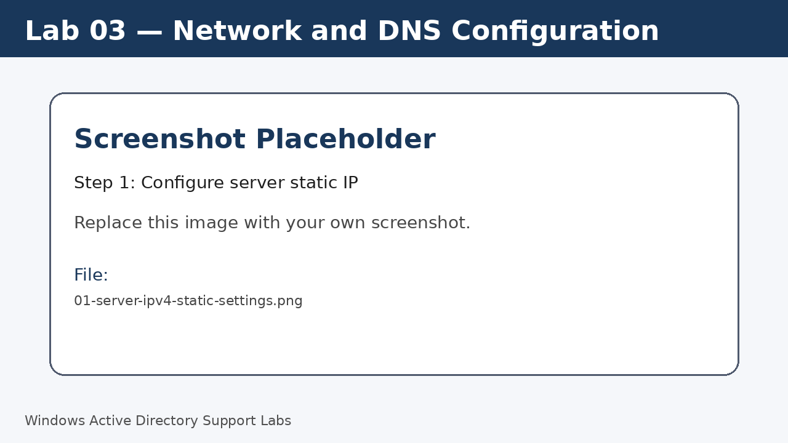
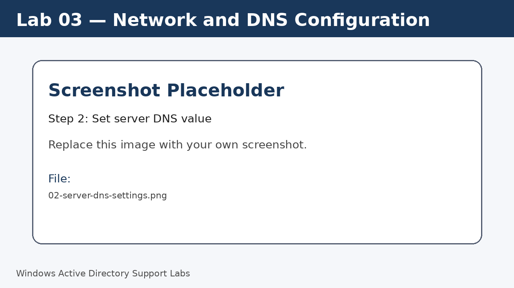
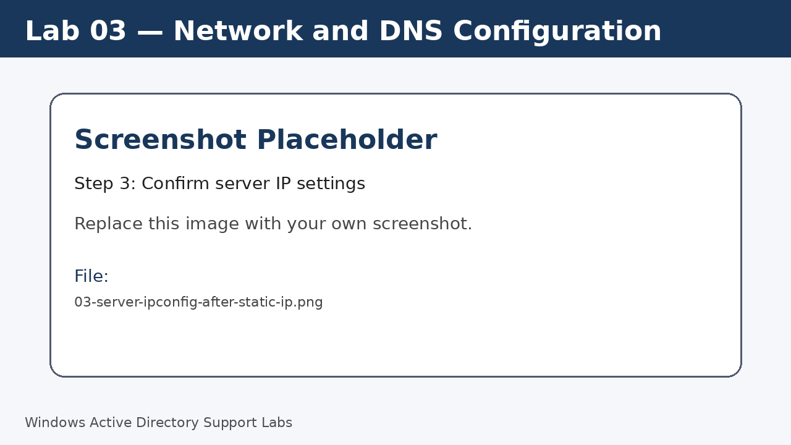
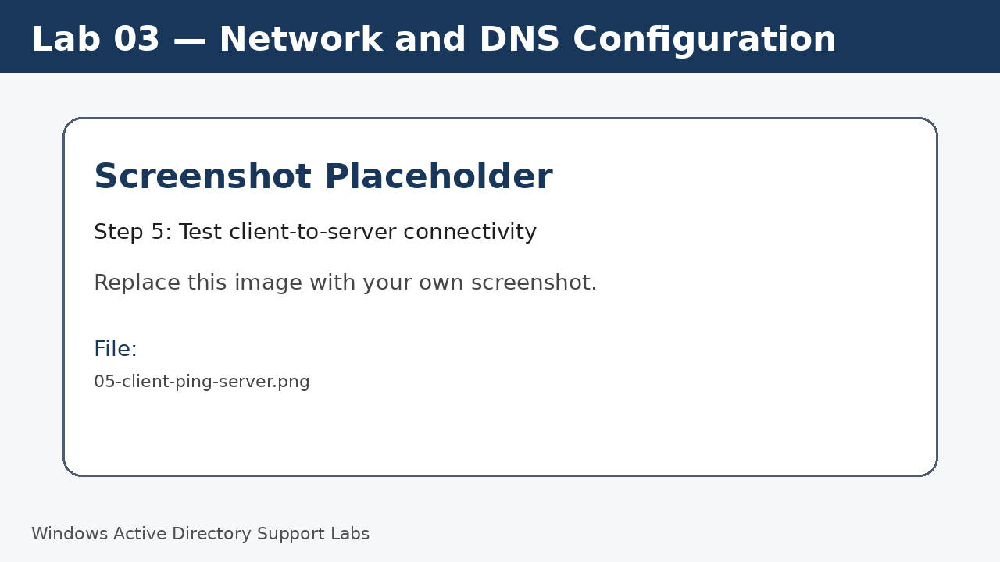
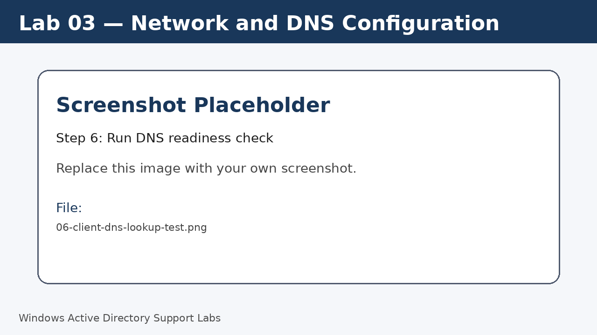

<a id="top"></a>

# Lab 03 — Network and DNS Configuration

<p align="center">
  
  
  
  
  
  
</p>

<p align="center">
  <a href="../02-windows-server-initial-configuration/README.md">⬅ Previous Lab</a> | <a href="../../README.md">🏠 Main README</a> | <a href="../04-active-directory-domain-services-setup/README.md">Next Lab ➡</a>
</p>

---

## Overview

Configure IP and DNS settings so Windows clients can communicate with the server and later locate the Active Directory domain.

---

## Objectives

- Set a static IP address on the Windows Server.
- Point server DNS to itself when it becomes the DNS server.
- Point the Windows 11 client DNS to the server IP.
- Test basic connectivity between client and server.
- Understand why DNS is required for domain join.

---

## Lab Values

| Item | Value |
|---|---|
| Server IP | `192.168.20.10` |
| Client IP | `192.168.20.101` or DHCP |
| Subnet mask | `255.255.255.0` |
| DNS server | `192.168.20.10` |
| Screenshot folder | `assets/images/lab-03-network-and-dns-configuration/` |

---

## Before You Start

- Complete the previous lab unless this is Lab 01.
- Use a lab environment only.
- Do not publish real passwords or private business information.
- Replace placeholder screenshots with your own screenshots after completing each step.

---

## Screenshot Files

| File name | Step |
|---|---|
| 01-server-ipv4-static-settings.png | Configure server static IP |
| 02-server-dns-settings.png | Set server DNS value |
| 03-server-ipconfig-after-static-ip.png | Confirm server IP settings |
| 04-client-dns-server-settings.png | Configure client DNS |
| 05-client-ping-server.png | Test client-to-server connectivity |
| 06-client-dns-lookup-test.png | Run DNS readiness check |

---

## Step 1 — Configure server static IP

On the server, open **Network Connections**.

Open the Ethernet adapter properties and select **Internet Protocol Version 4**.

Set the server IP to `192.168.20.10` and subnet mask to `255.255.255.0`.

Screenshot file:

```text
assets/images/lab-03-network-and-dns-configuration/01-server-ipv4-static-settings.png
```



[⬆ Back to top](#top)

## Step 2 — Set server DNS value

Set Preferred DNS server to `192.168.20.10`.

This value is suitable once DNS is installed with the domain controller role.

Screenshot file:

```text
assets/images/lab-03-network-and-dns-configuration/02-server-dns-settings.png
```



[⬆ Back to top](#top)

## Step 3 — Confirm server IP settings

Run the following command on the server.

Run:

```cmd
ipconfig /all
```

Screenshot file:

```text
assets/images/lab-03-network-and-dns-configuration/03-server-ipconfig-after-static-ip.png
```



[⬆ Back to top](#top)

## Step 4 — Configure client DNS

On the Windows 11 client, open IPv4 settings for the active adapter.

Set the DNS server to `192.168.20.10`.

The client can use DHCP or a static IP, but DNS must point to the domain controller.

Screenshot file:

```text
assets/images/lab-03-network-and-dns-configuration/04-client-dns-server-settings.png
```


[⬆ Back to top](#top)

## Step 5 — Test client-to-server connectivity

From the client, test whether the server is reachable.

Run:

```cmd
ping 192.168.20.10
```

Screenshot file:

```text
assets/images/lab-03-network-and-dns-configuration/05-client-ping-server.png
```



[⬆ Back to top](#top)

## Step 6 — Run DNS readiness check

After the domain is configured, use name lookup to confirm DNS resolution.

Run:

```cmd
nslookup corp.local
ping SRV-DC01
```

Screenshot file:

```text
assets/images/lab-03-network-and-dns-configuration/06-client-dns-lookup-test.png
```



[⬆ Back to top](#top)


---

## Completion Checklist

- [ ] Server static IP configured.
- [ ] Server DNS setting reviewed.
- [ ] Client DNS points to server IP.
- [ ] Client can ping server IP.
- [ ] DNS lookup command tested after domain setup.
- [ ] Final IP configuration screenshots saved.

---

## Key Takeaways

- Active Directory depends heavily on DNS.
- Domain join fails often when the client uses the wrong DNS server.
- Always confirm IP and DNS before troubleshooting domain issues.

---

## Author

**Xuan Toan Nguyen**  
IT Support | Service Desk | Desktop Support | System Administration  
Adelaide, South Australia

- LinkedIn: [www.linkedin.com/in/toan-nguyen-it-oz](https://www.linkedin.com/in/toan-nguyen-it-oz)
- GitHub: [github.com/toannguyenitoz](https://github.com/toannguyenitoz)

---

<p align="center">
  <a href="../02-windows-server-initial-configuration/README.md">⬅ Previous Lab</a> | <a href="../../README.md">🏠 Main README</a> | <a href="../04-active-directory-domain-services-setup/README.md">Next Lab ➡</a> |
  <a href="#top">⬆ Back to Top</a>
</p>
