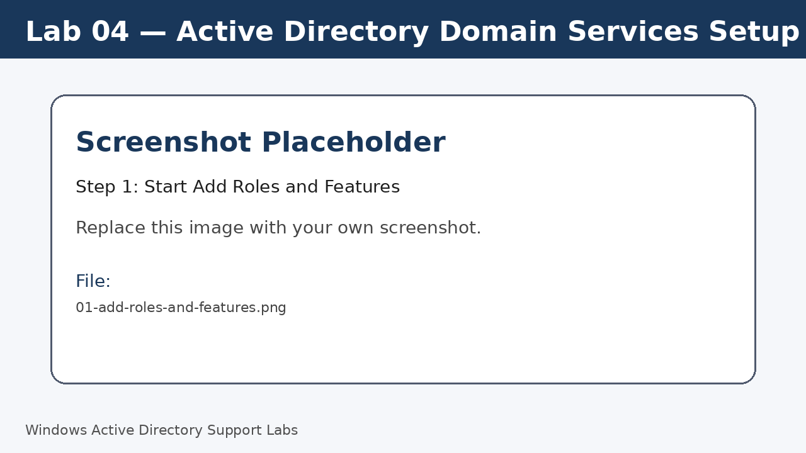
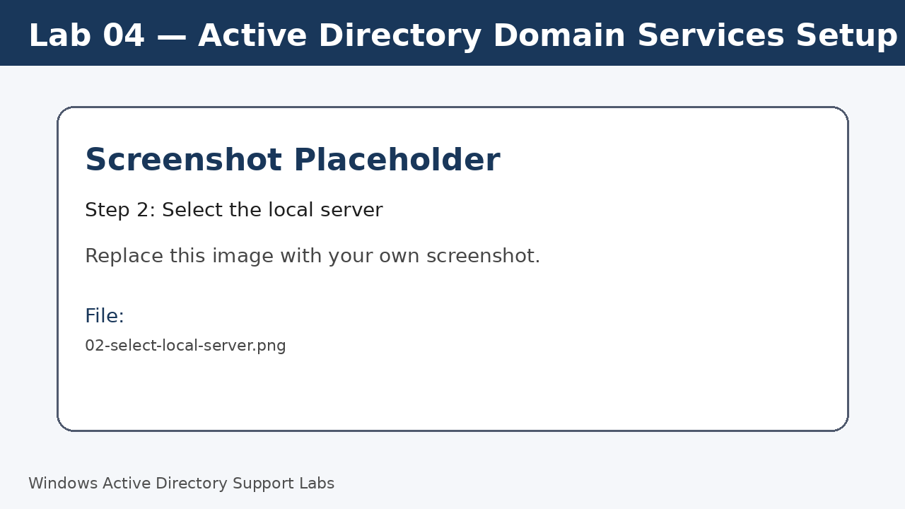
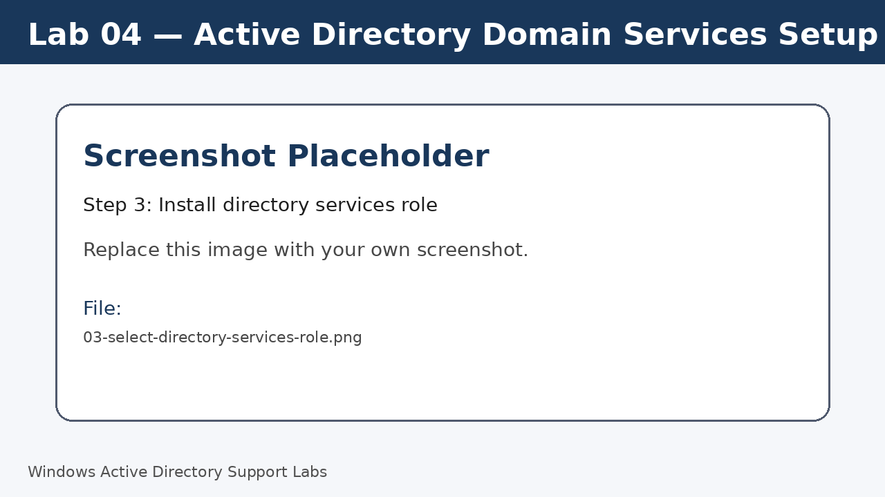
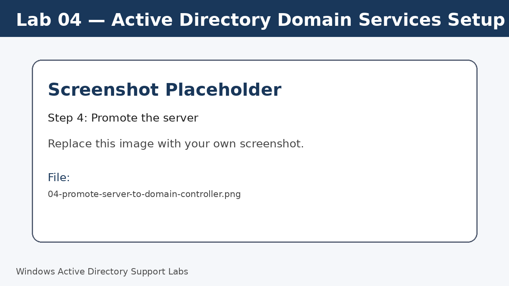
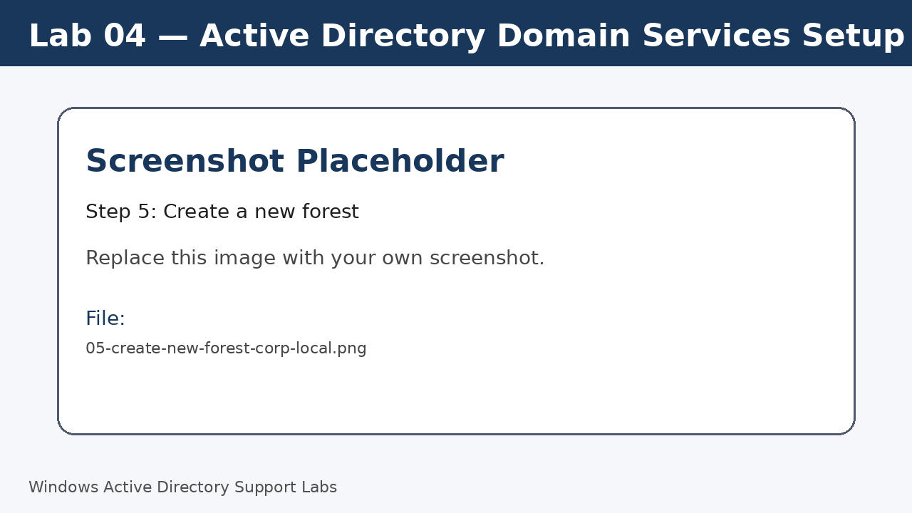
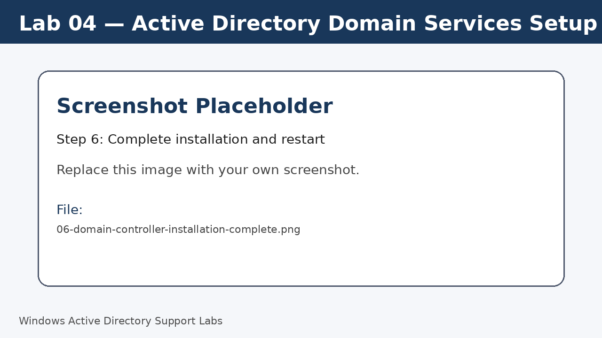
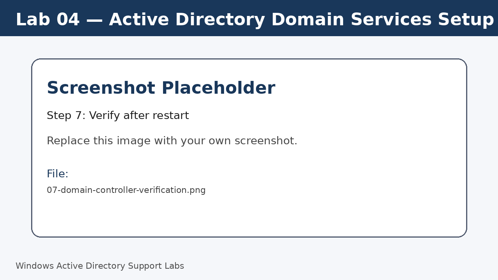

<a id="top"></a>

# Lab 04 — Active Directory Domain Services Setup

<p align="center">
  
  
  
  
  
  
</p>

<p align="center">
  <a href="../03-network-and-dns-configuration/README.md">⬅ Previous Lab</a> | <a href="../../README.md">🏠 Main README</a> | <a href="../05-join-windows-11-client-to-domain/README.md">Next Lab ➡</a>
</p>

---

## Overview

Install Active Directory Domain Services and promote the Windows Server to a domain controller for the lab domain.

---

## Objectives

- Install the directory services role.
- Create a new lab forest.
- Configure the server as a domain controller.
- Confirm the domain is available after restart.
- Review domain sign-in and DNS readiness.

---

## Lab Values

| Item | Value |
|---|---|
| Domain name | `corp.local` |
| Domain controller | `SRV-DC01` |
| Server IP | `192.168.20.10` |
| Screenshot folder | `assets/images/lab-04-active-directory-domain-services-setup/` |

---

## Before You Start

- Complete the previous lab unless this is Lab 01.
- Use a lab environment only.
- Do not publish real passwords or private business information.
- Replace placeholder screenshots with your own screenshots after completing each step.

---

## Screenshot Files

| File name | Step |
|---|---|
| 01-add-roles-and-features.png | Start Add Roles and Features |
| 02-select-local-server.png | Select the local server |
| 03-select-directory-services-role.png | Install directory services role |
| 04-promote-server-to-domain-controller.png | Promote the server |
| 05-create-new-forest-corp-local.png | Create a new forest |
| 06-domain-controller-installation-complete.png | Complete installation and restart |
| 07-domain-controller-verification.png | Verify after restart |

---

## Step 1 — Start Add Roles and Features

Open **Server Manager**.

Select **Manage > Add Roles and Features**.

Choose **Role-based or feature-based installation**.

Screenshot file:

```text
assets/images/lab-04-active-directory-domain-services-setup/01-add-roles-and-features.png
```



[⬆ Back to top](#top)

## Step 2 — Select the local server

Choose the local server from the server pool.

Confirm the target server is `SRV-DC01`.

Screenshot file:

```text
assets/images/lab-04-active-directory-domain-services-setup/02-select-local-server.png
```



[⬆ Back to top](#top)

## Step 3 — Install directory services role

Select **Active Directory Domain Services**.

Accept the required management tools.

Continue through the wizard and start installation.

Screenshot file:

```text
assets/images/lab-04-active-directory-domain-services-setup/03-select-directory-services-role.png
```



[⬆ Back to top](#top)

## Step 4 — Promote the server

After installation, click the notification flag in Server Manager.

Select **Promote this server to a domain controller**.

Screenshot file:

```text
assets/images/lab-04-active-directory-domain-services-setup/04-promote-server-to-domain-controller.png
```



[⬆ Back to top](#top)

## Step 5 — Create a new forest

Select **Add a new forest**.

Enter the root domain name `corp.local`.

Continue through the wizard using lab-safe settings.

Screenshot file:

```text
assets/images/lab-04-active-directory-domain-services-setup/05-create-new-forest-corp-local.png
```



[⬆ Back to top](#top)

## Step 6 — Complete installation and restart

Review prerequisites.

Start installation.

Allow the server to restart automatically.

Screenshot file:

```text
assets/images/lab-04-active-directory-domain-services-setup/06-domain-controller-installation-complete.png
```



[⬆ Back to top](#top)

## Step 7 — Verify after restart

Sign in again and confirm the server is now operating as the domain controller.

Run:

```cmd
hostname
ipconfig /all
echo %USERDOMAIN%
```

Screenshot file:

```text
assets/images/lab-04-active-directory-domain-services-setup/07-domain-controller-verification.png
```



[⬆ Back to top](#top)


---

## Completion Checklist

- [ ] Directory services role installed.
- [ ] Server promoted to domain controller.
- [ ] New forest `corp.local` created.
- [ ] Server restarted successfully.
- [ ] Domain sign-in confirmed.
- [ ] DNS settings reviewed after promotion.

---

## Key Takeaways

- A domain controller provides central authentication and directory services.
- DNS is installed and used by Active Directory for locating domain resources.
- Restart and verification are essential before joining clients.

---

## Author

**Xuan Toan Nguyen**  
IT Support | Service Desk | Desktop Support | System Administration  
Adelaide, South Australia

- LinkedIn: [www.linkedin.com/in/toan-nguyen-it-oz](https://www.linkedin.com/in/toan-nguyen-it-oz)
- GitHub: [github.com/toannguyenitoz](https://github.com/toannguyenitoz)

---

<p align="center">
  <a href="../03-network-and-dns-configuration/README.md">⬅ Previous Lab</a> | <a href="../../README.md">🏠 Main README</a> | <a href="../05-join-windows-11-client-to-domain/README.md">Next Lab ➡</a> |
  <a href="#top">⬆ Back to Top</a>
</p>
