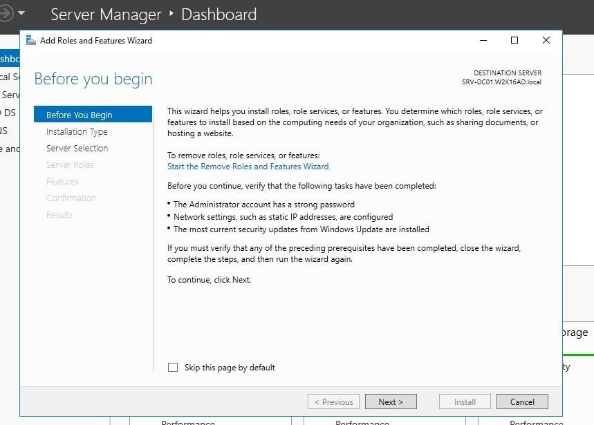
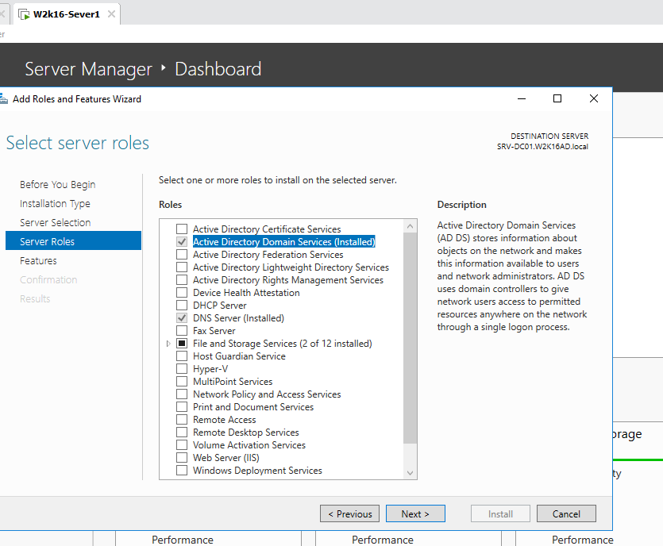
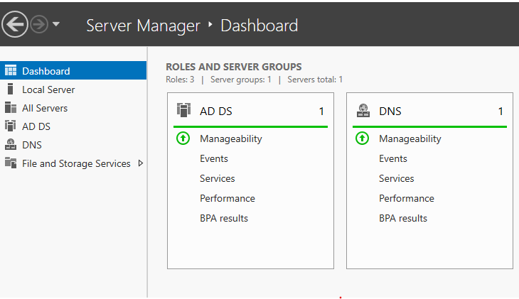
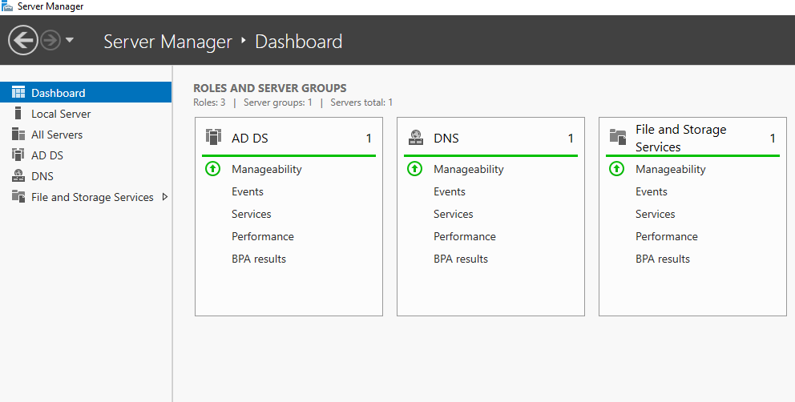
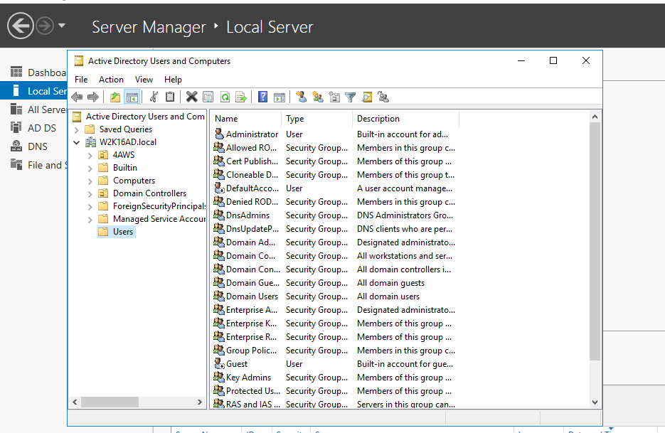
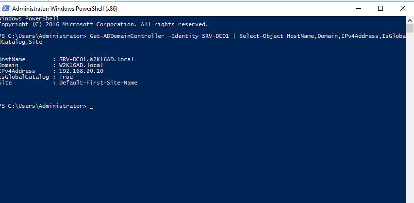
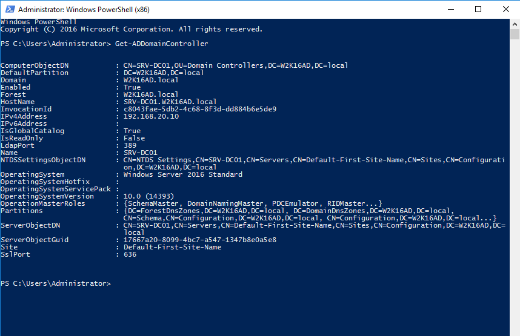
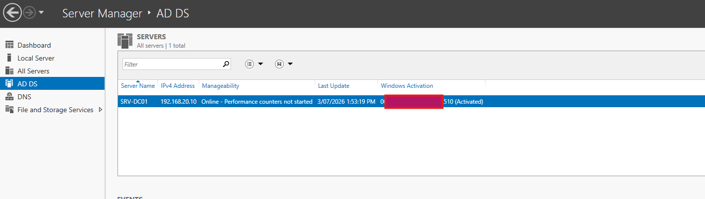
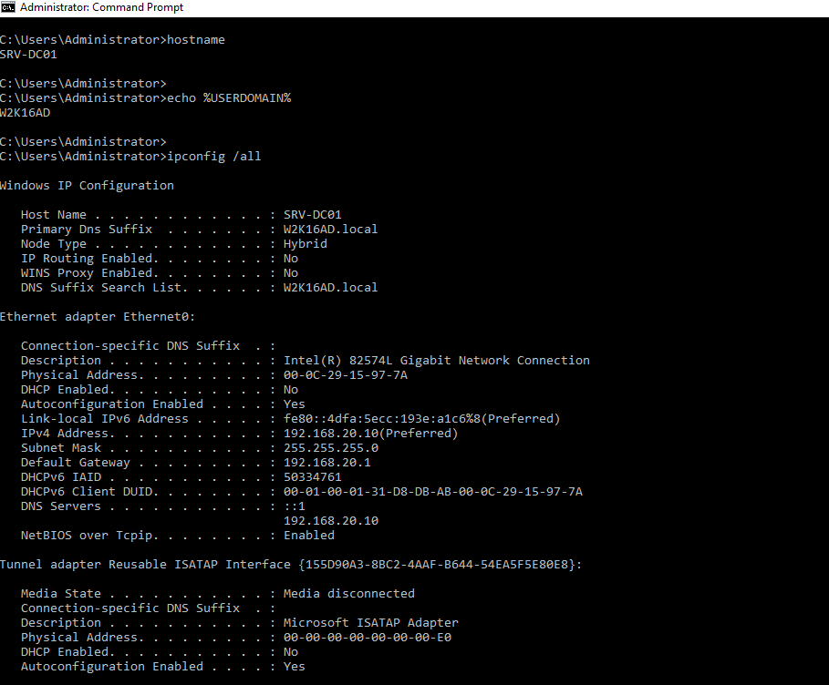
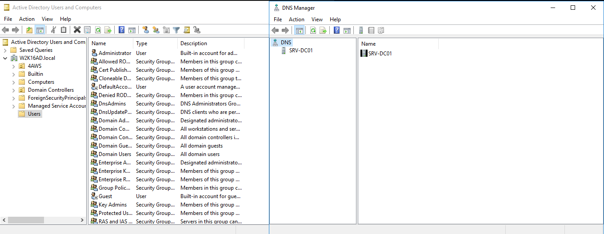

<a id="top"></a>

# 🏢 Lab 04 — Active Directory Domain Services Setup

<p align="center">
  
  
  
  
</p>

<p align="center"><a href="../03-network-and-dns-configuration/README.md">⬅ Previous Lab</a> · <a href="../../README.md">🏠 Main README</a> · <a href="../05-join-windows-11-client-to-domain/README.md">Next Lab ➜</a></p>

---

## 🎯 Lab Mission

Turn the Windows Server into the central identity server for the lab environment by installing Active Directory Domain Services and promoting the server to a domain controller.

> [!NOTE]
> This lab is written as a user guide. Follow the steps in order and compare your result with the expected checks.

---

## ✅ What You Will Learn

- Install the Active Directory Domain Services role.
- Promote the server to a domain controller.
- Create or confirm the lab forest and domain.
- Confirm domain controller status after restart.
- Open Active Directory Users and Computers and DNS Manager.

---

## 🧱 Lab Values

| Item | Value |
|---|---|
| Server name | `SRV-DC01` |
| Domain name | `W2K16AD.local` |
| Server IP | `192.168.20.10` |
| DNS server | `192.168.20.10` |
| NetBIOS name | `W2K16AD` |
| Next lab use | Join Windows 11 client to domain |

> [!IMPORTANT]
> This guide uses `W2K16AD.local` because that is the domain used in this lab environment. Use your own lab domain if different, but keep the same value across all later labs.

---

## 🧩 Before You Start

- Complete Lab 03 first.
- Confirm the server hostname and IP configuration.
- Confirm the server has a stable static IP address.
- Confirm the server DNS points to itself.

Useful pre-check commands:

```cmd
hostname
ipconfig /all
```

> [!WARNING]
> Use a lab environment only. Do not publish real passwords, personal information, client data or internal business details.

---

## 🚀 Step-by-Step Guide

### 🛠️ Step 1 — Open Add Roles and Features

Open **Server Manager > Manage > Add Roles and Features** and choose **Role-based or feature-based installation**.

> [!TIP]
> Use the local server as the installation target.

**Demo screenshot:** Add Roles and Features Wizard start screen.



---

### 🏢 Step 2 — Select Active Directory Domain Services

Select **Active Directory Domain Services** and accept the required management tools.

> [!TIP]
> Management tools are required for later Active Directory administration tasks.

**Demo screenshot:** Active Directory Domain Services role selected.



---

### ✅ Step 3 — Confirm role installation result

Complete the wizard and install the AD DS role.

The role installation should finish successfully before promotion.

> [!IMPORTANT]
> Installing the AD DS role alone does not make the server a domain controller. Promotion is required.

**Demo screenshot:** AD DS role installation completed successfully.



---

### 🚩 Step 4 — Start domain controller configuration

In Server Manager, click the notification flag and choose **Promote this server to a domain controller**.

> [!TIP]
> The notification flag appears after the AD DS role is installed.

**Demo screenshot:** Promote this server to a domain controller option.



---

### 🌲 Step 5 — Create or confirm the forest/domain

For a new lab forest, select **Add a new forest** and enter the lab domain name.

This lab uses:

```text
W2K16AD.local
```

> [!TIP]
> This creates the first domain in the lab forest.

**Demo screenshot:** Deployment configuration with the root domain name.



---

### 🔐 Step 6 — Review domain controller options

Review the domain controller options.

Typical options:

```text
Domain Name System (DNS) server: selected
Global Catalog (GC): selected
Read only domain controller (RODC): not selected
```

Set a lab-safe Directory Services Restore Mode password.

> [!WARNING]
> Do not publish or reuse real passwords. Use a lab-only DSRM password.

**Demo screenshot:** Domain Controller Options page.



---

### 🧾 Step 7 — Review NetBIOS name, paths and prerequisites

Review the NetBIOS name, database paths, SYSVOL path and prerequisite check.

Expected NetBIOS name:

```text
W2K16AD
```

The prerequisite check should pass before installation.

> [!TIP]
> Warnings are common in labs, but critical errors must be resolved before promotion.

**Demo screenshot:** Prerequisite check passed before installation.



---

### 🔁 Step 8 — Install and restart

Start the installation and allow the server to restart automatically.

> [!TIP]
> The restart completes the promotion process.

**Demo screenshot:** AD DS configuration installation running or completed.



---

### 🧪 Step 9 — Verify domain controller status

After restart, sign in and confirm hostname, IP/DNS and logon domain.

Run:

```cmd
hostname
```

```cmd
ipconfig /all
```

```cmd
echo %USERDOMAIN%
```

Expected values include:

```text
Host Name: SRV-DC01
DNS Servers: 192.168.20.10
USERDOMAIN: W2K16AD
```

> [!TIP]
> The domain should be available after sign-in.

**Demo screenshot:** Verification commands after domain controller promotion.



---

### 🧰 Step 10 — Open Active Directory tools

Open the required administration consoles from Server Manager.

Open:

```text
Server Manager > Tools > Active Directory Users and Computers
Server Manager > Tools > DNS
```

Both consoles should open without errors.

> [!TIP]
> ADUC confirms you can manage users, groups, OUs and computer objects. DNS Manager confirms DNS administration is available.

**Demo screenshot:** Active Directory Users and Computers and DNS Manager opened.



> [!WARNING]
> Screenshots display on GitHub only after the image files are committed and pushed to the matching `assets/images/...` folder.

---

## 🧾 Command Reference

| Command | Run on | Purpose | Expected result |
|---|---|---|---|
| `hostname` | Domain controller | Confirms server name | Shows `SRV-DC01` |
| `ipconfig /all` | Domain controller | Confirms IP and DNS settings | DNS points to the server IP |
| `echo %USERDOMAIN%` | Domain controller | Shows logon domain | Shows `W2K16AD` |
| `dsa.msc` | Domain controller | Opens Active Directory Users and Computers | ADUC opens |
| `dnsmgmt.msc` | Domain controller | Opens DNS Manager | DNS Manager opens |

---

## ✅ Completion Checklist

- [ ] Add Roles and Features wizard opened.
- [ ] AD DS role selected.
- [ ] Required management tools accepted.
- [ ] AD DS role installation completed.
- [ ] Domain controller promotion started.
- [ ] New forest/domain created or confirmed.
- [ ] DNS and Global Catalog options reviewed.
- [ ] DSRM password configured for lab use.
- [ ] Prerequisite check reviewed.
- [ ] Server restarted successfully.
- [ ] Domain sign-in confirmed.
- [ ] Verification commands completed.
- [ ] Active Directory Users and Computers opened.
- [ ] DNS Manager opened.

---

## 🧠 Key Takeaways

| Key point | Why it matters |
|---|---|
| 1 | Active Directory centralizes user, computer and group management. |
| 2 | DNS is required for clients to locate domain services. |
| 3 | Installing AD DS and promoting the server are two separate stages. |
| 4 | The first domain controller is the foundation for the rest of the lab. |

---

## 👤 Author

**Xuan Toan Nguyen**  
IT Support | Service Desk | Desktop Support | System Administration  
Adelaide, South Australia

- 🔗 LinkedIn: [www.linkedin.com/in/toan-nguyen-it-oz](https://www.linkedin.com/in/toan-nguyen-it-oz)
- 💻 GitHub: [github.com/toannguyenitoz](https://github.com/toannguyenitoz)

---

<p align="center"><a href="../03-network-and-dns-configuration/README.md">⬅ Previous Lab</a> · <a href="../../README.md">🏠 Main README</a> · <a href="../05-join-windows-11-client-to-domain/README.md">Next Lab ➜</a> · <a href="#top">⬆ Back to Top</a></p>
