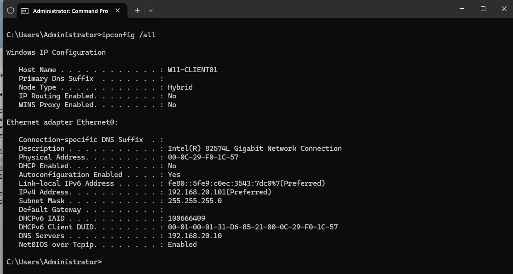
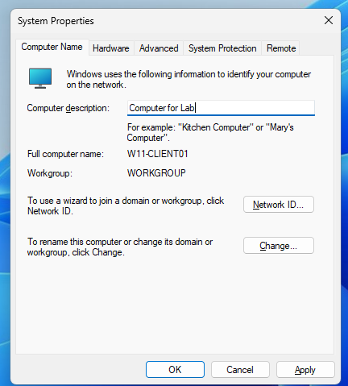
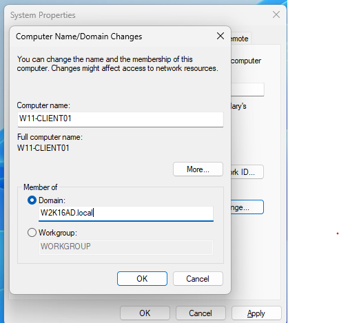
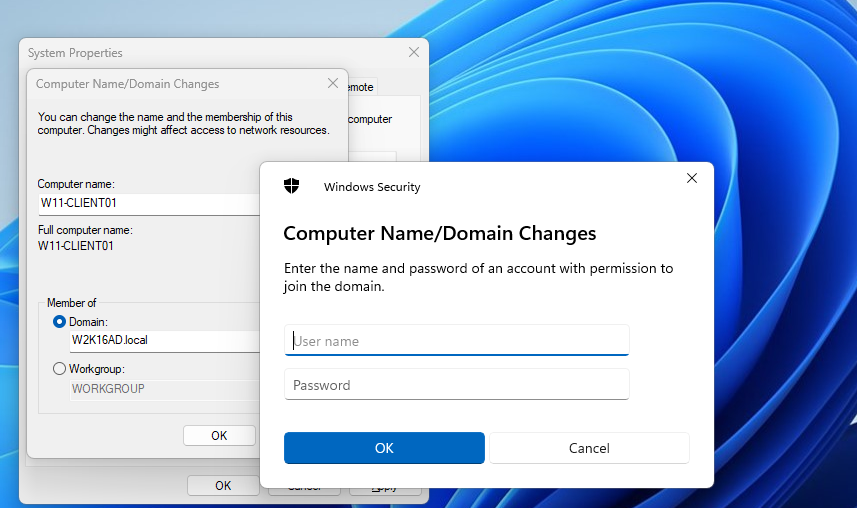
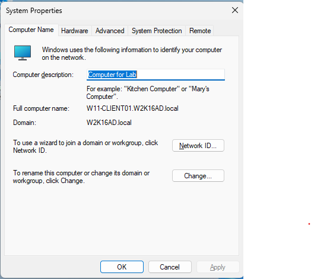
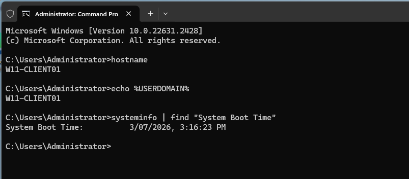
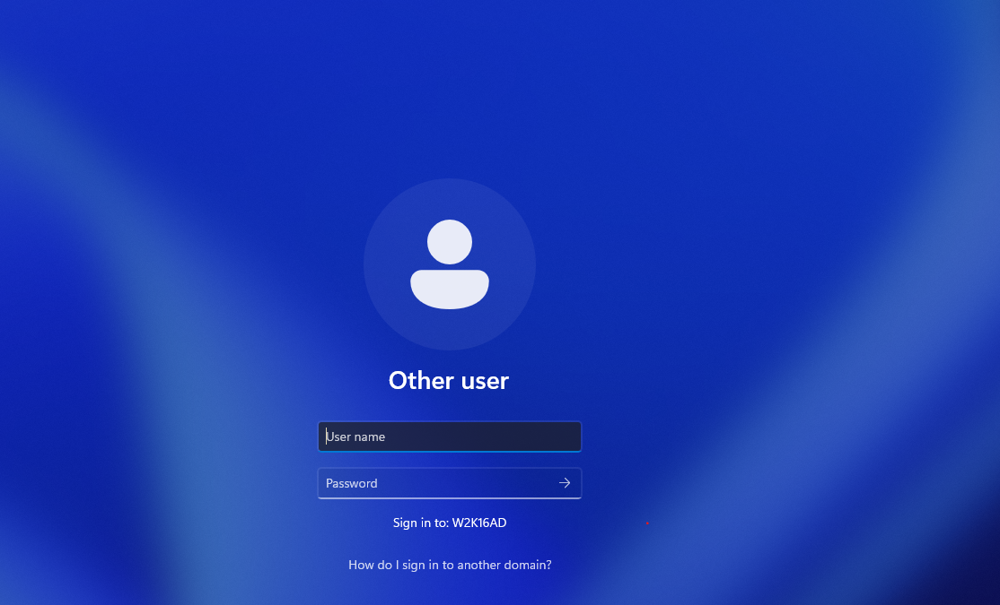
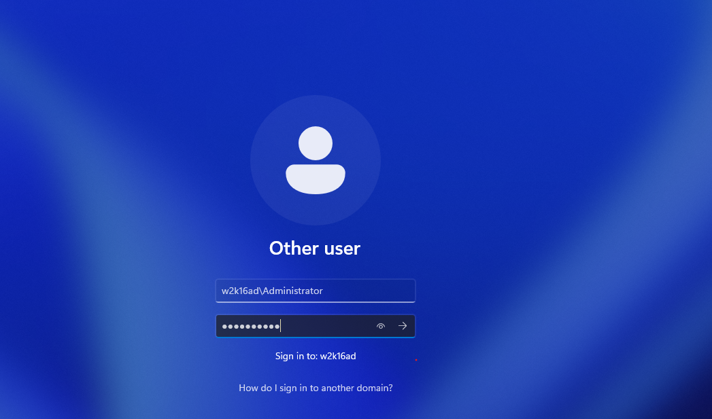
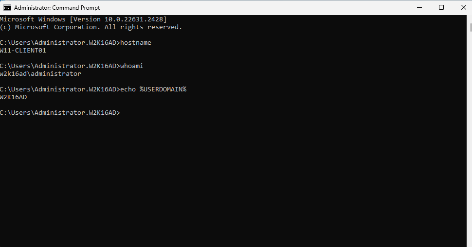
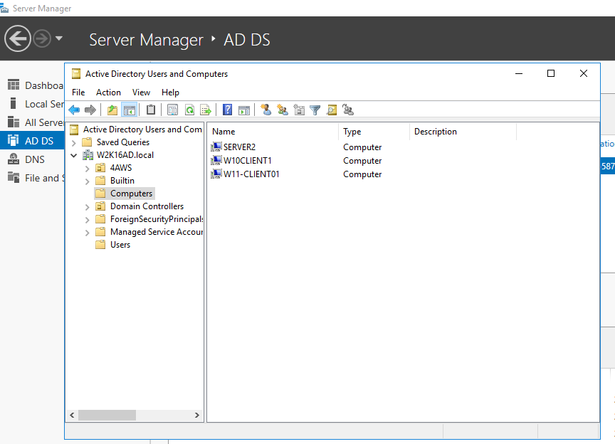

<a id="top"></a>

# 🔗 Lab 05 — Join Windows 11 Client to Domain

<p align="center">
  
  
  
</p>

<p align="center"><a href="../04-active-directory-domain-services-setup/README.md">⬅ Previous Lab</a> · <a href="../../README.md">🏠 Main README</a> · <a href="../06-active-directory-ou-structure/README.md">Next Lab ➜</a></p>

---

## 🎯 Lab Mission

Join the Windows 11 client to the Active Directory domain.

> [!NOTE]
> This lab is written as a user guide. Follow the steps in order and compare your result with the expected checks.

## ✅ What You Will Learn

- Confirm client DNS points to the domain controller.
- Join the client to `W2K16AD.local`.
- Understand which account is required during domain join.
- Restart and test domain sign-in.
- Confirm the computer object appears in Active Directory.

## 🧱 Lab Values

| Item | Value |
|---|---|
| Client name | `W11-CLIENT01` |
| Domain | `W2K16AD.local` |
| Domain controller | `SRV-DC01` |
| DNS server | `192.168.20.10` |
| Domain account example | `W2K16AD\Administrator` |

## 🧩 Before You Start

- Complete Lab 04 first.
- Confirm the client can reach the server.
- Confirm DNS points to the domain controller.
- Confirm you have a domain account with permission to join computers to the domain.

> [!WARNING]
> Use a lab environment only. Do not publish real passwords, personal information, client data or internal business details.

> [!IMPORTANT]
> When joining a Windows client to a domain, use a **domain account from the Domain Controller**, not a local account from the Windows 11 client.
>
> Correct example:
>
> ```text
> W2K16AD\Administrator
> ```
>
> Incorrect example:
>
> ```text
> W11-CLIENT01\Administrator
> ```
>
> The account is checked by Active Directory on `SRV-DC01`. A local client account cannot approve the domain join.

## 🚀 Step-by-Step Guide

### 📡 Step 1 — Check client DNS before domain join

On the Windows 11 client, confirm the client IP address and DNS server.

Run:

```cmd
ipconfig /all
```

Expected values:

```text
IPv4 Address: 192.168.20.101
DNS Servers: 192.168.20.10
```



> [!TIP]
> The client DNS server must point to the Domain Controller. Public DNS servers such as `8.8.8.8` cannot locate the internal Active Directory domain.

### ⚙️ Step 2 — Open System Properties

Open **System Properties > Computer Name** before changing the domain membership.

Run:

```cmd
sysdm.cpl
```



> [!TIP]
> This screenshot shows the client before it is joined to the domain.

### 🏢 Step 3 — Enter the domain name

Select **Domain** and enter:

```text
W2K16AD.local
```



> [!TIP]
> If the domain name cannot be found, check DNS and network connectivity first.

### 🔐 Step 4 — Enter domain credentials

When Windows asks for an account, enter a domain account that has permission to join computers to Active Directory.

Example:

```text
W2K16AD\Administrator
```



> [!IMPORTANT]
> This account comes from the server/domain environment. Do not use the local account from `W11-CLIENT01`.

### ✅ Step 5 — Confirm domain join success

After the correct domain account is accepted, Windows should show a welcome message for the domain.

Expected result:

```text
Welcome to the W2K16AD.local domain
```



### 🔁 Step 6 — Restart the client

Restart the Windows 11 client when prompted.



> [!TIP]
> Restart applies the domain membership change.

### 👤 Step 7 — Confirm the domain logon screen

After restart, confirm the sign-in screen can use a domain account.



### 👥 Step 8 — Sign in with a domain user

Use one of the following formats:

```text
W2K16AD\username
```

or

```text
username@W2K16AD.local
```



> [!TIP]
> Domain sign-in confirms the join is usable.

### 🧪 Step 9 — Verify domain membership

Run verification commands on the Windows 11 client.

Run:

```cmd
hostname
whoami
echo %USERDOMAIN%
```



> [!TIP]
> Confirm the computer name, signed-in user context and domain value.

### 🗂️ Step 10 — Confirm the computer object in Active Directory

On the Domain Controller, open **Active Directory Users and Computers** and find `W11-CLIENT01`.



> [!TIP]
> This confirms Active Directory knows the client computer.

---

## 🧯 Common Mistakes

### Using a local client account for domain join

Incorrect:

```text
W11-CLIENT01\Administrator
```

Correct:

```text
W2K16AD\Administrator
```

### DNS not pointing to the Domain Controller

Incorrect:

```text
DNS Server: 8.8.8.8
```

Correct:

```text
DNS Server: 192.168.20.10
```

### Client cannot resolve the domain

Verify:

```cmd
nslookup W2K16AD.local
ping SRV-DC01
```

---

## 🧾 Command Reference

| Command | Run on | Purpose | Expected result |
|---|---|---|---|
| `ipconfig /all` | Client | Checks client IP and DNS | DNS shows `192.168.20.10` |
| `nslookup W2K16AD.local` | Client | Tests DNS/domain lookup | Response from domain DNS |
| `ping 192.168.20.10` | Client | Tests server connectivity | Successful replies |
| `hostname` | Client | Shows computer name | `W11-CLIENT01` |
| `whoami` | Client | Shows signed-in account | Domain account context |
| `echo %USERDOMAIN%` | Client | Shows sign-in domain | Shows domain value |

---

## ✅ Completion Checklist

- [ ] Client DNS checked.
- [ ] Server connectivity tested.
- [ ] Domain lookup tested.
- [ ] Correct domain account used for domain join.
- [ ] Client joined to `W2K16AD.local`.
- [ ] Client restarted.
- [ ] Domain sign-in tested.
- [ ] Computer object found in AD.

---

## 🧠 Key Takeaways

| Key point | Why it matters |
|---|---|
| 1 | Domain join depends on correct DNS. |
| 2 | Domain join account must come from Active Directory, not the local client computer. |
| 3 | After joining the domain, the client becomes a managed computer. |
| 4 | Domain users can sign in after restart. |

---

## 👤 Author

**Xuan Toan Nguyen**  
IT Support | Service Desk | Desktop Support | System Administration  
Adelaide, South Australia

- 🔗 LinkedIn: [www.linkedin.com/in/toan-nguyen-it-oz](https://www.linkedin.com/in/toan-nguyen-it-oz)
- 💻 GitHub: [github.com/toannguyenitoz](https://github.com/toannguyenitoz)

---

<p align="center"><a href="../04-active-directory-domain-services-setup/README.md">⬅ Previous Lab</a> · <a href="../../README.md">🏠 Main README</a> · <a href="../06-active-directory-ou-structure/README.md">Next Lab ➜</a> · <a href="#top">⬆ Back to Top</a></p>
