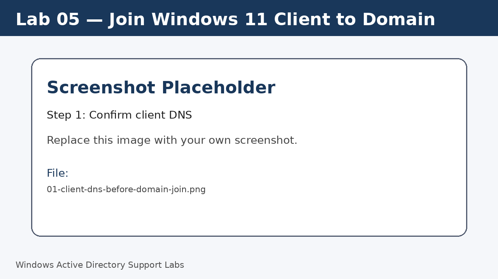
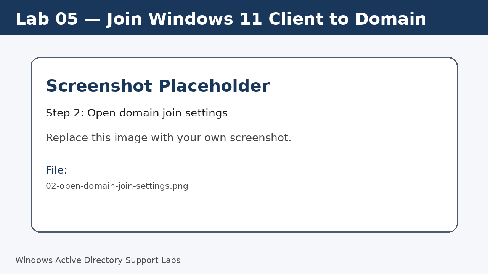
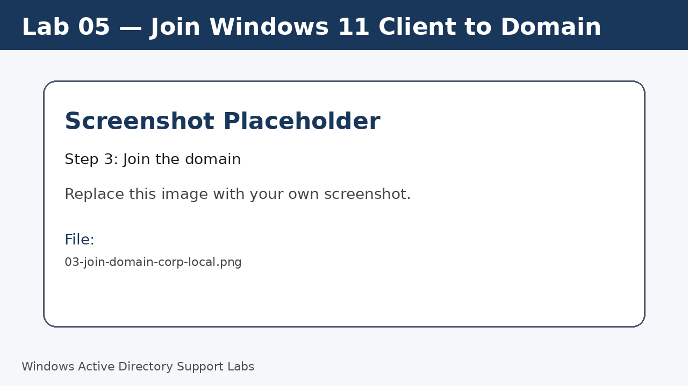
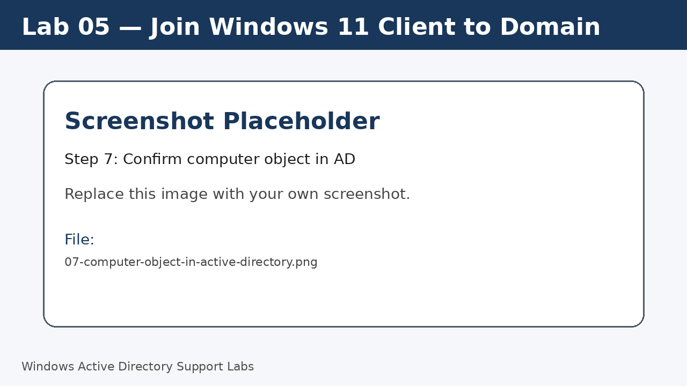

<a id="top"></a>

# Lab 05 — Join Windows 11 Client to Domain

<p align="center">
  
  
  
  
  
  
</p>

<p align="center">
  <a href="../04-active-directory-domain-services-setup/README.md">⬅ Previous Lab</a> | <a href="../../README.md">🏠 Main README</a> | <a href="../06-active-directory-ou-structure/README.md">Next Lab ➡</a>
</p>

---

## Overview

Join the Windows 11 workstation to the lab domain and confirm the computer object appears in Active Directory.

---

## Objectives

- Confirm client DNS points to the domain controller.
- Join the client to `corp.local`.
- Restart and sign in using a domain account.
- Confirm the computer object exists in Active Directory.

---

## Lab Values

| Item | Value |
|---|---|
| Domain | `corp.local` |
| Client | `W11-CLIENT01` |
| Domain controller | `SRV-DC01` |
| Screenshot folder | `assets/images/lab-05-join-windows-11-client-to-domain/` |

---

## Before You Start

- Complete the previous lab unless this is Lab 01.
- Use a lab environment only.
- Do not publish real passwords or private business information.
- Replace placeholder screenshots with your own screenshots after completing each step.

---

## Screenshot Files

| File name | Step |
|---|---|
| 01-client-dns-before-domain-join.png | Confirm client DNS |
| 02-open-domain-join-settings.png | Open domain join settings |
| 03-join-domain-corp-local.png | Join the domain |
| 04-restart-after-domain-join.png | Restart the client |
| 05-domain-login-screen.png | Sign in using domain context |
| 06-domain-join-verification.png | Confirm domain status |
| 07-computer-object-in-active-directory.png | Confirm computer object in AD |

---

## Step 1 — Confirm client DNS

On the client, confirm DNS server is `192.168.20.10`.

Run:

```cmd
ipconfig /all
```

Screenshot file:

```text
assets/images/lab-05-join-windows-11-client-to-domain/01-client-dns-before-domain-join.png
```



[⬆ Back to top](#top)

## Step 2 — Open domain join settings

Open **Settings > System > About**.

Open the advanced domain or workgroup settings.

Screenshot file:

```text
assets/images/lab-05-join-windows-11-client-to-domain/02-open-domain-join-settings.png
```



[⬆ Back to top](#top)

## Step 3 — Join the domain

Select the option to join a domain.

Enter `corp.local`.

Provide an account allowed to join computers to the domain.

Screenshot file:

```text
assets/images/lab-05-join-windows-11-client-to-domain/03-join-domain-corp-local.png
```



[⬆ Back to top](#top)

## Step 4 — Restart the client

Restart the client when prompted.

Screenshot file:

```text
assets/images/lab-05-join-windows-11-client-to-domain/04-restart-after-domain-join.png
```


[⬆ Back to top](#top)

## Step 5 — Sign in using domain context

At sign-in, select Other user if needed.

Sign in using a domain user account.

Screenshot file:

```text
assets/images/lab-05-join-windows-11-client-to-domain/05-domain-login-screen.png
```


[⬆ Back to top](#top)

## Step 6 — Confirm domain status

Run verification commands on the client.

Run:

```cmd
hostname
whoami
echo %USERDOMAIN%
ipconfig /all
```

Screenshot file:

```text
assets/images/lab-05-join-windows-11-client-to-domain/06-domain-join-verification.png
```


[⬆ Back to top](#top)

## Step 7 — Confirm computer object in AD

On the server, open Active Directory Users and Computers.

Confirm `W11-CLIENT01` exists in the Computers container or target OU.

Screenshot file:

```text
assets/images/lab-05-join-windows-11-client-to-domain/07-computer-object-in-active-directory.png
```



[⬆ Back to top](#top)


---

## Completion Checklist

- [ ] Client DNS checked.
- [ ] Client joined to `corp.local`.
- [ ] Client restarted.
- [ ] Domain sign-in tested.
- [ ] Computer object confirmed in Active Directory.
- [ ] Verification commands completed.

---

## Key Takeaways

- A domain join requires working DNS.
- Computer objects should be moved into the correct OU after joining.
- `whoami` confirms whether a domain account is being used.

---

## Author

**Xuan Toan Nguyen**  
IT Support | Service Desk | Desktop Support | System Administration  
Adelaide, South Australia

- LinkedIn: [www.linkedin.com/in/toan-nguyen-it-oz](https://www.linkedin.com/in/toan-nguyen-it-oz)
- GitHub: [github.com/toannguyenitoz](https://github.com/toannguyenitoz)

---

<p align="center">
  <a href="../04-active-directory-domain-services-setup/README.md">⬅ Previous Lab</a> | <a href="../../README.md">🏠 Main README</a> | <a href="../06-active-directory-ou-structure/README.md">Next Lab ➡</a> |
  <a href="#top">⬆ Back to Top</a>
</p>
