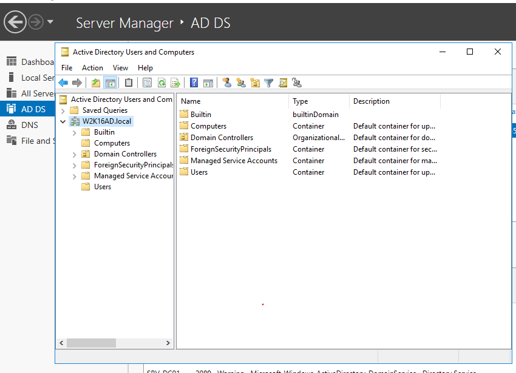
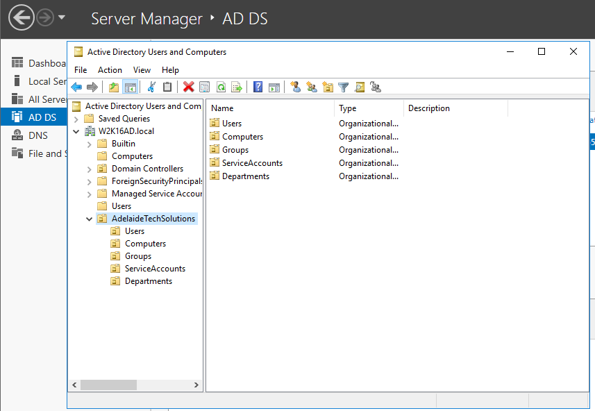
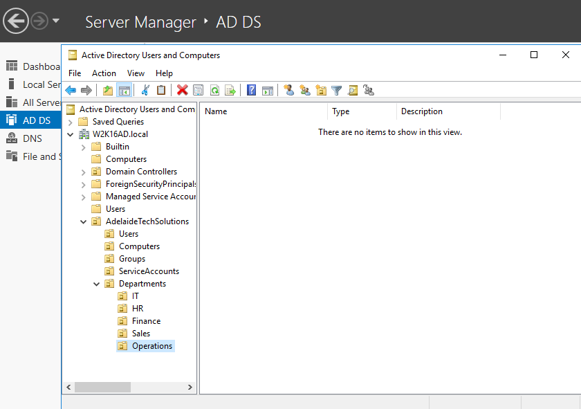
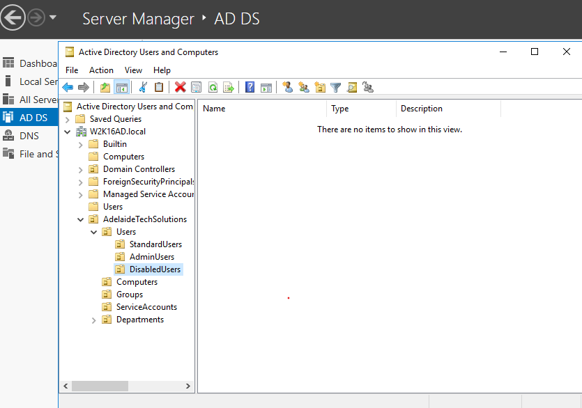
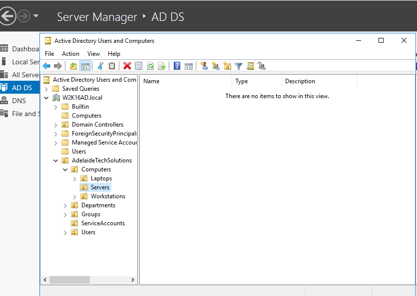
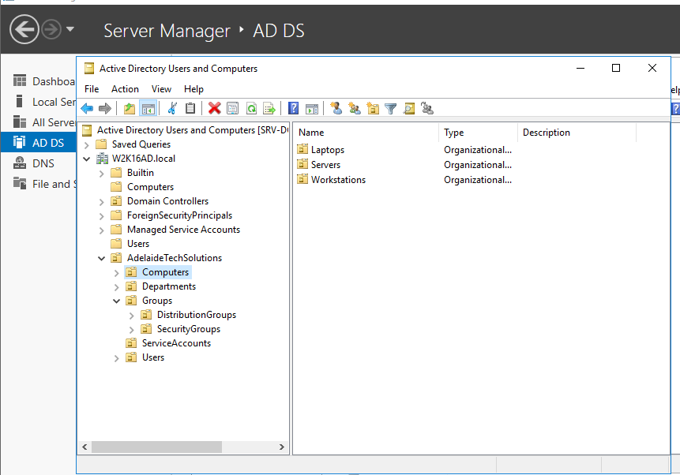
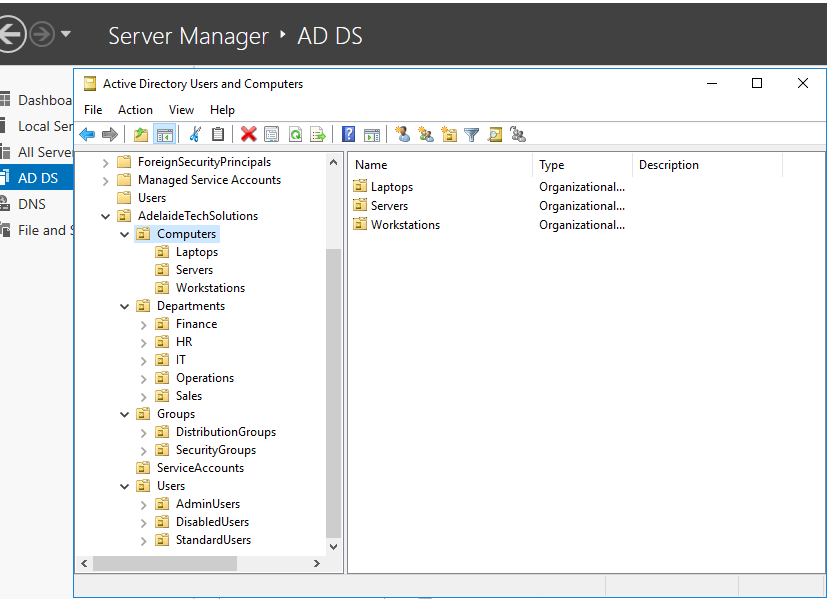
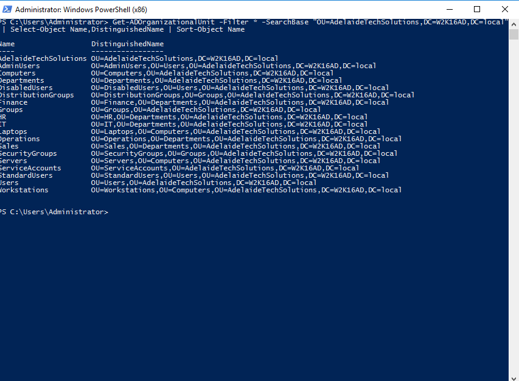
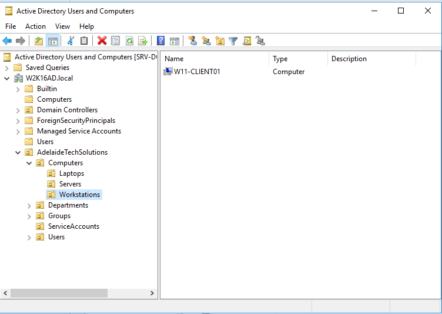
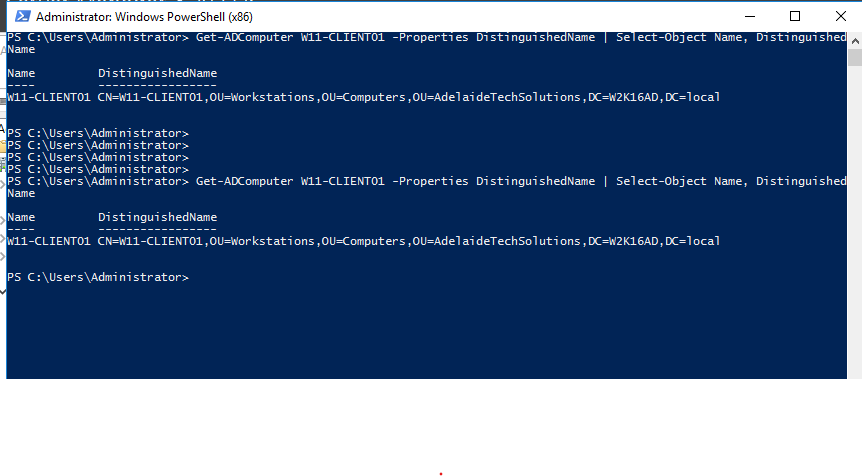

<a id="top"></a>

# 🗂️ Lab 06 — Active Directory OU Structure

<p align="center">
  
  
  
  
</p>

<p align="center"><a href="../05-join-windows-11-client-to-domain/README.md">⬅ Previous Lab</a> · <a href="../../README.md">🏠 Main README</a> · <a href="../07-active-directory-user-management/README.md">Next Lab ➜</a></p>

---

## 🎯 Lab Mission

Create a clean, workplace-style **Organizational Unit (OU)** structure in Active Directory for a small company environment.

This lab can be completed in two ways:

1. **GUI method** — create and manage OUs using **Active Directory Users and Computers (ADUC)**.
2. **PowerShell method** — create, verify and move objects using scripts.

> [!NOTE]
> Screenshots show the final result for each section. The text steps explain the full GUI process so the lab can be followed manually without relying only on scripts.

---

## ✅ What You Will Learn

- Create a top-level company OU.
- Create structured OUs for users, computers, groups, service accounts and departments.
- Organize sub-OUs for departments, user types, computer types and group types.
- Move a joined Windows 11 client computer object into the correct OU.
- Verify the OU structure using PowerShell.
- Use repeatable scripts for Active Directory administration tasks.

---

## 🧱 Lab Values

| Item | Value |
|---|---|
| Domain | `W2K16AD.local` |
| Domain Controller | `SRV-DC01` |
| Company name | `Adelaide Tech Solutions` |
| Top-level OU | `AdelaideTechSolutions` |
| Client computer | `W11-CLIENT01` |
| Target computer OU | `AdelaideTechSolutions > Computers > Workstations` |

---

## 🗺️ Target OU Structure

```text
W2K16AD.local
└── AdelaideTechSolutions
    ├── Computers
    │   ├── Workstations
    │   ├── Servers
    │   └── Laptops
    ├── Departments
    │   ├── IT
    │   ├── HR
    │   ├── Finance
    │   ├── Sales
    │   └── Operations
    ├── Groups
    │   ├── SecurityGroups
    │   └── DistributionGroups
    ├── ServiceAccounts
    └── Users
        ├── StandardUsers
        ├── AdminUsers
        └── DisabledUsers
```

---

## 🧩 Before You Start

- Complete **Lab 05 — Join Windows 11 Client to Domain**.
- Confirm `W11-CLIENT01` exists in Active Directory.
- Sign in to `SRV-DC01` using a domain administrator account.
- Open PowerShell as Administrator if using scripts.
- Open PowerShell from the repository root folder, or change directory to the repository root before running scripts.

> [!WARNING]
> Use a lab environment only. Do not publish real passwords, personal information, client data or internal business details.

---

## 🧰 Scripts Used in This Lab

| Script | Purpose |
|---|---|
| [`create-lab06-ou-structure.ps1`](../../scripts/create-lab06-ou-structure.ps1) | Creates the full OU structure. |
| [`verify-lab06-ou-structure.ps1`](../../scripts/verify-lab06-ou-structure.ps1) | Verifies all expected OUs exist. |
| [`move-lab06-client-to-workstations-ou.ps1`](../../scripts/move-lab06-client-to-workstations-ou.ps1) | Moves `W11-CLIENT01` into the Workstations OU. |

> [!TIP]
> The examples below avoid fixed local drive paths. They assume you are already in the repository root folder. This makes the guide portable on any drive or computer.

Example:

```powershell
Set-ExecutionPolicy RemoteSigned -Scope Process
Set-Location .\scripts
.\create-lab06-ou-structure.ps1
.\verify-lab06-ou-structure.ps1
.\move-lab06-client-to-workstations-ou.ps1
```

> [!TIP]
> The creation script is idempotent. It can be run again without creating duplicate OUs. Existing OUs are detected and skipped.

---

# Method 1 — Detailed GUI Step-by-Step Guide

Use this method if you want to practise the normal Active Directory admin interface. The screenshot under each step is the final evidence image, but the instructions describe the complete GUI action.

---

## 🖱️ Step 1 — Open Active Directory Users and Computers

1. Sign in to `SRV-DC01`.
2. Open **Server Manager**.
3. Click **Tools** in the top-right menu.
4. Select **Active Directory Users and Computers**.
5. In the left pane, expand the domain:

```text
W2K16AD.local
```

6. Review the default containers:

```text
Builtin
Computers
Domain Controllers
Users
```

This confirms the ADUC console is connected to the correct domain before creating any new OUs.



---

## 🏢 Step 2 — Create the top-level company OU

1. In ADUC, right-click the domain root:

```text
W2K16AD.local
```

2. Select:

```text
New > Organizational Unit
```

3. In **Name**, enter:

```text
AdelaideTechSolutions
```

4. Keep the option selected:

```text
Protect container from accidental deletion
```

5. Click **OK**.
6. Confirm the new OU appears directly under `W2K16AD.local`.


> [!TIP]
> The display company name is **Adelaide Tech Solutions**, but the OU is named `AdelaideTechSolutions` to keep it clean for scripts and administration.

---

## 🧱 Step 3 — Create core organizational units

Create the main administrative containers inside the company OU.

1. Right-click:

```text
AdelaideTechSolutions
```

2. Select:

```text
New > Organizational Unit
```

3. Enter the first OU name:

```text
Users
```

4. Keep **Protect container from accidental deletion** selected.
5. Click **OK**.
6. Repeat the same process for each OU below:

```text
Computers
Groups
ServiceAccounts
Departments
```

Expected result:

```text
AdelaideTechSolutions
├── Computers
├── Departments
├── Groups
├── ServiceAccounts
└── Users
```



---

## 🏬 Step 4 — Create department OUs

Create department OUs inside the `Departments` OU.

1. Expand:

```text
AdelaideTechSolutions > Departments
```

2. Right-click `Departments`.
3. Select:

```text
New > Organizational Unit
```

4. Create the following OUs one by one:

```text
IT
HR
Finance
Sales
Operations
```

5. Keep **Protect container from accidental deletion** selected for each OU.
6. Click **OK** after each one.

Expected result:

```text
Departments
├── Finance
├── HR
├── IT
├── Operations
└── Sales
```



---

## 👤 Step 5 — Create user management OUs

Create separate user OUs for normal users, admin users and disabled accounts.

1. Expand:

```text
AdelaideTechSolutions > Users
```

2. Right-click `Users`.
3. Select:

```text
New > Organizational Unit
```

4. Create these OUs one by one:

```text
StandardUsers
AdminUsers
DisabledUsers
```

5. Keep **Protect container from accidental deletion** selected.
6. Confirm all three OUs appear under `Users`.

Purpose of each OU:

| OU | Purpose |
|---|---|
| `StandardUsers` | Normal user accounts. |
| `AdminUsers` | Administrative or delegated support accounts. |
| `DisabledUsers` | Disabled or offboarded lab accounts. |



---

## 💻 Step 6 — Create computer management OUs

Create separate computer OUs for different device types.

1. Expand:

```text
AdelaideTechSolutions > Computers
```

2. Right-click `Computers`.
3. Select:

```text
New > Organizational Unit
```

4. Create these OUs one by one:

```text
Workstations
Servers
Laptops
```

5. Keep **Protect container from accidental deletion** selected.
6. Confirm all three OUs appear under `Computers`.

Purpose of each OU:

| OU | Purpose |
|---|---|
| `Workstations` | Domain-joined desktop PCs. |
| `Servers` | Member servers and server objects. |
| `Laptops` | Portable client devices. |



---

## 👥 Step 7 — Create group management OUs

Create separate group OUs for security and distribution groups.

1. Expand:

```text
AdelaideTechSolutions > Groups
```

2. Right-click `Groups`.
3. Select:

```text
New > Organizational Unit
```

4. Create these OUs one by one:

```text
SecurityGroups
DistributionGroups
```

5. Keep **Protect container from accidental deletion** selected.
6. Confirm both OUs appear under `Groups`.

Purpose of each OU:

| OU | Purpose |
|---|---|
| `SecurityGroups` | Groups used for permissions and access control. |
| `DistributionGroups` | Groups used for email-style distribution examples. |



---

## 🧾 Step 8 — Review the final OU structure

1. In ADUC, expand:

```text
W2K16AD.local > AdelaideTechSolutions
```

2. Expand each child OU to confirm the sub-OUs exist:

```text
Computers > Workstations / Servers / Laptops
Departments > IT / HR / Finance / Sales / Operations
Groups > SecurityGroups / DistributionGroups
Users > StandardUsers / AdminUsers / DisabledUsers
```

3. If any OU is missing, create it before continuing.
4. If the console does not update immediately, right-click `AdelaideTechSolutions` and select **Refresh**.



---

## 🧪 Step 9 — Verify OU structure with PowerShell

Open **PowerShell as Administrator** on `SRV-DC01`.

Run:

```powershell
Get-ADOrganizationalUnit -Filter * -SearchBase "OU=AdelaideTechSolutions,DC=W2K16AD,DC=local" | Select-Object Name,DistinguishedName | Sort-Object Name
```

Review the output and confirm the OU names are listed.



> [!TIP]
> This verifies the structure from the command line and is useful evidence for a portfolio.

---

## 🚚 Step 10 — Move the client computer object

Move `W11-CLIENT01` from the default `Computers` container into the managed workstation OU.

1. In ADUC, open the default container:

```text
W2K16AD.local > Computers
```

2. Find the computer object:

```text
W11-CLIENT01
```

3. Right-click `W11-CLIENT01`.
4. Select **Move**.
5. In the destination picker, browse to:

```text
W2K16AD.local > AdelaideTechSolutions > Computers > Workstations
```

6. Select `Workstations`.
7. Click **OK**.
8. Open:

```text
AdelaideTechSolutions > Computers > Workstations
```

9. Confirm `W11-CLIENT01` now appears in the `Workstations` OU.



> [!TIP]
> In real environments, administrators usually move computer objects out of default containers and into managed OUs.

---

## ✅ Step 11 — Verify the computer object location

Open **PowerShell as Administrator** on `SRV-DC01`.

Run:

```powershell
Get-ADComputer W11-CLIENT01 -Properties DistinguishedName | Select-Object Name, DistinguishedName
```

Expected result should include:

```text
OU=Workstations,OU=Computers,OU=AdelaideTechSolutions,DC=W2K16AD,DC=local
```



---

# Method 2 — PowerShell Automation Guide

Use this method if you want to complete the lab faster and demonstrate automation skills.

---

## ⚙️ Script Step 1 — Create the full OU structure

Run on `SRV-DC01` from the repository root folder:

```powershell
Set-ExecutionPolicy RemoteSigned -Scope Process
Set-Location .\scripts
.\create-lab06-ou-structure.ps1
```

---

## 🔍 Script Step 2 — Verify the OU structure

Run from the `scripts` folder:

```powershell
.\verify-lab06-ou-structure.ps1
```

---

## 🚚 Script Step 3 — Move the client computer object

Run from the `scripts` folder:

```powershell
.\move-lab06-client-to-workstations-ou.ps1
```

---

## 🧪 Script Step 4 — Verify the client computer location

Run:

```powershell
Get-ADComputer W11-CLIENT01 -Properties DistinguishedName | Select-Object Name, DistinguishedName
```

---

## 🧯 Troubleshooting

### ActiveDirectory module is not found

Run the scripts on the Domain Controller, or install RSAT tools on an admin workstation.

```powershell
Get-Module -ListAvailable ActiveDirectory
```

### Access is denied

Use a domain administrator account or an account with permission to create OUs and move computer objects.

### Computer object cannot be found

Confirm the Windows 11 client has already joined the domain in Lab 05.

```powershell
Get-ADComputer W11-CLIENT01
```

### OU already exists

This is not an error. The creation script is designed to skip existing OUs.

---

## 🧾 Command Reference

| Command | Run on | Purpose | Expected result |
|---|---|---|---|
| `Get-ADDomain` | Server | Confirms domain context | Shows `W2K16AD.local` domain details |
| `Get-ADOrganizationalUnit -Filter *` | Server | Lists AD OUs | Shows created OUs |
| `Get-ADComputer W11-CLIENT01` | Server | Finds client object | Shows client computer object |
| `Move-ADObject` | Server | Moves AD object | Object appears in target OU |
| `create-lab06-ou-structure.ps1` | Server | Creates OU structure | OUs created or skipped if existing |
| `verify-lab06-ou-structure.ps1` | Server | Verifies OU structure | PASS for all expected OUs |
| `move-lab06-client-to-workstations-ou.ps1` | Server | Moves client object | Client appears in Workstations OU |

---

## ✅ Completion Checklist

- [ ] ADUC opened and domain root reviewed.
- [ ] Top-level OU `AdelaideTechSolutions` created.
- [ ] Core OUs created.
- [ ] Department OUs created.
- [ ] User management OUs created.
- [ ] Computer management OUs created.
- [ ] Group management OUs created.
- [ ] OU structure verified with PowerShell.
- [ ] `W11-CLIENT01` moved to the Workstations OU.
- [ ] Computer object location verified with PowerShell.
- [ ] Scripts reviewed and saved in the `scripts` folder.

---

## 🧠 Key Takeaways

| Key point | Why it matters |
|---|---|
| 1 | OUs organize users, computers, groups and service accounts. |
| 2 | Clean OU design makes administration easier. |
| 3 | Computer objects should be moved out of default containers. |
| 4 | Scripts make AD administration repeatable and consistent. |
| 5 | PowerShell verification is useful for troubleshooting and documentation. |

---

## 👤 Author

**Xuan Toan Nguyen**  
IT Support | Service Desk | Desktop Support | System Administration  
Adelaide, South Australia

- 🔗 LinkedIn: [www.linkedin.com/in/toan-nguyen-it-oz](https://www.linkedin.com/in/toan-nguyen-it-oz)
- 💻 GitHub: [github.com/toannguyenitoz](https://github.com/toannguyenitoz)

---

<p align="center"><a href="../05-join-windows-11-client-to-domain/README.md">⬅ Previous Lab</a> · <a href="../../README.md">🏠 Main README</a> · <a href="../07-active-directory-user-management/README.md">Next Lab ➜</a> · <a href="#top">⬆ Back to Top</a></p>
