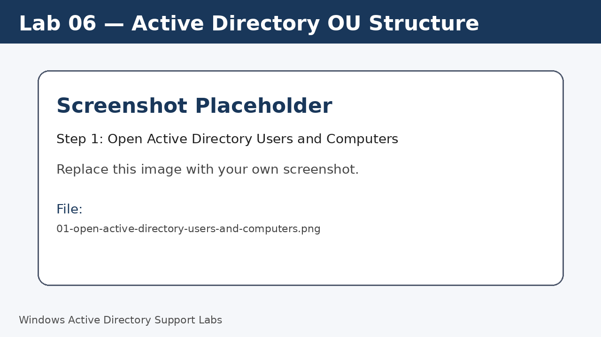
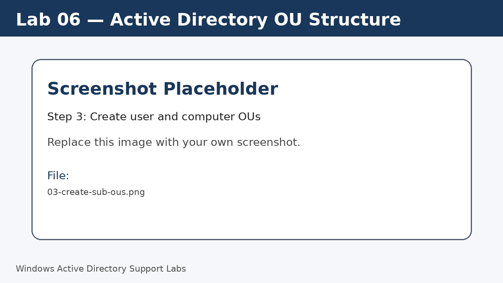
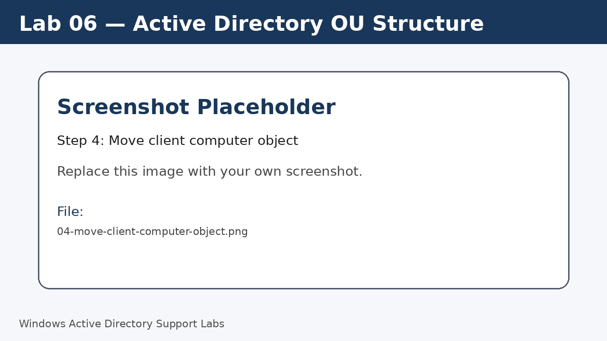
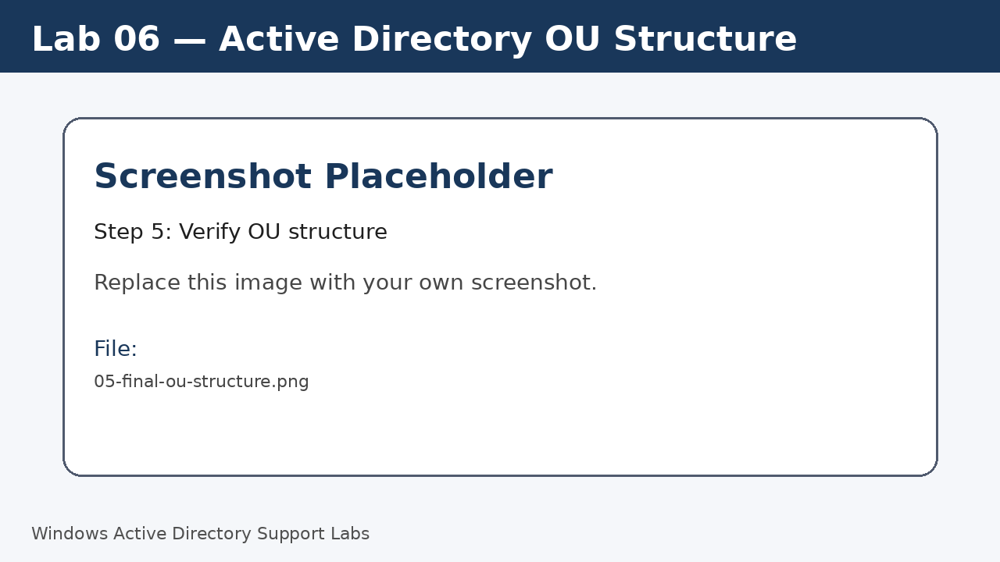

<a id="top"></a>

# Lab 06 — Active Directory OU Structure

<p align="center">
  
  
  
  
  
  
</p>

<p align="center">
  <a href="../05-join-windows-11-client-to-domain/README.md">⬅ Previous Lab</a> | <a href="../../README.md">🏠 Main README</a> | <a href="../07-active-directory-user-management/README.md">Next Lab ➡</a>
</p>

---

## Overview

Create a clean Organizational Unit structure to organize users, computers, groups and administrative objects.

---

## Objectives

- Create top-level and sub-level OUs.
- Organize computer objects.
- Understand why OUs are important for delegation and Group Policy.
- Document a reusable OU layout.

---

## Lab Values

| Item | Value |
|---|---|
| Domain | `corp.local` |
| Top-level OU | `Company` |
| Tool | Active Directory Users and Computers |
| Screenshot folder | `assets/images/lab-06-active-directory-ou-structure/` |

---

## Before You Start

- Complete the previous lab unless this is Lab 01.
- Use a lab environment only.
- Do not publish real passwords or private business information.
- Replace placeholder screenshots with your own screenshots after completing each step.

---

## Screenshot Files

| File name | Step |
|---|---|
| 01-open-active-directory-users-and-computers.png | Open Active Directory Users and Computers |
| 02-create-company-ou.png | Create top-level OU |
| 03-create-sub-ous.png | Create user and computer OUs |
| 04-move-client-computer-object.png | Move client computer object |
| 05-final-ou-structure.png | Verify OU structure |

---

## Step 1 — Open Active Directory Users and Computers

On `SRV-DC01`, open **Server Manager > Tools > Active Directory Users and Computers**.

Screenshot file:

```text
assets/images/lab-06-active-directory-ou-structure/01-open-active-directory-users-and-computers.png
```



[⬆ Back to top](#top)

## Step 2 — Create top-level OU

Right-click the domain and create a new OU named `Company`.

Screenshot file:

```text
assets/images/lab-06-active-directory-ou-structure/02-create-company-ou.png
```


[⬆ Back to top](#top)

## Step 3 — Create user and computer OUs

Inside `Company`, create `Users`, `Computers`, `Groups`, `Service Accounts`, and `Disabled Accounts`.

Screenshot file:

```text
assets/images/lab-06-active-directory-ou-structure/03-create-sub-ous.png
```



[⬆ Back to top](#top)

## Step 4 — Move client computer object

Find `W11-CLIENT01` and move it into `Company > Computers`.

Screenshot file:

```text
assets/images/lab-06-active-directory-ou-structure/04-move-client-computer-object.png
```



[⬆ Back to top](#top)

## Step 5 — Verify OU structure

Refresh ADUC and confirm the final structure.

Run:

```powershell
Get-ADOrganizationalUnit -Filter *
```

Screenshot file:

```text
assets/images/lab-06-active-directory-ou-structure/05-final-ou-structure.png
```



[⬆ Back to top](#top)


---

## Completion Checklist

- [ ] Top-level OU created.
- [ ] User OU created.
- [ ] Computer OU created.
- [ ] Group OU created.
- [ ] Service Accounts OU created.
- [ ] Disabled Accounts OU created.
- [ ] Client computer moved.

---

## Key Takeaways

- OUs are used for organization, delegation and Group Policy targeting.
- A clean OU structure makes administration easier.
- Avoid leaving managed computers in the default Computers container.

---

## Author

**Xuan Toan Nguyen**  
IT Support | Service Desk | Desktop Support | System Administration  
Adelaide, South Australia

- LinkedIn: [www.linkedin.com/in/toan-nguyen-it-oz](https://www.linkedin.com/in/toan-nguyen-it-oz)
- GitHub: [github.com/toannguyenitoz](https://github.com/toannguyenitoz)

---

<p align="center">
  <a href="../05-join-windows-11-client-to-domain/README.md">⬅ Previous Lab</a> | <a href="../../README.md">🏠 Main README</a> | <a href="../07-active-directory-user-management/README.md">Next Lab ➡</a> |
  <a href="#top">⬆ Back to Top</a>
</p>
