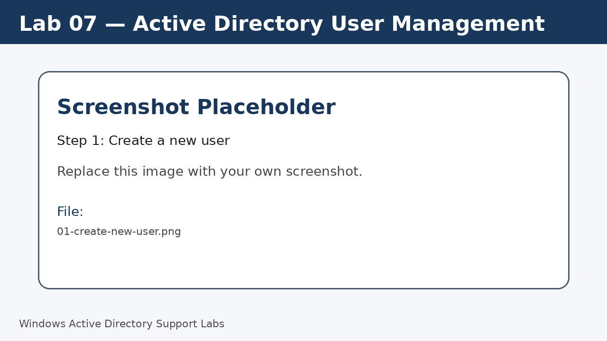
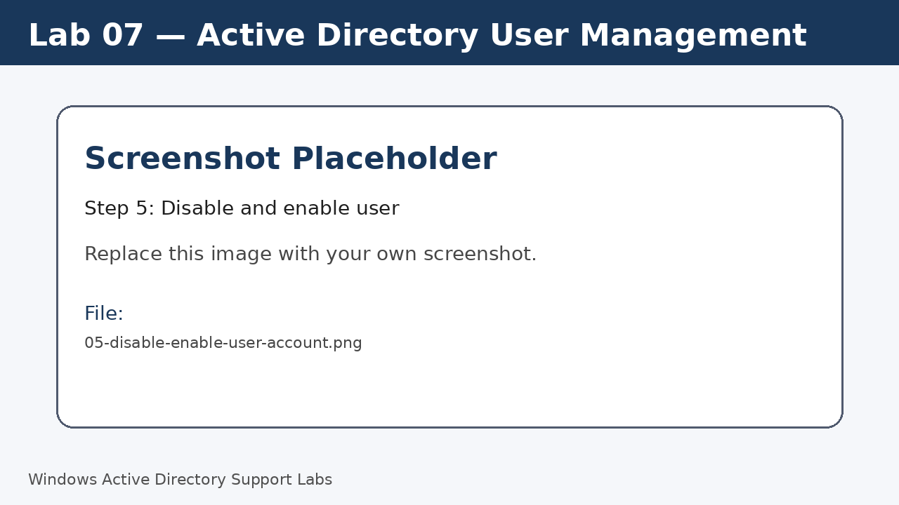

<a id="top"></a>

# Lab 07 — Active Directory User Management

<p align="center">
  
  
  
  
  
  
</p>

<p align="center">
  <a href="../06-active-directory-ou-structure/README.md">⬅ Previous Lab</a> | <a href="../../README.md">🏠 Main README</a> | <a href="../08-active-directory-group-management/README.md">Next Lab ➡</a>
</p>

---

## Overview

Create and manage domain user accounts with common workplace-style user attributes.

---

## Objectives

- Create a test domain user.
- Configure user profile information.
- Test sign-in from Windows 11.
- Disable and enable the account for support practice.

---

## Lab Values

| Item | Value |
|---|---|
| Example user | `j.smith` |
| OU | `Company > Users` |
| Tool | Active Directory Users and Computers |
| Screenshot folder | `assets/images/lab-07-active-directory-user-management/` |

---

## Before You Start

- Complete the previous lab unless this is Lab 01.
- Use a lab environment only.
- Do not publish real passwords or private business information.
- Replace placeholder screenshots with your own screenshots after completing each step.

---

## Screenshot Files

| File name | Step |
|---|---|
| 01-create-new-user.png | Create a new user |
| 02-set-user-password-options.png | Set initial lab password |
| 03-user-properties-general-tab.png | Configure user properties |
| 04-domain-user-login-test.png | Test domain sign-in |
| 05-disable-enable-user-account.png | Disable and enable user |
| 06-powershell-user-check.png | Verify user with PowerShell |

---

## Step 1 — Create a new user

Open ADUC and go to `Company > Users`.

Create a user named John Smith with sign-in name `j.smith`.

Screenshot file:

```text
assets/images/lab-07-active-directory-user-management/01-create-new-user.png
```



[⬆ Back to top](#top)

## Step 2 — Set initial lab password

Set a lab password and choose whether the user must change it at next sign-in.

Do not publish real passwords in screenshots or documentation.

Screenshot file:

```text
assets/images/lab-07-active-directory-user-management/02-set-user-password-options.png
```


[⬆ Back to top](#top)

## Step 3 — Configure user properties

Open the user properties.

Add description, office, telephone, department or job title values.

Screenshot file:

```text
assets/images/lab-07-active-directory-user-management/03-user-properties-general-tab.png
```


[⬆ Back to top](#top)

## Step 4 — Test domain sign-in

Sign in to `W11-CLIENT01` with the new domain account.

Run:

```cmd
whoami
```

Screenshot file:

```text
assets/images/lab-07-active-directory-user-management/04-domain-user-login-test.png
```


[⬆ Back to top](#top)

## Step 5 — Disable and enable user

Disable the user account, test sign-in result, then enable it again.

Screenshot file:

```text
assets/images/lab-07-active-directory-user-management/05-disable-enable-user-account.png
```



[⬆ Back to top](#top)

## Step 6 — Verify user with PowerShell

On the server, confirm the account exists.

Run:

```powershell
Get-ADUser j.smith -Properties Department,Title,Enabled
```

Screenshot file:

```text
assets/images/lab-07-active-directory-user-management/06-powershell-user-check.png
```


[⬆ Back to top](#top)


---

## Completion Checklist

- [ ] New user created.
- [ ] User properties configured.
- [ ] Domain sign-in tested.
- [ ] Disable account tested.
- [ ] Enable account tested.
- [ ] PowerShell check completed.

---

## Key Takeaways

- User objects represent people or service identities in the domain.
- Good descriptions and attributes help support teams identify accounts.
- Disabling is safer than deleting when access should be removed temporarily.

---

## Author

**Xuan Toan Nguyen**  
IT Support | Service Desk | Desktop Support | System Administration  
Adelaide, South Australia

- LinkedIn: [www.linkedin.com/in/toan-nguyen-it-oz](https://www.linkedin.com/in/toan-nguyen-it-oz)
- GitHub: [github.com/toannguyenitoz](https://github.com/toannguyenitoz)

---

<p align="center">
  <a href="../06-active-directory-ou-structure/README.md">⬅ Previous Lab</a> | <a href="../../README.md">🏠 Main README</a> | <a href="../08-active-directory-group-management/README.md">Next Lab ➡</a> |
  <a href="#top">⬆ Back to Top</a>
</p>
