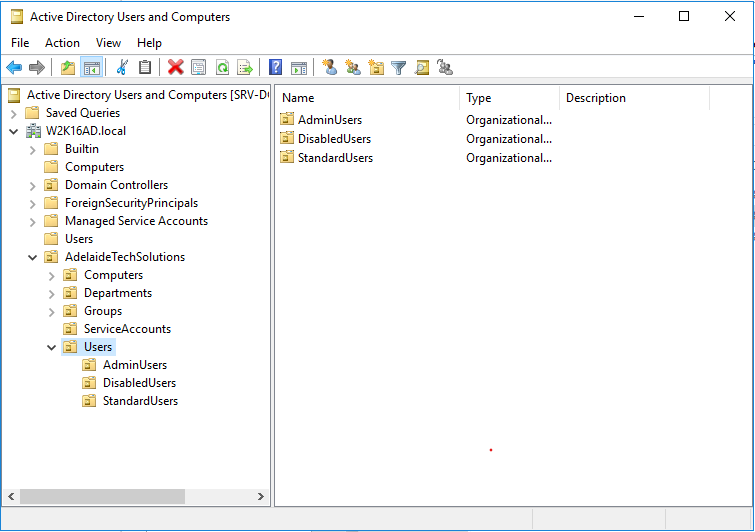
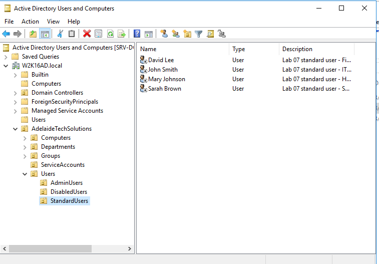
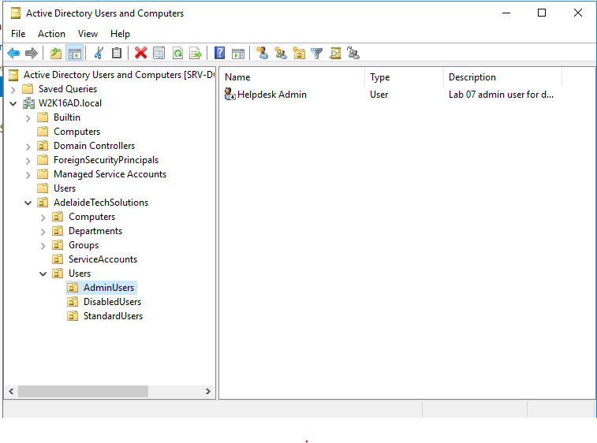
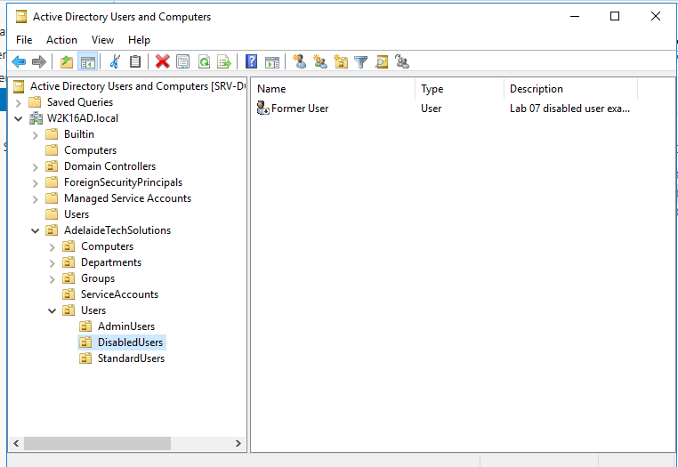
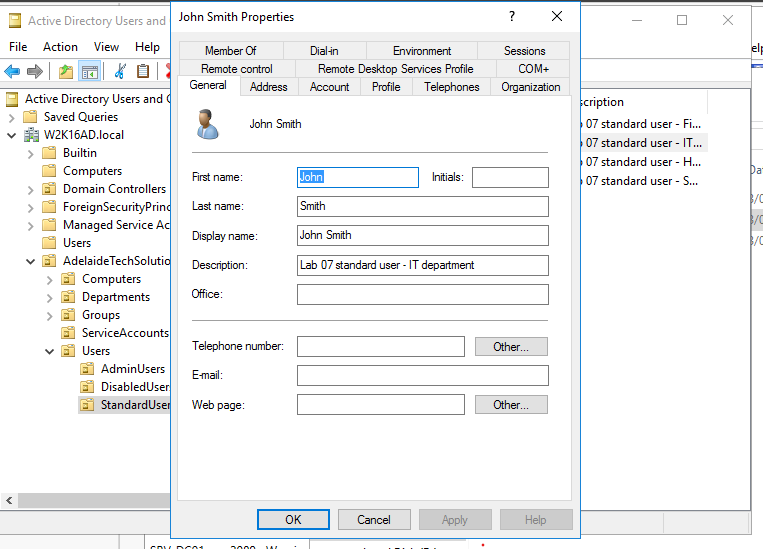
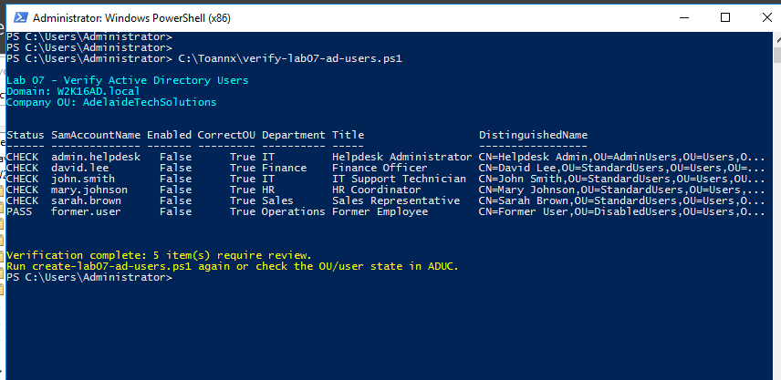

<a id="top"></a>

# 👤 Lab 07 — Active Directory User Management

<p align="center">
  
  
  
  
</p>

<p align="center"><a href="../06-active-directory-ou-structure/README.md">⬅ Previous Lab</a> · <a href="../../README.md">🏠 Main README</a> · <a href="../08-active-directory-group-management/README.md">Next Lab ➜</a></p>

---

## 🎯 Lab Mission

Create and manage sample Active Directory domain users for a small workplace-style environment.

This lab uses **PowerShell automation as the main method** and uses **Active Directory Users and Computers (ADUC)** screenshots as visual evidence.

> [!NOTE]
> The goal is not to screenshot every wizard page. The goal is to demonstrate that users can be created, reviewed, verified and managed using a repeatable script-based workflow.

---

## ✅ What You Will Learn

- Create multiple domain users with PowerShell.
- Place users into the correct OU structure.
- Configure user attributes such as department and job title.
- Create enabled standard users, an admin user and a disabled user example.
- Verify users with PowerShell.
- Review user properties in ADUC.
- Perform common account lifecycle tasks such as disable, enable, reset password and force password change.

---

## 🧱 Lab Values

| Item | Value |
|---|---|
| Domain | `W2K16AD.local` |
| Domain Controller | `SRV-DC01` |
| Company OU | `AdelaideTechSolutions` |
| Standard Users OU | `AdelaideTechSolutions > Users > StandardUsers` |
| Admin Users OU | `AdelaideTechSolutions > Users > AdminUsers` |
| Disabled Users OU | `AdelaideTechSolutions > Users > DisabledUsers` |

---

## 👥 Users Created in This Lab

| User | Username | OU | Department | Title | State |
|---|---|---|---|---|---|
| John Smith | `john.smith` | `StandardUsers` | IT | IT Support Technician | Enabled |
| Mary Johnson | `mary.johnson` | `StandardUsers` | HR | HR Coordinator | Enabled |
| David Lee | `david.lee` | `StandardUsers` | Finance | Finance Officer | Enabled |
| Sarah Brown | `sarah.brown` | `StandardUsers` | Sales | Sales Representative | Enabled |
| Helpdesk Admin | `admin.helpdesk` | `AdminUsers` | IT | Helpdesk Administrator | Enabled |
| Former User | `former.user` | `DisabledUsers` | Operations | Former Employee | Disabled |

---

## 🧩 Before You Start

- Complete **Lab 06 — Active Directory OU Structure**.
- Confirm these OUs exist:

```text
AdelaideTechSolutions > Users > StandardUsers
AdelaideTechSolutions > Users > AdminUsers
AdelaideTechSolutions > Users > DisabledUsers
```

- Sign in to `SRV-DC01` using a domain administrator account.
- Open PowerShell as Administrator.

> [!WARNING]
> Use a lab environment only. Do not publish real passwords, personal information, client data or internal business details.

---

## 🧰 Scripts Used in This Lab

| Script | Purpose |
|---|---|
| [`create-lab07-ad-users.ps1`](../../scripts/create-lab07-ad-users.ps1) | Creates or updates the Lab 07 sample users. |
| [`verify-lab07-ad-users.ps1`](../../scripts/verify-lab07-ad-users.ps1) | Verifies the expected users, OU location and enabled/disabled state. |
| [`manage-lab07-user-lifecycle.ps1`](../../scripts/manage-lab07-user-lifecycle.ps1) | Demonstrates disable, enable, reset password and force password change actions. |

---

# Method 1 — Recommended Script Workflow

This is the preferred workflow for the portfolio version of this lab.

## ⚙️ Step 1 — Run the user creation script

Run on `SRV-DC01`:

```powershell
Set-ExecutionPolicy RemoteSigned -Scope Process
cd D:\Toannx\Github\windows-active-directory-support-labs\scripts
.\create-lab07-ad-users.ps1
```

When prompted, enter a temporary password for the lab users. The password is entered securely and is not stored in the script.

Expected result:

```text
Lab 07 user creation completed.
Created or updated users:
```

---

## 🔍 Step 2 — Verify the users

Run:

```powershell
.\verify-lab07-ad-users.ps1
```

Expected result:

```text
PASS
```

for each expected user.

---

## 🔐 Step 3 — Optional user lifecycle examples

Show a user:

```powershell
.\manage-lab07-user-lifecycle.ps1 -Action Show -SamAccountName john.smith
```

Disable a user:

```powershell
.\manage-lab07-user-lifecycle.ps1 -Action Disable -SamAccountName former.user
```

Enable a user:

```powershell
.\manage-lab07-user-lifecycle.ps1 -Action Enable -SamAccountName former.user
```

Reset a user password:

```powershell
.\manage-lab07-user-lifecycle.ps1 -Action ResetPassword -SamAccountName john.smith
```

Force password change at next logon:

```powershell
.\manage-lab07-user-lifecycle.ps1 -Action ForcePasswordChange -SamAccountName john.smith
```

> [!TIP]
> These commands demonstrate real Service Desk account support tasks without hard-coding passwords into the repository.

---

# Method 2 — GUI Review and Screenshot Evidence

After running the scripts, use ADUC to review and capture evidence.

---

## 🖱️ Step 1 — Open the StandardUsers OU

Open:

```text
Server Manager > Tools > Active Directory Users and Computers
```

Browse to:

```text
W2K16AD.local > AdelaideTechSolutions > Users > StandardUsers
```



---

## 👥 Step 2 — Confirm standard users were created

In `StandardUsers`, confirm these users exist:

```text
John Smith
Mary Johnson
David Lee
Sarah Brown
```



---

## 🛡️ Step 3 — Confirm admin user was created

Browse to:

```text
W2K16AD.local > AdelaideTechSolutions > Users > AdminUsers
```

Confirm this user exists:

```text
Helpdesk Admin
```



---

## ⛔ Step 4 — Confirm disabled user was created

Browse to:

```text
W2K16AD.local > AdelaideTechSolutions > Users > DisabledUsers
```

Confirm this user exists:

```text
Former User
```



> [!TIP]
> The disabled icon in ADUC is useful visual evidence for account status.

---

## 📝 Step 5 — Review a user properties example

Open properties for:

```text
John Smith
```

Review the **Organization** tab and confirm values such as:

```text
Title: IT Support Technician
Department: IT
```



---

## 🧪 Step 6 — Verify users with PowerShell

Run:

```powershell
cd D:\Toannx\Github\windows-active-directory-support-labs\scripts
.\verify-lab07-ad-users.ps1
```

Expected result:

```text
PASS
```

for all Lab 07 users.



---

## 📋 Step 7 — Optional PowerShell user list

Run:

```powershell
Get-ADUser -Filter * -SearchBase "OU=Users,OU=AdelaideTechSolutions,DC=W2K16AD,DC=local" -Properties Department,Title,Enabled |
Select-Object Name,SamAccountName,Department,Title,Enabled |
Sort-Object SamAccountName |
Format-Table -AutoSize
```


---

## 🧯 Troubleshooting

### ActiveDirectory module is not found

Run the scripts on the Domain Controller, or install RSAT tools on an admin workstation.

Check:

```powershell
Get-Module -ListAvailable ActiveDirectory
```

### Required OU not found

Run the Lab 06 OU creation script first:

```powershell
.\create-lab06-ou-structure.ps1
```

### User already exists

This is not an error. The script updates existing users instead of creating duplicates.

### Access is denied

Use a domain administrator account or an account delegated to create and manage users.

### Password does not meet complexity requirements

Use a stronger temporary lab password that meets the domain password policy.

---

## 🧾 Command Reference

| Command | Run on | Purpose | Expected result |
|---|---|---|---|
| `New-ADUser` | Server | Creates AD users | New users appear in ADUC |
| `Set-ADUser` | Server | Updates user attributes | Department, title and settings updated |
| `Disable-ADAccount` | Server | Disables a user account | User cannot sign in |
| `Enable-ADAccount` | Server | Enables a user account | User can sign in again |
| `Set-ADAccountPassword` | Server | Resets password | New temporary password is set |
| `Get-ADUser` | Server | Verifies user details | User details are returned |
| `create-lab07-ad-users.ps1` | Server | Creates or updates lab users | Users created in correct OUs |
| `verify-lab07-ad-users.ps1` | Server | Verifies users | PASS for expected users |
| `manage-lab07-user-lifecycle.ps1` | Server | Performs account support actions | Account state changes as expected |

---

## ✅ Completion Checklist

- [ ] Lab 06 OU structure completed.
- [ ] User creation script reviewed.
- [ ] Lab 07 users created or updated.
- [ ] Standard users confirmed in ADUC.
- [ ] Admin user confirmed in ADUC.
- [ ] Disabled user confirmed in ADUC.
- [ ] User properties reviewed.
- [ ] Users verified with PowerShell.
- [ ] Optional lifecycle management script tested.

---

## 🧠 Key Takeaways

| Key point | Why it matters |
|---|---|
| 1 | Users should be created in the correct OU. |
| 2 | User attributes such as department and title help support and administration. |
| 3 | Disabled user examples are useful for account lifecycle practice. |
| 4 | PowerShell makes user creation repeatable and consistent. |
| 5 | Verification scripts improve documentation and troubleshooting quality. |

---

## 👤 Author

**Xuan Toan Nguyen**  
IT Support | Service Desk | Desktop Support | System Administration  
Adelaide, South Australia

- 🔗 LinkedIn: [www.linkedin.com/in/toan-nguyen-it-oz](https://www.linkedin.com/in/toan-nguyen-it-oz)
- 💻 GitHub: [github.com/toannguyenitoz](https://github.com/toannguyenitoz)

---

<p align="center"><a href="../06-active-directory-ou-structure/README.md">⬅ Previous Lab</a> · <a href="../../README.md">🏠 Main README</a> · <a href="../08-active-directory-group-management/README.md">Next Lab ➜</a> · <a href="#top">⬆ Back to Top</a></p>
