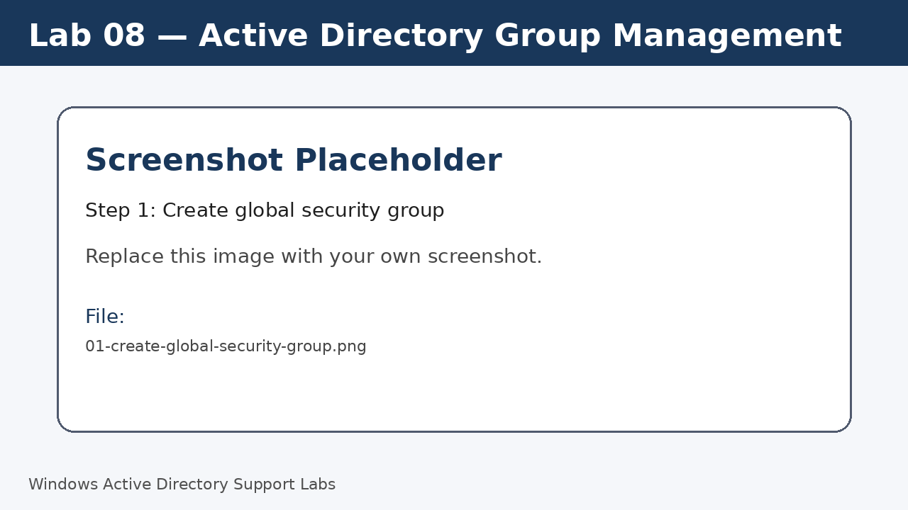
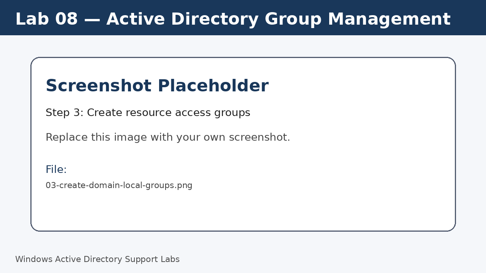
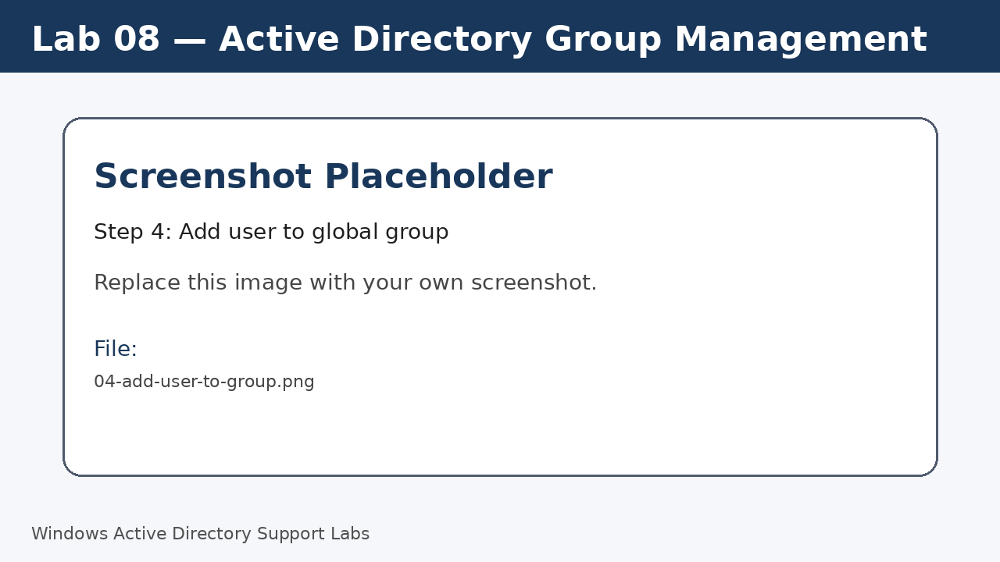
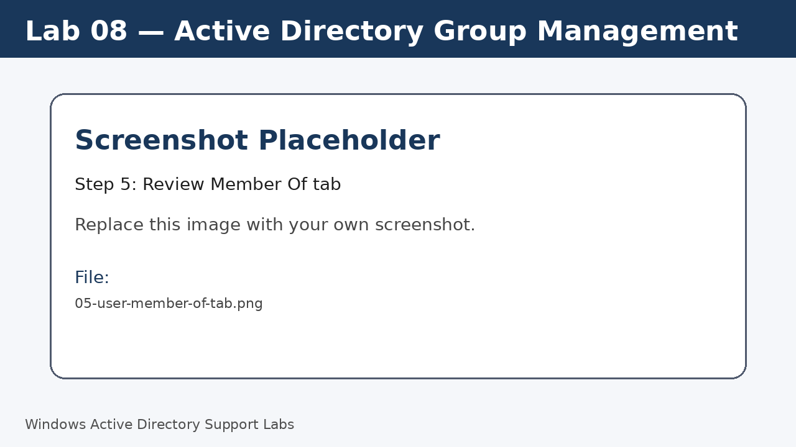
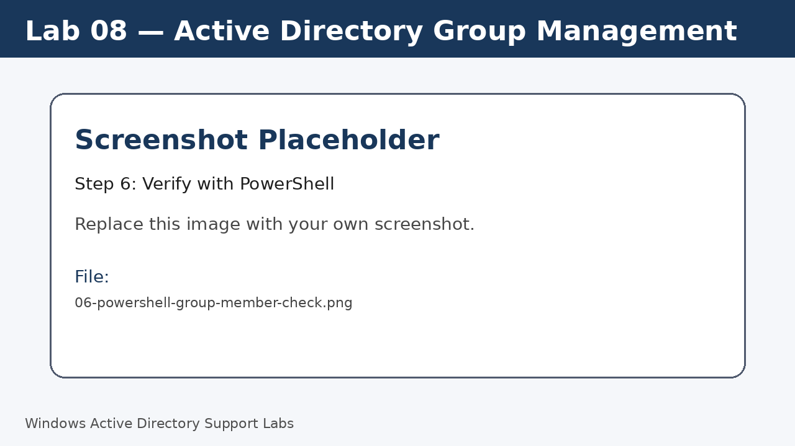

<a id="top"></a>

# Lab 08 — Active Directory Group Management

<p align="center">
  
  
  
  
  
  
</p>

<p align="center">
  <a href="../07-active-directory-user-management/README.md">⬅ Previous Lab</a> | <a href="../../README.md">🏠 Main README</a> | <a href="../09-password-lockout-logon-controls/README.md">Next Lab ➡</a>
</p>

---

## Overview

Create security groups and practice group membership management for scalable access control.

---

## Objectives

- Create global and domain local groups.
- Add users to groups.
- Review Members and Member Of tabs.
- Understand the basic AGDLP access model.

---

## Lab Values

| Item | Value |
|---|---|
| Example global group | `GG_StandardUsers` |
| Example resource group | `DL_SharedData_Read` |
| OU | `Company > Groups` |
| Screenshot folder | `assets/images/lab-08-active-directory-group-management/` |

---

## Before You Start

- Complete the previous lab unless this is Lab 01.
- Use a lab environment only.
- Do not publish real passwords or private business information.
- Replace placeholder screenshots with your own screenshots after completing each step.

---

## Screenshot Files

| File name | Step |
|---|---|
| 01-create-global-security-group.png | Create global security group |
| 02-create-it-support-group.png | Create another role group |
| 03-create-domain-local-groups.png | Create resource access groups |
| 04-add-user-to-group.png | Add user to global group |
| 05-user-member-of-tab.png | Review Member Of tab |
| 06-powershell-group-member-check.png | Verify with PowerShell |

---

## Step 1 — Create global security group

In `Company > Groups`, create `GG_StandardUsers` as a Global Security group.

Screenshot file:

```text
assets/images/lab-08-active-directory-group-management/01-create-global-security-group.png
```



[⬆ Back to top](#top)

## Step 2 — Create another role group

Create `GG_ITSupport` for IT support users.

Screenshot file:

```text
assets/images/lab-08-active-directory-group-management/02-create-it-support-group.png
```


[⬆ Back to top](#top)

## Step 3 — Create resource access groups

Create `DL_SharedData_Read` and `DL_SharedData_Modify` as Domain Local Security groups.

Screenshot file:

```text
assets/images/lab-08-active-directory-group-management/03-create-domain-local-groups.png
```



[⬆ Back to top](#top)

## Step 4 — Add user to global group

Add `j.smith` to `GG_StandardUsers`.

Screenshot file:

```text
assets/images/lab-08-active-directory-group-management/04-add-user-to-group.png
```



[⬆ Back to top](#top)

## Step 5 — Review Member Of tab

Open the user properties and review group membership.

Screenshot file:

```text
assets/images/lab-08-active-directory-group-management/05-user-member-of-tab.png
```



[⬆ Back to top](#top)

## Step 6 — Verify with PowerShell

Check group members.

Run:

```powershell
Get-ADGroupMember GG_StandardUsers
```

Screenshot file:

```text
assets/images/lab-08-active-directory-group-management/06-powershell-group-member-check.png
```



[⬆ Back to top](#top)


---

## Completion Checklist

- [ ] Global groups created.
- [ ] Domain local groups created.
- [ ] User added to group.
- [ ] Membership reviewed in GUI.
- [ ] PowerShell check completed.

---

## Key Takeaways

- Use groups rather than assigning permissions directly to users.
- Global groups can represent roles; domain local groups can represent resource access.
- Group naming standards make support easier.

---

## Author

**Xuan Toan Nguyen**  
IT Support | Service Desk | Desktop Support | System Administration  
Adelaide, South Australia

- LinkedIn: [www.linkedin.com/in/toan-nguyen-it-oz](https://www.linkedin.com/in/toan-nguyen-it-oz)
- GitHub: [github.com/toannguyenitoz](https://github.com/toannguyenitoz)

---

<p align="center">
  <a href="../07-active-directory-user-management/README.md">⬅ Previous Lab</a> | <a href="../../README.md">🏠 Main README</a> | <a href="../09-password-lockout-logon-controls/README.md">Next Lab ➡</a> |
  <a href="#top">⬆ Back to Top</a>
</p>
