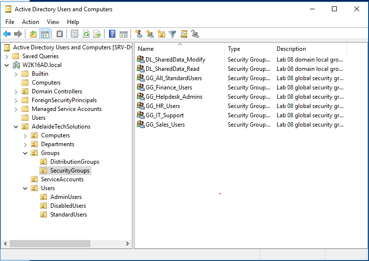
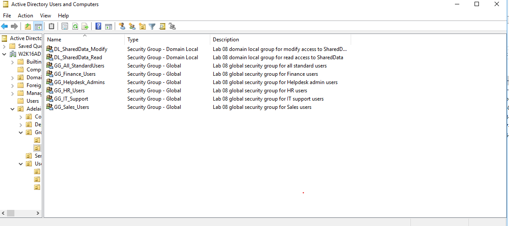
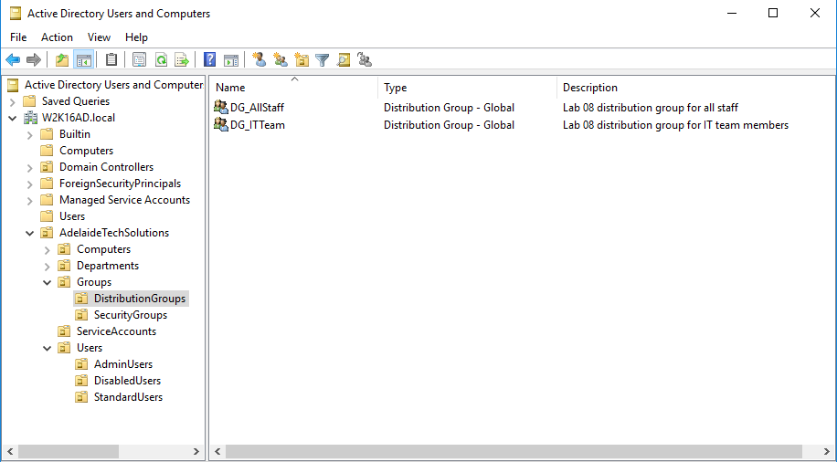
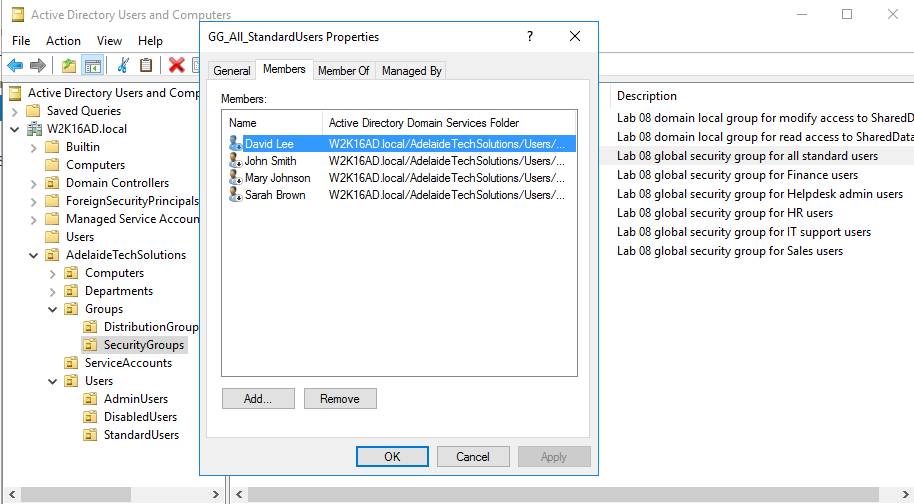
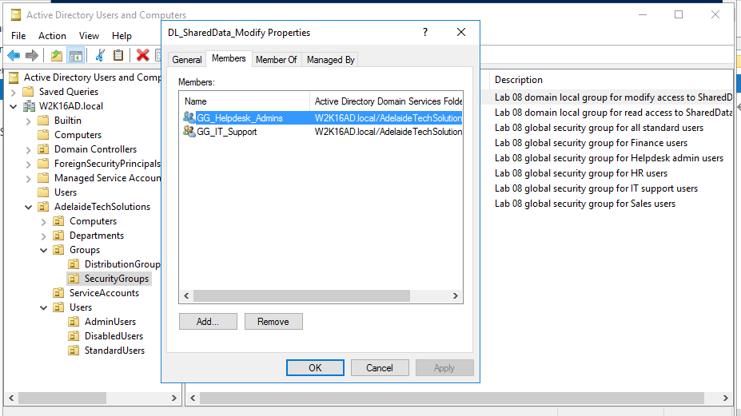
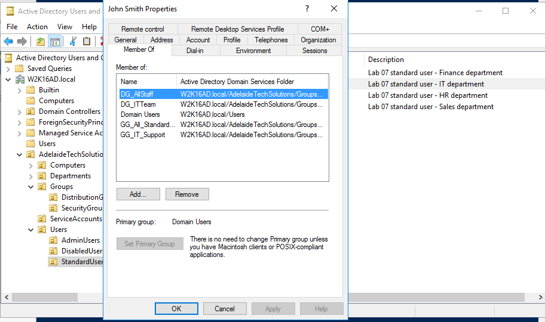
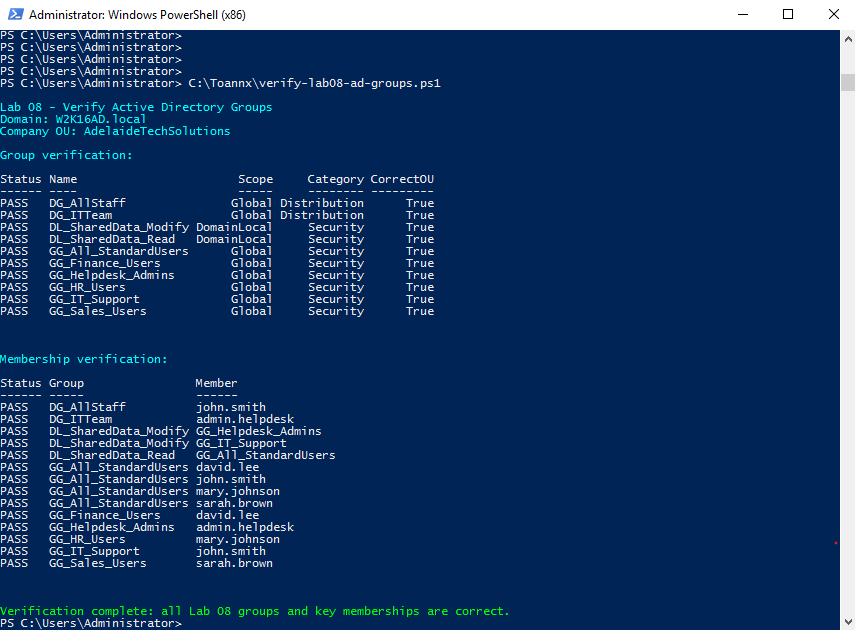
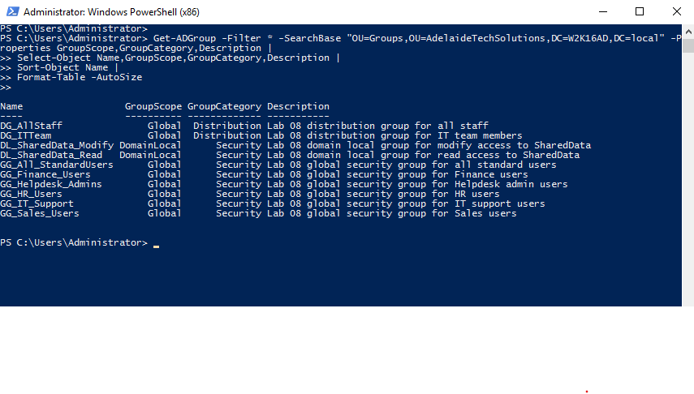

<a id="top"></a>

# 👥 Lab 08 — Active Directory Group Management

<p align="center">
  
  
  
  
</p>

<p align="center"><a href="../07-active-directory-user-management/README.md">⬅ Previous Lab</a> · <a href="../../README.md">🏠 Main README</a> · <a href="../09-password-lockout-logon-controls/README.md">Next Lab ➜</a></p>

---

## 🎯 Lab Mission

Create and manage Active Directory groups for cleaner user access management.

This lab uses **PowerShell automation as the main method** and uses **Active Directory Users and Computers (ADUC)** screenshots as visual evidence.

> [!NOTE]
> The goal is not to screenshot every group creation wizard page. The goal is to demonstrate a repeatable group management workflow using scripts, then review the result in ADUC and PowerShell.

---

## ✅ What You Will Learn

- Create Global Security groups.
- Create Domain Local Security access groups.
- Create Distribution groups.
- Add users to role-based groups.
- Nest Global groups inside Domain Local groups.
- Review membership in ADUC.
- Verify group configuration with PowerShell.
- Practise common group membership support tasks.

---

## 🧱 Lab Values

| Item | Value |
|---|---|
| Domain | `W2K16AD.local` |
| Domain Controller | `SRV-DC01` |
| Company OU | `AdelaideTechSolutions` |
| Security Groups OU | `AdelaideTechSolutions > Groups > SecurityGroups` |
| Distribution Groups OU | `AdelaideTechSolutions > Groups > DistributionGroups` |
| Main user group | `GG_All_StandardUsers` |
| IT support group | `GG_IT_Support` |
| Read access group | `DL_SharedData_Read` |
| Modify access group | `DL_SharedData_Modify` |

---

## 🧠 Naming Standard Used

| Prefix | Meaning | Example |
|---|---|---|
| `GG_` | Global Group, usually contains users | `GG_IT_Support` |
| `DL_` | Domain Local Group, usually assigned permissions | `DL_SharedData_Read` |
| `DG_` | Distribution Group, used for email-style grouping examples | `DG_AllStaff` |

> [!TIP]
> This lab follows a simple AGDLP-style idea: users go into Global groups, Global groups go into Domain Local groups, and Domain Local groups are later used for permissions.

---

## 👥 Groups Created in This Lab

| Group | Scope | Category | Purpose |
|---|---|---|---|
| `GG_All_StandardUsers` | Global | Security | Holds all standard users |
| `GG_IT_Support` | Global | Security | Holds IT support users |
| `GG_HR_Users` | Global | Security | Holds HR users |
| `GG_Finance_Users` | Global | Security | Holds Finance users |
| `GG_Sales_Users` | Global | Security | Holds Sales users |
| `GG_Helpdesk_Admins` | Global | Security | Holds helpdesk admin users |
| `DL_SharedData_Read` | Domain Local | Security | Used later for shared folder read access |
| `DL_SharedData_Modify` | Domain Local | Security | Used later for shared folder modify access |
| `DG_AllStaff` | Global | Distribution | All staff distribution example |
| `DG_ITTeam` | Global | Distribution | IT team distribution example |

---

## 🧩 Before You Start

- Complete **Lab 06 — Active Directory OU Structure**.
- Complete **Lab 07 — Active Directory User Management**.
- Confirm these OUs exist:

```text
AdelaideTechSolutions > Groups > SecurityGroups
AdelaideTechSolutions > Groups > DistributionGroups
```

- Confirm Lab 07 users exist:

```text
john.smith
mary.johnson
david.lee
sarah.brown
admin.helpdesk
```

- Sign in to `SRV-DC01` using a domain administrator account.
- Open PowerShell as Administrator.
- Open PowerShell from the repository root folder, or change directory to the repository root before running scripts.

> [!WARNING]
> Use a lab environment only. Do not publish real passwords, personal information, client data or internal business details.

---

## 🧰 Scripts Used in This Lab

| Script | Purpose |
|---|---|
| [`create-lab08-ad-groups.ps1`](../../scripts/create-lab08-ad-groups.ps1) | Creates or updates Lab 08 groups and memberships. |
| [`verify-lab08-ad-groups.ps1`](../../scripts/verify-lab08-ad-groups.ps1) | Verifies groups, scope, category, OU location and key memberships. |
| [`manage-lab08-group-membership.ps1`](../../scripts/manage-lab08-group-membership.ps1) | Demonstrates show, add and remove group membership actions. |

> [!TIP]
> The examples below avoid fixed local drive paths. They assume you are already in the repository root folder. This makes the guide portable on any drive or computer.

---

# Method 1 — Recommended Script Workflow

This is the preferred workflow for the portfolio version of this lab.

## ⚙️ Step 1 — Create groups and memberships

Run on `SRV-DC01` from the repository root folder:

```powershell
Set-ExecutionPolicy RemoteSigned -Scope Process
Set-Location .\scripts
.\create-lab08-ad-groups.ps1
```

Expected result:

```text
Lab 08 group creation and membership setup completed.
```

---

## 🔍 Step 2 — Verify groups and memberships

Run from the `scripts` folder:

```powershell
.\verify-lab08-ad-groups.ps1
```

Expected result:

```text
PASS
```

for expected groups and key memberships.

---

## 🔐 Step 3 — Optional group membership management examples

Show group members:

```powershell
.\manage-lab08-group-membership.ps1 -Action ShowGroup -GroupName GG_All_StandardUsers
```

Show a user's groups:

```powershell
.\manage-lab08-group-membership.ps1 -Action ShowUser -MemberName john.smith
```

Add a member:

```powershell
.\manage-lab08-group-membership.ps1 -Action AddMember -GroupName GG_IT_Support -MemberName john.smith
```

Remove a member:

```powershell
.\manage-lab08-group-membership.ps1 -Action RemoveMember -GroupName GG_IT_Support -MemberName john.smith
```

> [!TIP]
> These commands demonstrate common Service Desk and junior System Administrator group membership tasks.

---

# Method 2 — GUI Review and Screenshot Evidence

After running the scripts, use ADUC to review and capture evidence.

---

## 🖱️ Step 1 — Open the SecurityGroups OU

Open:

```text
Server Manager > Tools > Active Directory Users and Computers
```

Browse to:

```text
W2K16AD.local > AdelaideTechSolutions > Groups > SecurityGroups
```



---

## 🛡️ Step 2 — Confirm security groups were created

In `SecurityGroups`, confirm groups such as:

```text
GG_All_StandardUsers
GG_IT_Support
GG_HR_Users
GG_Finance_Users
GG_Sales_Users
GG_Helpdesk_Admins
DL_SharedData_Read
DL_SharedData_Modify
```



---

## 📧 Step 3 — Confirm distribution groups were created

Browse to:

```text
W2K16AD.local > AdelaideTechSolutions > Groups > DistributionGroups
```

Confirm groups such as:

```text
DG_AllStaff
DG_ITTeam
```



---

## 👤 Step 4 — Review members of a Global group

Open properties for:

```text
GG_All_StandardUsers
```

Review the **Members** tab and confirm users such as:

```text
John Smith
Mary Johnson
David Lee
Sarah Brown
```



---

## 🔁 Step 5 — Review nested group membership

Open properties for:

```text
DL_SharedData_Modify
```

Review the **Members** tab and confirm nested groups such as:

```text
GG_IT_Support
GG_Helpdesk_Admins
```



> [!TIP]
> This shows the AGDLP-style model: user accounts are placed in Global groups, and Global groups are nested into Domain Local access groups.

---

## 👥 Step 6 — Review a user's Member Of tab

Open properties for:

```text
John Smith
```

Review the **Member Of** tab and confirm memberships such as:

```text
GG_All_StandardUsers
GG_IT_Support
DG_AllStaff
DG_ITTeam
```



---

## 🧪 Step 7 — Verify groups with PowerShell

From the repository root folder, run:

```powershell
Set-Location .\scripts
.\verify-lab08-ad-groups.ps1
```

Expected result:

```text
PASS
```

for group and membership checks.



---

## 📋 Step 8 — Optional PowerShell group list

Run:

```powershell
Get-ADGroup -Filter * -SearchBase "OU=Groups,OU=AdelaideTechSolutions,DC=W2K16AD,DC=local" -Properties GroupScope,GroupCategory,Description |
Select-Object Name,GroupScope,GroupCategory,Description |
Sort-Object Name |
Format-Table -AutoSize
```



---

## 🧯 Troubleshooting

### ActiveDirectory module is not found

Run the scripts on the Domain Controller, or install RSAT tools on an admin workstation.

Check:

```powershell
Get-Module -ListAvailable ActiveDirectory
```

### Required OU not found

Run the Lab 06 OU creation script first from the `scripts` folder:

```powershell
.\create-lab06-ou-structure.ps1
```

### User not found

Run the Lab 07 user creation script first from the `scripts` folder:

```powershell
.\create-lab07-ad-users.ps1
```

### Group already exists

This is not an error. The script updates existing group descriptions and skips duplicate membership.

### Access is denied

Use a domain administrator account or an account delegated to manage groups and group membership.

---

## 🧾 Command Reference

| Command | Run on | Purpose | Expected result |
|---|---|---|---|
| `New-ADGroup` | Server | Creates AD groups | Groups appear in ADUC |
| `Set-ADGroup` | Server | Updates group attributes | Description updated |
| `Add-ADGroupMember` | Server | Adds users or groups to groups | Membership appears in ADUC |
| `Remove-ADGroupMember` | Server | Removes group members | Membership removed |
| `Get-ADGroup` | Server | Lists group details | Group details returned |
| `Get-ADGroupMember` | Server | Lists group members | Users or nested groups shown |
| `Get-ADPrincipalGroupMembership` | Server | Shows user group membership | User memberships shown |
| `create-lab08-ad-groups.ps1` | Server | Creates groups and memberships | Groups created in correct OUs |
| `verify-lab08-ad-groups.ps1` | Server | Verifies groups and memberships | PASS for expected checks |
| `manage-lab08-group-membership.ps1` | Server | Performs membership support actions | Membership changes as expected |

---

## ✅ Completion Checklist

- [ ] Lab 06 OU structure completed.
- [ ] Lab 07 users created.
- [ ] Group creation script reviewed.
- [ ] Security groups created.
- [ ] Distribution groups created.
- [ ] Users added to Global groups.
- [ ] Global groups nested into Domain Local groups.
- [ ] Group membership reviewed in ADUC.
- [ ] User membership reviewed in ADUC.
- [ ] Groups and memberships verified with PowerShell.
- [ ] Optional membership management script tested.

---

## 🧠 Key Takeaways

| Key point | Why it matters |
|---|---|
| 1 | Groups make permission management easier and more scalable. |
| 2 | Naming standards help support staff understand group purpose. |
| 3 | Global groups are useful for grouping users by role or department. |
| 4 | Domain Local groups are useful for assigning access permissions. |
| 5 | PowerShell makes group creation and membership management repeatable. |

---

## 👤 Author

**Xuan Toan Nguyen**  
IT Support | Service Desk | Desktop Support | System Administration  
Adelaide, South Australia

- 🔗 LinkedIn: [www.linkedin.com/in/toan-nguyen-it-oz](https://www.linkedin.com/in/toan-nguyen-it-oz)
- 💻 GitHub: [github.com/toannguyenitoz](https://github.com/toannguyenitoz)

---

<p align="center"><a href="../07-active-directory-user-management/README.md">⬅ Previous Lab</a> · <a href="../../README.md">🏠 Main README</a> · <a href="../09-password-lockout-logon-controls/README.md">Next Lab ➜</a> · <a href="#top">⬆ Back to Top</a></p>
