<a id="top"></a>

# 🔐 Lab 09 — Password, Lockout and Logon Controls

<p align="center">
  
  
  
  
  
</p>

<p align="center">
  <strong>Hands-on Active Directory user guide for password policy, account lockout, password reset, account enable/disable and account unlock workflows.</strong>
</p>

<p align="center">
  <a href="../08-active-directory-group-management/README.md">⬅ Previous Lab</a> ·
  <a href="../../README.md">🏠 Main README</a> ·
  <a href="../10-home-folder-and-file-share/README.md">Next Lab ➜</a>
</p>

---

## 🎯 Lab Mission

This lab demonstrates how an IT Support, Service Desk or junior System Administrator can manage common Active Directory account support tasks in a Windows domain environment.

The guide is written as a practical user guide. Follow the GUI steps first to understand the real support workflow, then use PowerShell to verify and automate the same tasks.

This lab covers:

- Reviewing a domain password policy
- Reviewing an account lockout policy
- Reviewing an Active Directory user account
- Resetting a user password
- Forcing password change at next logon
- Disabling and enabling a user account
- Simulating an account lockout from a Windows 11 domain client
- Verifying a locked account in Active Directory Users and Computers
- Unlocking a locked account
- Verifying account state and policy settings with PowerShell

> [!NOTE]
> This is a lab environment. In a real workplace, password resets, unlock requests and account access changes must follow identity verification, approval and audit procedures.

---

## 🧱 Lab Environment

| Component | Value |
|---|---|
| Domain | `W2K16AD.local` |
| NetBIOS name | `W2K16AD` |
| Domain Controller | `SRV-DC01` |
| Windows Client | `W11-CLIENT01` |
| Server IP | `192.168.20.10` |
| Client IP | `192.168.20.101` |
| Root OU | `AdelaideTechSolutions` |
| Test user | `lockout.test` |
| Test user display name | `Lockout Test User` |
| Test user OU | `AdelaideTechSolutions > Users > StandardUsers` |

---

## ✅ Skills Demonstrated

| Area | Skills |
|---|---|
| Active Directory Administration | Review user properties, reset passwords, disable users, enable users and unlock accounts |
| Group Policy Management | Review password policy and account lockout policy in Default Domain Policy |
| Service Desk Support | Handle locked account and password reset scenarios |
| Windows Client Testing | Simulate failed logon attempts from a domain-joined Windows 11 client |
| PowerShell Administration | Verify domain password policy and user account state |
| Documentation | Capture visual evidence and document a support workflow |

---

## 🔐 Lab Policy Settings

The lab uses the following password and lockout settings.

| Setting | Lab value |
|---|---|
| Password complexity | Enabled |
| Minimum password length | `10` |
| Password history | `5` |
| Maximum password age | `90 days` |
| Minimum password age | `0 days` |
| Lockout threshold | `5 invalid logon attempts` |
| Lockout duration | `15 minutes` |
| Reset account lockout counter after | `15 minutes` |

> [!WARNING]
> Do not apply these settings directly to a production domain without business approval and security review. This lab is for training and portfolio demonstration only.

---

## 🧩 Before You Start

Complete these earlier labs first:

| Required lab | Purpose |
|---|---|
| Lab 04 — Active Directory Domain Services Setup | Domain Controller is available |
| Lab 05 — Join Windows 11 Client to Domain | Windows 11 client can test domain logon |
| Lab 06 — Active Directory OU Structure | Required OU structure exists |
| Lab 07 — Active Directory User Management | User management basics completed |
| Lab 08 — Active Directory Group Management | Account support context completed |

Confirm this OU exists:

```text
W2K16AD.local
└── AdelaideTechSolutions
    └── Users
        └── StandardUsers
```

Sign in to `SRV-DC01` with a domain administrator account.

---

# Method 1 — GUI User Guide

This is the main hands-on workflow for the lab. It follows how a Service Desk Analyst or junior System Administrator would review and support a user account using Windows administrative tools.

---

## Step 01 — Open Active Directory Users and Computers and Verify the Test User

### Purpose

Before changing password or lockout settings, first confirm that the test user exists in Active Directory and is located in the expected OU.

### Steps

1. Sign in to `SRV-DC01` using a domain administrator account.
2. Open **Server Manager**.
3. Select **Tools** from the top-right menu.
4. Select **Active Directory Users and Computers**.
5. In the left pane, expand the domain:

```text
W2K16AD.local
```

6. Browse to the target OU:

```text
AdelaideTechSolutions
└── Users
    └── StandardUsers
```

7. In the right pane, confirm that this user exists:

```text
Lockout Test User
```

8. Confirm that the logon name for the test user is:

```text
lockout.test
```

### Expected Result

The user `Lockout Test User` is visible under the `StandardUsers` OU and is ready for password reset, enable/disable and lockout testing.

### Visual Reference

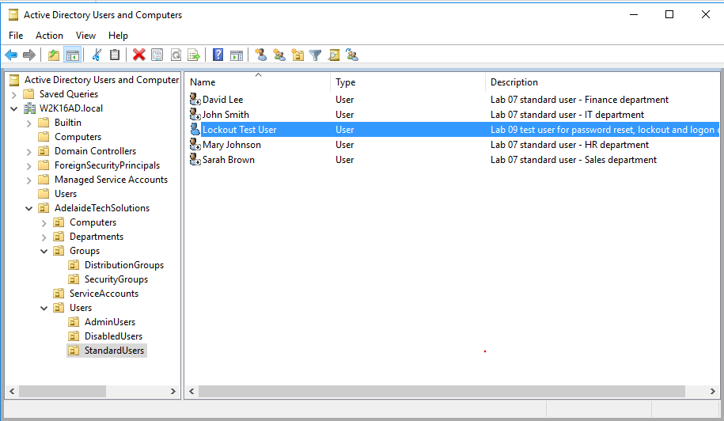

<p align="right"><a href="#top">⬆ Back to Top</a></p>

---

## Step 02 — Review the Domain Password Policy

### Purpose

The Password Policy controls password rules for domain users, such as minimum password length, password history and complexity requirements.

### Steps

1. On `SRV-DC01`, open **Server Manager**.
2. Select **Tools**.
3. Open **Group Policy Management**.
4. In the left pane, expand:

```text
Forest: W2K16AD.local
└── Domains
    └── W2K16AD.local
```

5. Right-click **Default Domain Policy**.
6. Select **Edit**.
7. In **Group Policy Management Editor**, browse to:

```text
Computer Configuration
└── Policies
    └── Windows Settings
        └── Security Settings
            └── Account Policies
                └── Password Policy
```

8. Review the following policy items:

| Policy item | What to check |
|---|---|
| Enforce password history | Confirms how many old passwords are remembered |
| Maximum password age | Confirms when users must change passwords |
| Minimum password age | Confirms how soon users can change passwords again |
| Minimum password length | Confirms the minimum allowed password length |
| Password must meet complexity requirements | Confirms complexity is enabled |
| Store passwords using reversible encryption | Should normally remain disabled |

### Expected Result

The Password Policy is visible and shows the configured domain password requirements.

### Visual Reference

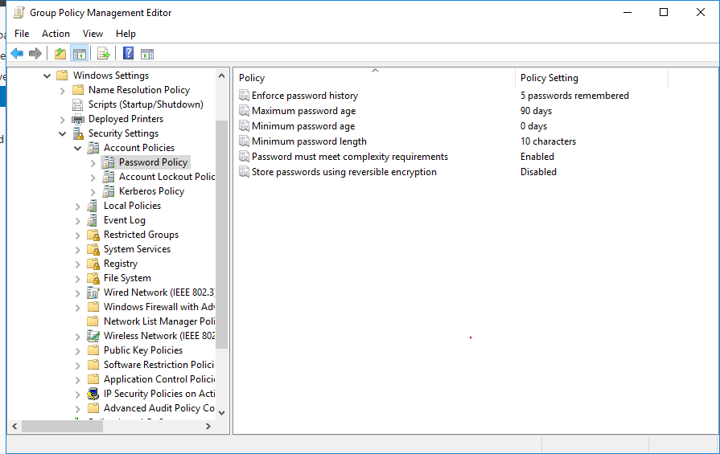

<p align="right"><a href="#top">⬆ Back to Top</a></p>

---

## Step 03 — Review the Account Lockout Policy

### Purpose

The Account Lockout Policy controls what happens when a user enters the wrong password multiple times. This helps protect accounts from repeated failed sign-in attempts.

### Steps

1. Continue in **Group Policy Management Editor**.
2. Browse to:

```text
Computer Configuration
└── Policies
    └── Windows Settings
        └── Security Settings
            └── Account Policies
                └── Account Lockout Policy
```

3. Review these policy items:

| Policy item | Lab value | Meaning |
|---|---:|---|
| Account lockout threshold | `5 invalid logon attempts` | User account locks after 5 failed attempts |
| Account lockout duration | `15 minutes` | Account remains locked for 15 minutes unless unlocked by an administrator |
| Reset account lockout counter after | `15 minutes` | Failed attempt counter resets after 15 minutes |

4. Confirm that the values match the lab design.
5. Close **Group Policy Management Editor** when finished.

### Expected Result

The domain is configured to lock the account after repeated incorrect password attempts.

### Visual Reference

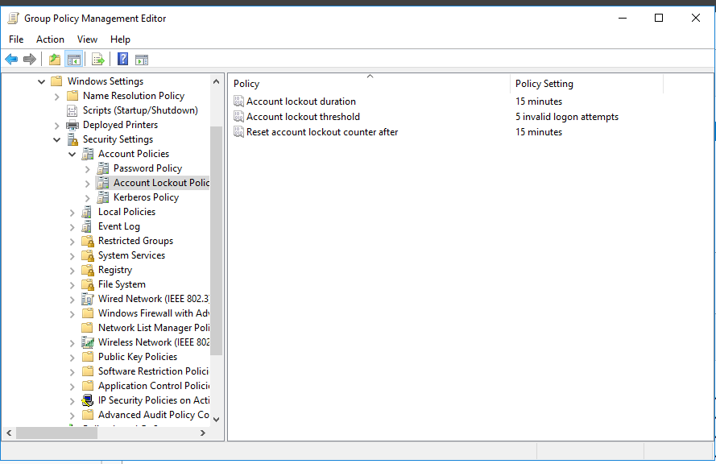

<p align="right"><a href="#top">⬆ Back to Top</a></p>

---

## Step 04 — Review the Test User Account Tab

### Purpose

The Account tab in ADUC is used to review the user logon name, account options, logon restrictions, account expiry and lockout state.

### Steps

1. Open **Active Directory Users and Computers**.
2. Browse to:

```text
W2K16AD.local
└── AdelaideTechSolutions
    └── Users
        └── StandardUsers
```

3. Right-click **Lockout Test User**.
4. Select **Properties**.
5. Open the **Account** tab.
6. Review the **User logon name** field.
7. Confirm the username is:

```text
lockout.test
```

8. Review the **Account options** section.
9. Review the **Account expires** section.
10. Check whether the **Unlock account** option is currently available or greyed out.

### Expected Result

The Account tab shows the user logon name and account options. At this point, the account should not be locked.

### Visual Reference

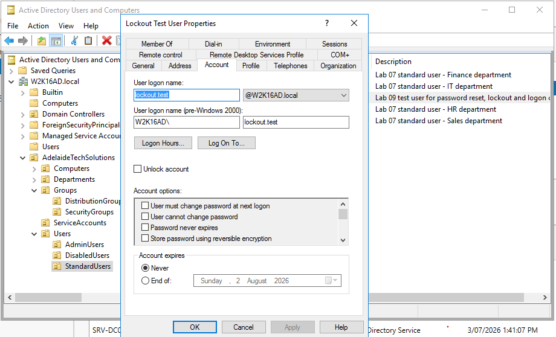

<p align="right"><a href="#top">⬆ Back to Top</a></p>

---

## Step 05 — Reset the User Password

### Purpose

Password reset is one of the most common Service Desk tasks. In this lab, the password reset is performed from ADUC and the user is required to change the password at next logon.

### Steps

1. In **Active Directory Users and Computers**, browse to:

```text
AdelaideTechSolutions
└── Users
    └── StandardUsers
```

2. Right-click **Lockout Test User**.
3. Select **Reset Password...**.
4. Enter a temporary lab password.
5. Re-enter the same temporary password in the confirmation field.
6. Select:

```text
User must change password at next logon
```

7. Select **OK**.
8. Confirm the success message if prompted.

### Important Notes

- Do not use a real personal password in a lab document.
- Do not publish passwords in repository images.
- In a real workplace, verify the user's identity before resetting the password.

### Expected Result

The password is reset successfully and the user must change the password at next sign-in.

### Visual Reference

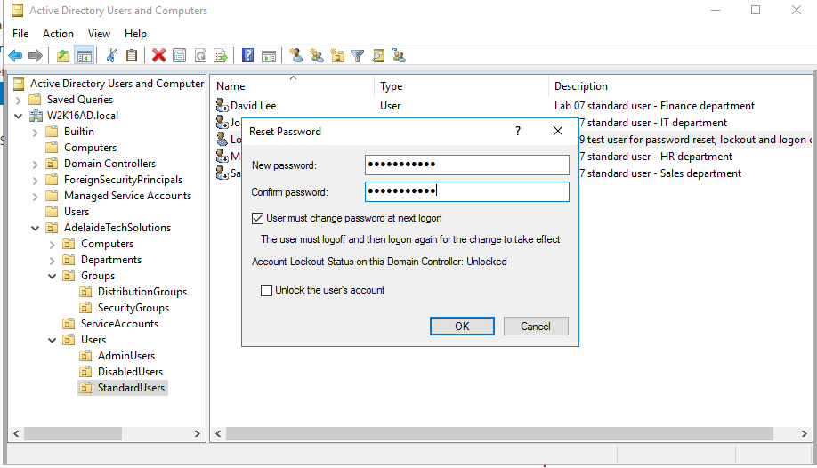

<p align="right"><a href="#top">⬆ Back to Top</a></p>

---

## Step 06 — Disable the User Account

### Purpose

Disabling an account is commonly used when access needs to be temporarily blocked, such as during security review, employee leave or account investigation.

### Steps

1. In **Active Directory Users and Computers**, browse to the test user.
2. Right-click **Lockout Test User**.
3. Select **Disable Account**.
4. Confirm the action if prompted.
5. Review the user icon in ADUC.

### Expected Result

The user account is disabled. In ADUC, the user icon changes to show that the account is disabled.

### Visual Reference

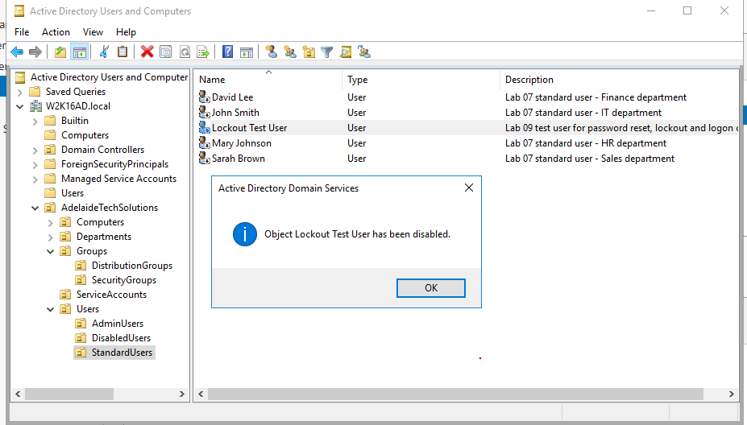

<p align="right"><a href="#top">⬆ Back to Top</a></p>

---

## Step 07 — Enable the User Account

### Purpose

After confirming the disable workflow, enable the user again so the account can be used for the lockout test.

### Steps

1. In **Active Directory Users and Computers**, locate **Lockout Test User**.
2. Right-click the user.
3. Select **Enable Account**.
4. Confirm the success message if prompted.
5. Review the user icon again.

### Expected Result

The user account is enabled again and no longer shows as disabled in ADUC.

### Visual Reference

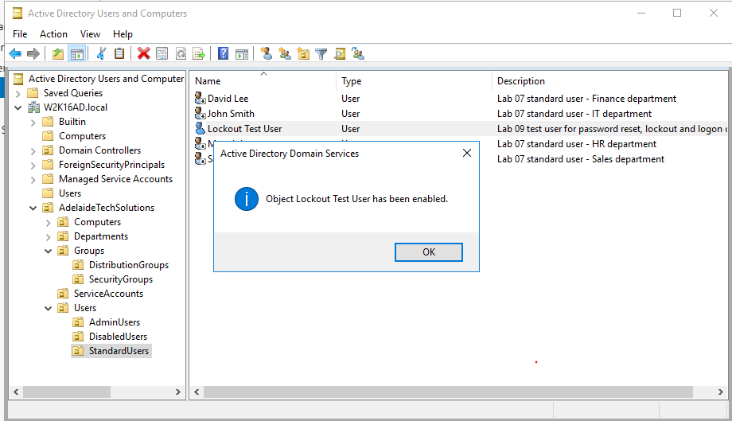

<p align="right"><a href="#top">⬆ Back to Top</a></p>

---

## Step 08 — Test Account Lockout from the Windows 11 Client

### Purpose

This step simulates a real support scenario where a user enters the wrong password multiple times and becomes locked out.

### Steps

1. Go to `W11-CLIENT01`.
2. Sign out of the current session, or lock the Windows client.
3. At the Windows sign-in screen, select **Other user** if required.
4. Enter the domain username:

```text
W2K16AD\lockout.test
```

or:

```text
lockout.test@W2K16AD.local
```

5. Enter an incorrect password.
6. Repeat the incorrect password attempt until the failed attempt count reaches the lockout threshold.
7. In this lab, the threshold is:

```text
5 invalid logon attempts
```

8. Wait for Windows to display the locked account message.

### Expected Result

Windows displays a message similar to:

```text
The referenced account is currently locked out and may not be logged on to.
```

This confirms the lockout policy is working from the client side.

### Visual Reference

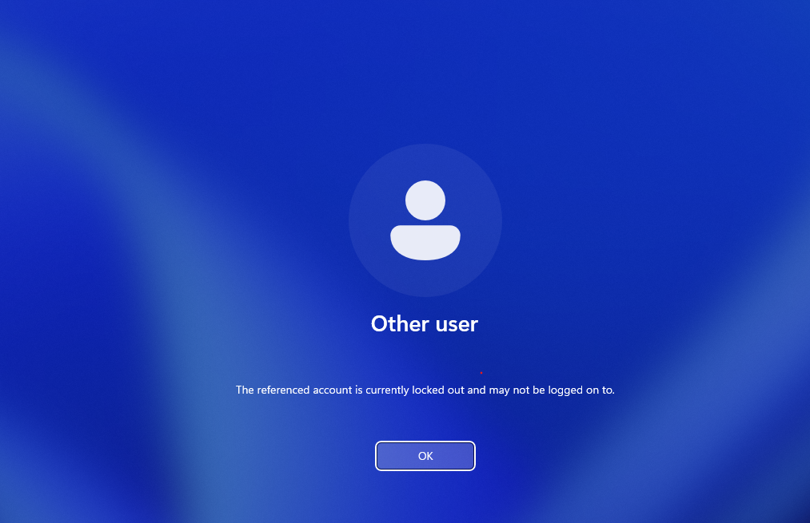

<p align="right"><a href="#top">⬆ Back to Top</a></p>

---

## Step 09 — Verify the Locked Account in ADUC

### Purpose

After the failed logon test, verify the locked state from the Domain Controller using ADUC.

### Steps

1. Return to `SRV-DC01`.
2. Open **Active Directory Users and Computers**.
3. Browse to:

```text
AdelaideTechSolutions
└── Users
    └── StandardUsers
```

4. Right-click **Lockout Test User**.
5. Select **Properties**.
6. Open the **Account** tab.
7. Look for the unlock option.

### Expected Result

The Account tab shows that the account is currently locked out. The unlock option is available and indicates that the account is locked on the Active Directory Domain Controller.

Expected text is similar to:

```text
Unlock account. This account is currently locked out on this Active Directory Domain Controller.
```

### Visual Reference

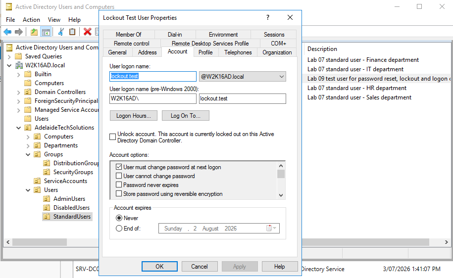

<p align="right"><a href="#top">⬆ Back to Top</a></p>

---

## Step 10 — Unlock the Account in ADUC

### Purpose

This step restores access for the locked user account. This is a common Service Desk task after confirming the user identity and the reason for the lockout.

### Steps

1. Stay on the **Account** tab for **Lockout Test User**.
2. Select the unlock option shown in the Account tab.
3. Click **Apply**.
4. Click **OK**.
5. Reopen the user properties if needed and confirm the account is no longer locked.

### Expected Result

The user account is unlocked and can attempt sign-in again.

### Visual Reference

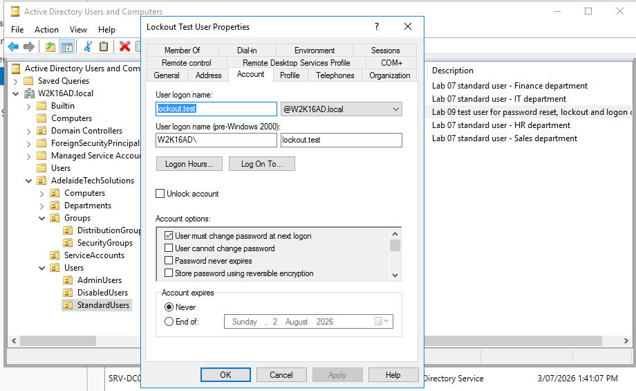

<p align="right"><a href="#top">⬆ Back to Top</a></p>

---

## Step 11 — Verify the User Account State with PowerShell

### Purpose

PowerShell verification confirms the final account state after the GUI unlock action.

### Steps

1. On `SRV-DC01`, open **PowerShell** as Administrator.
2. Run:

```powershell
Get-ADUser lockout.test -Properties LockedOut,Enabled |
Select-Object Name,Enabled,LockedOut
```

3. Review the `Enabled` value.
4. Review the `LockedOut` value.

### Expected Result

The user is enabled and not locked.

```text
Name               Enabled  LockedOut
----               -------  ---------
Lockout Test User  True     False
```

### Visual Reference

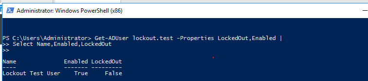

<p align="right"><a href="#top">⬆ Back to Top</a></p>

---

## Step 12 — Verify the Domain Password Policy with PowerShell

### Purpose

This final verification confirms the domain password and lockout settings from PowerShell.

### Steps

1. On `SRV-DC01`, open **PowerShell**.
2. Run:

```powershell
Get-ADDefaultDomainPasswordPolicy
```

3. Review the following values:

| Value | Purpose |
|---|---|
| ComplexityEnabled | Shows whether complexity is enabled |
| MinPasswordLength | Shows minimum password length |
| PasswordHistoryCount | Shows password history count |
| MaxPasswordAge | Shows password expiry period |
| LockoutThreshold | Shows failed attempts before lockout |
| LockoutDuration | Shows how long the account remains locked |
| LockoutObservationWindow | Shows when the failed attempt counter resets |

### Expected Result

PowerShell displays the configured domain password and lockout settings.

### Visual Reference

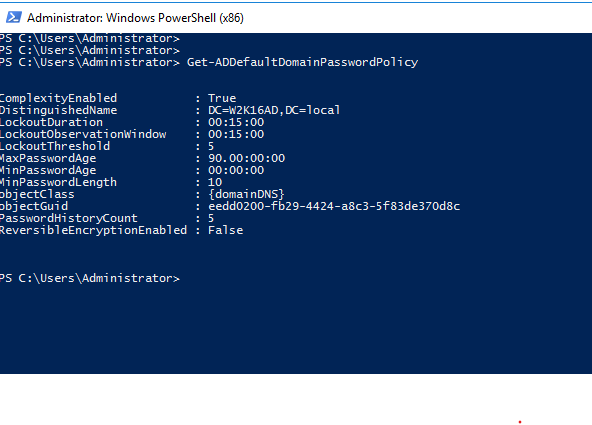

<p align="right"><a href="#top">⬆ Back to Top</a></p>

---

# Method 2 — PowerShell Script Workflow

The GUI method above is useful for learning and support demonstrations. The PowerShell script workflow below provides a faster and repeatable method for configuring and verifying the same lab.

---

## Scripts Used in This Lab

| Script | Purpose |
|---|---|
| [`configure-lab09-password-lockout-policy.ps1`](../../scripts/configure-lab09-password-lockout-policy.ps1) | Configures the lab domain password and account lockout policy. |
| [`create-lab09-lockout-test-user.ps1`](../../scripts/create-lab09-lockout-test-user.ps1) | Creates or updates the `lockout.test` user account. |
| [`manage-lab09-account-controls.ps1`](../../scripts/manage-lab09-account-controls.ps1) | Performs show, reset password, force password change, unlock, disable, enable and expiry actions. |
| [`verify-lab09-account-controls.ps1`](../../scripts/verify-lab09-account-controls.ps1) | Verifies the password policy and account state. |

---

## Step 01 — Open PowerShell as Administrator

Run PowerShell as Administrator on `SRV-DC01`.

From the repository root, run:

```powershell
Set-ExecutionPolicy RemoteSigned -Scope Process
Set-Location .\scripts
```

---

## Step 02 — Configure Password and Lockout Policy

```powershell
.\configure-lab09-password-lockout-policy.ps1
```

Expected result:

```text
Lab 09 policy configuration completed.
```

---

## Step 03 — Create the Lockout Test User

```powershell
.\create-lab09-lockout-test-user.ps1
```

When prompted, enter a temporary lab password. The password is entered securely and is not stored in the script.

Expected result:

```text
Lab 09 lockout test user ready.
```

---

## Step 04 — Verify Policy and User State

```powershell
.\verify-lab09-account-controls.ps1
```

Expected result:

```text
Verification complete: Lab 09 policy and account controls match the expected lab state.
```

---

## Step 05 — Practise Account Support Actions

Show account state:

```powershell
.\manage-lab09-account-controls.ps1 -Action Show -SamAccountName lockout.test
```

Reset password:

```powershell
.\manage-lab09-account-controls.ps1 -Action ResetPassword -SamAccountName lockout.test
```

Force password change at next logon:

```powershell
.\manage-lab09-account-controls.ps1 -Action ForcePasswordChange -SamAccountName lockout.test
```

Disable account:

```powershell
.\manage-lab09-account-controls.ps1 -Action Disable -SamAccountName lockout.test
```

Enable account:

```powershell
.\manage-lab09-account-controls.ps1 -Action Enable -SamAccountName lockout.test
```

Unlock account:

```powershell
.\manage-lab09-account-controls.ps1 -Action Unlock -SamAccountName lockout.test
```

---

# Visual Evidence Checklist

| No. | File | Evidence |
|---:|---|---|
| 01 | `01-open-lockout-test-user.png` | Test user exists in ADUC |
| 02 | `02-password-policy.png` | Password Policy settings reviewed |
| 03 | `03-account-lockout-policy.png` | Account Lockout Policy settings reviewed |
| 04 | `04-test-user-properties-account-tab.png` | User Account tab reviewed |
| 05 | `05-reset-password-user.png` | Password reset workflow completed |
| 06 | `06-disabled-account-example.png` | Account disabled |
| 07 | `07-enabled-account-example.png` | Account enabled |
| 08 | `08-lockout-user-test.png` | Lockout tested from Windows 11 client |
| 09 | `09-account-locked-in-aduc.png` | Locked account confirmed in ADUC |
| 10 | `10-unlock-account-in-aduc.png` | Account unlocked in ADUC |
| 11 | `11-verify-unlocked-user-powershell.png` | User enabled and not locked |
| 12 | `12-domain-password-policy-powershell.png` | Domain password policy verified |

---

# Real-World Service Desk Scenario

## Example Ticket

```text
User reports they cannot log in after several failed password attempts.
```

## Support Workflow

| Step | Action |
|---|---|
| 1 | Verify the identity of the user according to company policy. |
| 2 | Check whether the account is disabled, expired or locked. |
| 3 | Unlock the account if approved. |
| 4 | Reset the password if required. |
| 5 | Select user must change password at next logon when appropriate. |
| 6 | Ask the user to test sign-in again. |
| 7 | Document the action taken in the ticket. |

## Example Case Note

```text
Verified user identity according to support procedure. Checked ADUC and confirmed the account was locked due to failed logon attempts. Unlocked the account and reset the temporary password. User was required to change password at next logon. User confirmed successful sign-in. Ticket resolved.
```

---

# Troubleshooting

## ActiveDirectory Module Not Found

Run the scripts on the Domain Controller, or install RSAT tools on an admin workstation.

Check:

```powershell
Get-Module -ListAvailable ActiveDirectory
```

---

## Group Policy Management Not Available

Install the Group Policy Management feature or use the Domain Controller where Group Policy Management is already available.

---

## Required OU Not Found

Run the Lab 06 OU creation script first:

```powershell
.\create-lab06-ou-structure.ps1
```

---

## Password Does Not Meet Complexity Requirements

Use a password that includes:

- Uppercase letter
- Lowercase letter
- Number
- Special character
- Minimum required length

Do not publish real passwords in screenshots, repository images or documentation.

---

## Account Is Still Locked

Run:

```powershell
Unlock-ADAccount -Identity lockout.test
```

Then verify:

```powershell
Get-ADUser lockout.test -Properties LockedOut,Enabled |
Select-Object Name,Enabled,LockedOut
```

---

## Account Is Disabled

Run:

```powershell
Enable-ADAccount -Identity lockout.test
```

Then verify:

```powershell
Get-ADUser lockout.test -Properties Enabled |
Select-Object Name,Enabled
```

---

# Command Reference

| Command | Purpose |
|---|---|
| `Get-ADDefaultDomainPasswordPolicy` | Shows domain password and account lockout policy. |
| `Set-ADDefaultDomainPasswordPolicy` | Configures domain password and lockout settings. |
| `Get-ADUser lockout.test -Properties LockedOut,Enabled` | Checks whether the test account is enabled or locked. |
| `Set-ADAccountPassword` | Resets an AD user password. |
| `Set-ADUser -ChangePasswordAtLogon` | Forces password change at next logon. |
| `Unlock-ADAccount` | Unlocks a locked AD user account. |
| `Disable-ADAccount` | Disables an AD user account. |
| `Enable-ADAccount` | Enables an AD user account. |

---

# Completion Checklist

- [x] Password Policy reviewed in Group Policy Management.
- [x] Account Lockout Policy reviewed in Group Policy Management.
- [x] `lockout.test` user confirmed in ADUC.
- [x] Account tab reviewed.
- [x] Password reset workflow completed.
- [x] Account disable workflow completed.
- [x] Account enable workflow completed.
- [x] Lockout test completed from Windows 11 client.
- [x] Locked account verified in ADUC.
- [x] Account unlock completed.
- [x] User state verified with PowerShell.
- [x] Domain password policy verified with PowerShell.
- [x] Visual evidence added to the lab documentation.

---

# Key Learning Outcomes

After completing this lab, you can explain and demonstrate how to:

- Review password policy in Group Policy Management.
- Review account lockout policy in Group Policy Management.
- Reset a user password in Active Directory.
- Force a user to change password at next logon.
- Disable and enable a user account.
- Simulate a locked account from a Windows 11 client.
- Unlock an account in Active Directory Users and Computers.
- Verify account status using PowerShell.
- Document account support actions for a Service Desk ticket.

---

## 👤 Author

**Xuan Toan Nguyen**  
IT Support | Service Desk | Desktop Support | System Administration  
Adelaide, South Australia

🥈 Silver Medal — WorldSkills Australia SA Regional Competition 2026, Cloud Computing

- 🔗 LinkedIn: [www.linkedin.com/in/toan-nguyen-it-oz](https://www.linkedin.com/in/toan-nguyen-it-oz)
- 💻 GitHub: [github.com/toannguyenitoz](https://github.com/toannguyenitoz)

---

<p align="center">
  <a href="../08-active-directory-group-management/README.md">⬅ Previous Lab</a> ·
  <a href="../../README.md">🏠 Main README</a> ·
  <a href="../10-home-folder-and-file-share/README.md">Next Lab ➜</a> ·
  <a href="#top">⬆ Back to Top</a>
</p>

<p align="center">
  <strong>#ToanNguyenITOz #ActiveDirectory #WindowsServer #ITSupport #ServiceDesk #PowerShell #SystemAdministration</strong>
</p>
