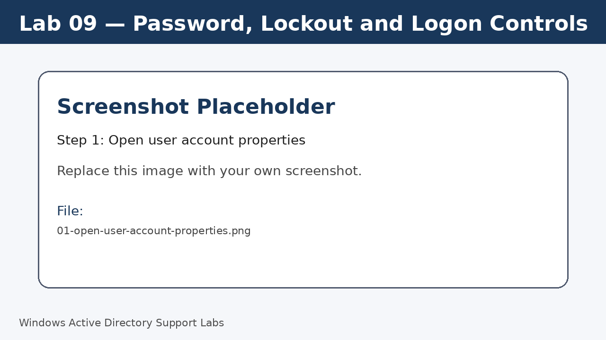
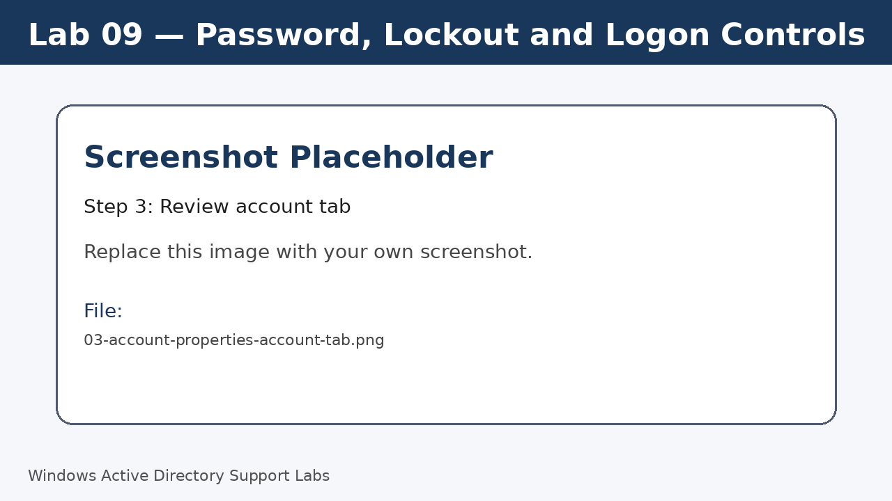
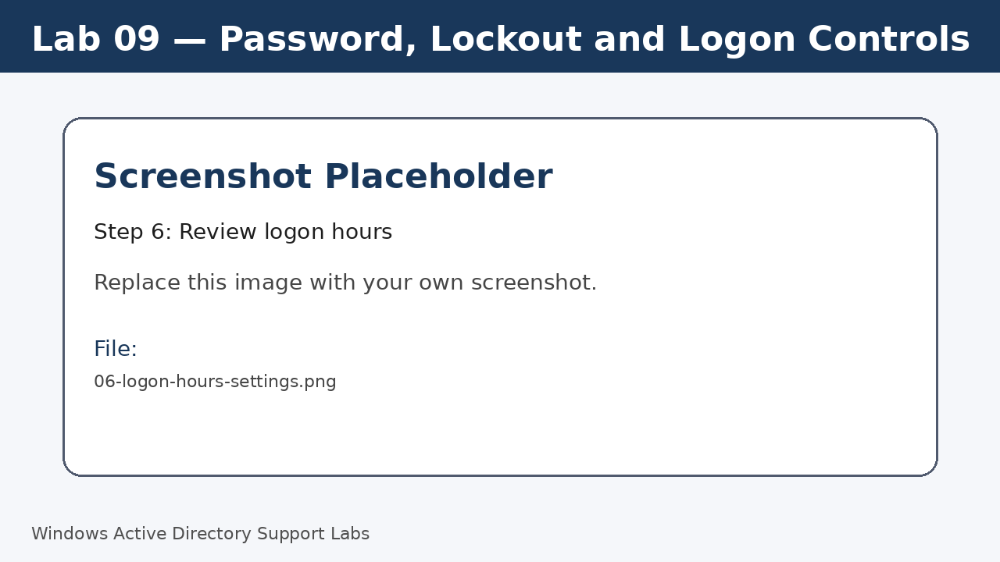

<a id="top"></a>

# Lab 09 — Password, Lockout and Logon Controls

<p align="center">
  
  
  
  
  
  
</p>

<p align="center">
  <a href="../08-active-directory-group-management/README.md">⬅ Previous Lab</a> | <a href="../../README.md">🏠 Main README</a> | <a href="../10-home-folder-and-file-share/README.md">Next Lab ➡</a>
</p>

---

## Overview

Practice common account support actions such as password reset, account unlock, disable/enable and logon controls.

---

## Objectives

- Reset a user password safely in a lab.
- Review account status and unlock option.
- Disable and enable an account.
- Review logon hours and account expiry.

---

## Lab Values

| Item | Value |
|---|---|
| Example user | `j.smith` |
| Tool | Active Directory Users and Computers |
| Screenshot folder | `assets/images/lab-09-password-lockout-logon-controls/` |

---

## Before You Start

- Complete the previous lab unless this is Lab 01.
- Use a lab environment only.
- Do not publish real passwords or private business information.
- Replace placeholder screenshots with your own screenshots after completing each step.

---

## Screenshot Files

| File name | Step |
|---|---|
| 01-open-user-account-properties.png | Open user account properties |
| 02-reset-user-password.png | Reset password |
| 03-account-properties-account-tab.png | Review account tab |
| 04-disable-user-account.png | Disable account |
| 05-enable-user-account.png | Enable account |
| 06-logon-hours-settings.png | Review logon hours |

---

## Step 1 — Open user account properties

Open ADUC and locate the test user `j.smith`.

Screenshot file:

```text
assets/images/lab-09-password-lockout-logon-controls/01-open-user-account-properties.png
```



[⬆ Back to top](#top)

## Step 2 — Reset password

Right-click the user and select **Reset Password**.

Use a lab-safe value and avoid publishing real passwords.

Screenshot file:

```text
assets/images/lab-09-password-lockout-logon-controls/02-reset-user-password.png
```


[⬆ Back to top](#top)

## Step 3 — Review account tab

Open the Account tab and review sign-in name, account options, unlock option and expiry settings.

Screenshot file:

```text
assets/images/lab-09-password-lockout-logon-controls/03-account-properties-account-tab.png
```



[⬆ Back to top](#top)

## Step 4 — Disable account

Disable the account and confirm the disabled icon appears.

Screenshot file:

```text
assets/images/lab-09-password-lockout-logon-controls/04-disable-user-account.png
```


[⬆ Back to top](#top)

## Step 5 — Enable account

Enable the account again and confirm normal status.

Screenshot file:

```text
assets/images/lab-09-password-lockout-logon-controls/05-enable-user-account.png
```


[⬆ Back to top](#top)

## Step 6 — Review logon hours

Open Logon Hours and review how access can be limited by time.

Screenshot file:

```text
assets/images/lab-09-password-lockout-logon-controls/06-logon-hours-settings.png
```



[⬆ Back to top](#top)


---

## Completion Checklist

- [ ] Password reset practiced.
- [ ] Account tab reviewed.
- [ ] Disable account tested.
- [ ] Enable account tested.
- [ ] Logon hours reviewed.
- [ ] Account expiry reviewed.

---

## Key Takeaways

- Password reset should be documented clearly in a support ticket.
- Disabling is useful when access must be removed quickly.
- Logon controls can restrict when an account is allowed to sign in.

---

## Author

**Xuan Toan Nguyen**  
IT Support | Service Desk | Desktop Support | System Administration  
Adelaide, South Australia

- LinkedIn: [www.linkedin.com/in/toan-nguyen-it-oz](https://www.linkedin.com/in/toan-nguyen-it-oz)
- GitHub: [github.com/toannguyenitoz](https://github.com/toannguyenitoz)

---

<p align="center">
  <a href="../08-active-directory-group-management/README.md">⬅ Previous Lab</a> | <a href="../../README.md">🏠 Main README</a> | <a href="../10-home-folder-and-file-share/README.md">Next Lab ➡</a> |
  <a href="#top">⬆ Back to Top</a>
</p>
