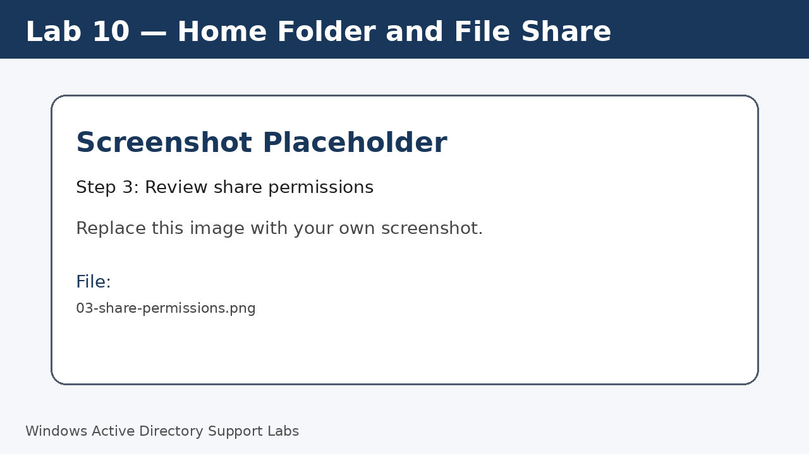
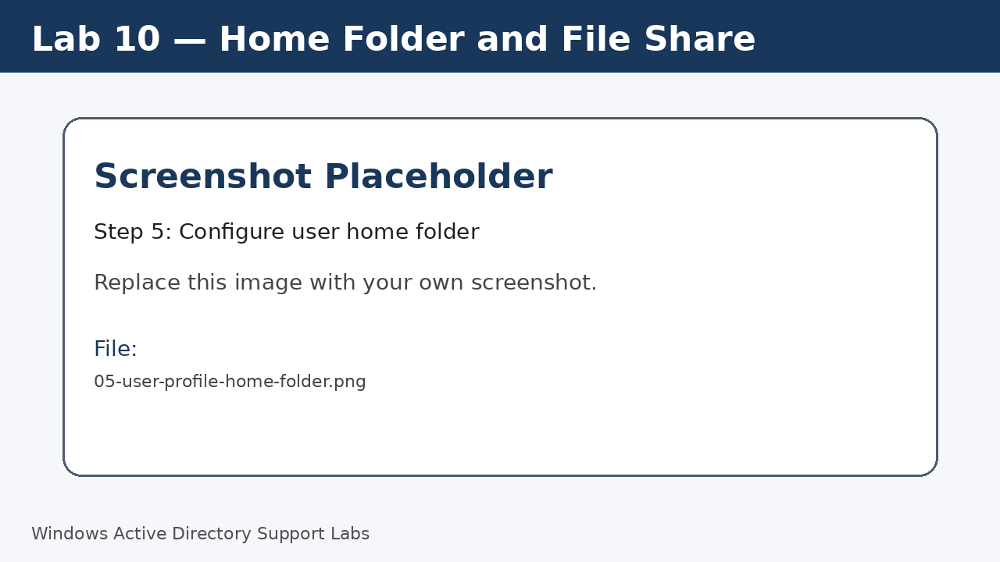
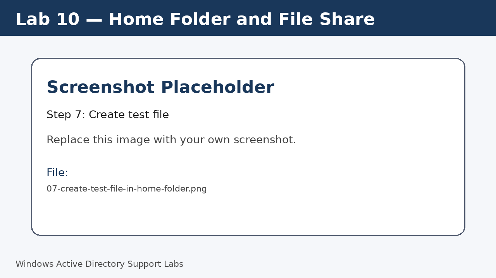

<a id="top"></a>

# Lab 10 — Home Folder and File Share

<p align="center">
  
  
  
  
  
  
</p>

<p align="center">
  <a href="../09-password-lockout-logon-controls/README.md">⬅ Previous Lab</a> | <a href="../../README.md">🏠 Main README</a> | <a href="../11-rsat-remote-administration/README.md">Next Lab ➡</a>
</p>

---

## Overview

Create a server share and configure a user home folder for workplace-style file access.

---

## Objectives

- Create a folder on the server.
- Share the folder.
- Review share and NTFS permissions.
- Configure a home folder path for a user.
- Test access from Windows 11.

---

## Lab Values

| Item | Value |
|---|---|
| Server folder | `C:\Shares\Homes` |
| Share name | `Homes` |
| Drive letter | `H:` |
| Screenshot folder | `assets/images/lab-10-home-folder-and-file-share/` |

---

## Before You Start

- Complete the previous lab unless this is Lab 01.
- Use a lab environment only.
- Do not publish real passwords or private business information.
- Replace placeholder screenshots with your own screenshots after completing each step.

---

## Screenshot Files

| File name | Step |
|---|---|
| 01-create-server-homes-folder.png | Create server folder |
| 02-advanced-sharing-homes.png | Enable sharing |
| 03-share-permissions.png | Review share permissions |
| 04-ntfs-permissions.png | Review NTFS permissions |
| 05-user-profile-home-folder.png | Configure user home folder |
| 06-client-home-folder-test.png | Test from client |
| 07-create-test-file-in-home-folder.png | Create test file |

---

## Step 1 — Create server folder

On the server, create `C:\Shares\Homes`.

Screenshot file:

```text
assets/images/lab-10-home-folder-and-file-share/01-create-server-homes-folder.png
```


[⬆ Back to top](#top)

## Step 2 — Enable sharing

Open folder properties and enable advanced sharing.

Set the share name to `Homes`.

Screenshot file:

```text
assets/images/lab-10-home-folder-and-file-share/02-advanced-sharing-homes.png
```


[⬆ Back to top](#top)

## Step 3 — Review share permissions

Review share permissions and use lab-safe group-based permissions.

Screenshot file:

```text
assets/images/lab-10-home-folder-and-file-share/03-share-permissions.png
```



[⬆ Back to top](#top)

## Step 4 — Review NTFS permissions

Open the Security tab and review NTFS permissions.

Screenshot file:

```text
assets/images/lab-10-home-folder-and-file-share/04-ntfs-permissions.png
```


[⬆ Back to top](#top)

## Step 5 — Configure user home folder

Open the user properties in ADUC.

On the Profile tab, configure drive `H:` with a user-specific folder path.

Screenshot file:

```text
assets/images/lab-10-home-folder-and-file-share/05-user-profile-home-folder.png
```



[⬆ Back to top](#top)

## Step 6 — Test from client

Sign in as the domain user on Windows 11 and confirm the home drive or folder is available.

Run:

```cmd
whoami
net use
```

Screenshot file:

```text
assets/images/lab-10-home-folder-and-file-share/06-client-home-folder-test.png
```


[⬆ Back to top](#top)

## Step 7 — Create test file

Create a small text file in the home folder and confirm it appears on the server.

Screenshot file:

```text
assets/images/lab-10-home-folder-and-file-share/07-create-test-file-in-home-folder.png
```



[⬆ Back to top](#top)


---

## Completion Checklist

- [ ] Server folder created.
- [ ] Folder shared.
- [ ] Share permissions reviewed.
- [ ] NTFS permissions reviewed.
- [ ] Home folder configured.
- [ ] Client access tested.
- [ ] Test file created.

---

## Key Takeaways

- Share permissions and NTFS permissions work together.
- Home folders give users a consistent personal network storage location.
- Group-based permissions are easier to manage than user-by-user permissions.

---

## Author

**Xuan Toan Nguyen**  
IT Support | Service Desk | Desktop Support | System Administration  
Adelaide, South Australia

- LinkedIn: [www.linkedin.com/in/toan-nguyen-it-oz](https://www.linkedin.com/in/toan-nguyen-it-oz)
- GitHub: [github.com/toannguyenitoz](https://github.com/toannguyenitoz)

---

<p align="center">
  <a href="../09-password-lockout-logon-controls/README.md">⬅ Previous Lab</a> | <a href="../../README.md">🏠 Main README</a> | <a href="../11-rsat-remote-administration/README.md">Next Lab ➡</a> |
  <a href="#top">⬆ Back to Top</a>
</p>
