<a id="top"></a>

# 📁 Lab 10 — Home Folder and File Share

<p align="center">
  
  
  
  
  
</p>

<p align="center">
  <strong>Step-by-step Windows Server and Active Directory user guide for home folders, SMB shares, share permissions, NTFS permissions and client access testing.</strong>
</p>

<p align="center">
  <a href="../09-password-lockout-logon-controls/README.md">⬅ Previous Lab</a> ·
  <a href="../../README.md">🏠 Main README</a> ·
  <a href="../11-rsat-remote-administration/README.md">Next Lab ➜</a>
</p>

---

## 🎯 Lab Mission

This lab demonstrates how an IT Support, Service Desk or junior System Administrator can create and test server-based file shares in an Active Directory environment.

The lab has two practical parts:

1. Configure a **Home folder** for a domain user and map it automatically as drive `H:`.
2. Configure a shared folder named **SharedData** and test access from a Windows 11 domain client.

The guide is written as a GUI-first user guide. The visual references are included at the end of each step as evidence of the completed task.

> [!NOTE]
> This is a lab environment. In a real workplace, shared folders and home folders should be configured according to company security standards, data classification and access approval processes.

---

## 🧱 Lab Environment

| Component | Value |
|---|---|
| Domain | `W2K16AD.local` |
| NetBIOS name | `W2K16AD` |
| Domain Controller / File Server | `SRV-DC01` |
| Windows Client | `W11-CLIENT01` |
| Server IP | `192.168.20.10` |
| Client IP | `192.168.20.101` |
| Root OU | `AdelaideTechSolutions` |
| Test user | `john.smith` |
| Test user display name | `John Smith` |
| Home folder root | `C:\Shares\Homes` |
| Home folder share | `\\SRV-DC01\Homes` |
| User home folder path | `\\SRV-DC01\Homes\%username%` |
| Home drive letter | `H:` |
| Shared data folder | `C:\Shares\SharedData` |
| Shared data network path | `\\SRV-DC01\SharedData` |

---

## ✅ Skills Demonstrated

| Area | Skills |
|---|---|
| Windows Server Administration | Create server folders and share folders over the network |
| Active Directory Administration | Configure user Profile tab and Home folder mapping |
| SMB File Sharing | Create network shares and verify UNC paths |
| Permission Management | Review share permissions and NTFS permissions |
| Client Support | Test mapped drives and shared folder access from Windows 11 |
| Troubleshooting | Check mapped drives with `net use` and verify server-side file creation |
| Documentation | Capture evidence and write a repeatable support guide |

---

## 🧩 Before You Start

Complete these earlier labs first:

| Required lab | Purpose |
|---|---|
| Lab 04 — Active Directory Domain Services Setup | Domain Controller is available |
| Lab 05 — Join Windows 11 Client to Domain | Windows 11 client can sign in with a domain user |
| Lab 06 — Active Directory OU Structure | User OU structure exists |
| Lab 07 — Active Directory User Management | Test users exist |
| Lab 08 — Active Directory Group Management | Security groups are available |
| Lab 09 — Password, Lockout and Logon Controls | User account is enabled and ready for testing |

Confirm the test user account is enabled before starting client testing:

```powershell
Get-ADUser john.smith -Properties Enabled |
Select-Object Name,SamAccountName,Enabled
```

Expected result:

```text
Enabled : True
```

---

# GUI User Guide

Follow these steps in order. The Home folder section is completed first, then the shared data folder is created and tested.

---

## Step 01 — Create the Root Shares Folder

### Purpose

Create a central parent folder on the server to store all shared folders used in this lab.

### Steps

1. Sign in to `SRV-DC01` using a domain administrator account.
2. Open **File Explorer**.
3. Open the `C:` drive.
4. Create a new folder named:

```text
Shares
```

5. Confirm the folder path is:

```text
C:\Shares
```

### Expected Result

The `Shares` folder exists directly under `C:\` and will be used as the parent folder for `Homes` and `SharedData`.

### Visual Reference

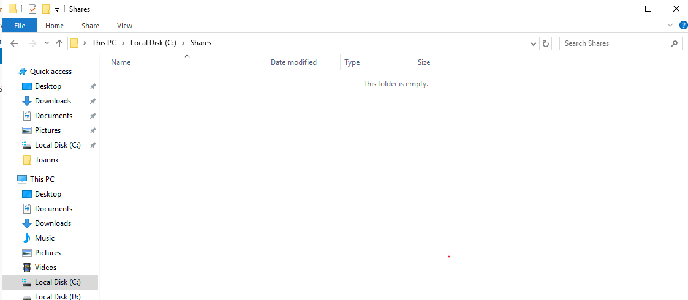

<p align="right"><a href="#top">⬆ Back to Top</a></p>

---

## Step 02 — Create the Homes Folder

### Purpose

Create a folder that will store a separate Home folder for each domain user.

### Steps

1. Open **File Explorer** on `SRV-DC01`.
2. Browse to:

```text
C:\Shares
```

3. Create a new folder named:

```text
Homes
```

4. Confirm the folder path is:

```text
C:\Shares\Homes
```

### Expected Result

The `Homes` folder exists under `C:\Shares` and is ready to be shared over the network.

### Visual Reference

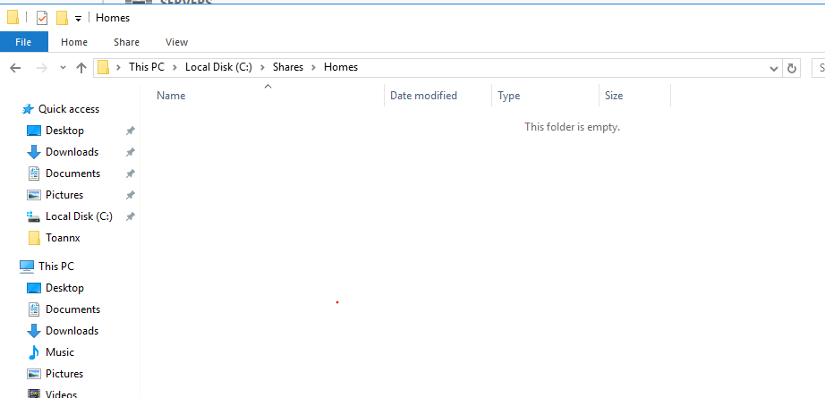

<p align="right"><a href="#top">⬆ Back to Top</a></p>

---

## Step 03 — Share the Homes Folder

### Purpose

Make the `Homes` folder available on the network so Active Directory can map user Home folders to drive `H:`.

### Steps

1. In **File Explorer**, browse to:

```text
C:\Shares
```

2. Right-click the `Homes` folder.
3. Select **Properties**.
4. Open the **Sharing** tab.
5. Select **Advanced Sharing...**.
6. Tick:

```text
Share this folder
```

7. Set the share name to:

```text
Homes
```

8. Confirm the network path will be:

```text
\\SRV-DC01\Homes
```

### Expected Result

The `Homes` folder is shared as `Homes` and can be referenced using the UNC path `\\SRV-DC01\Homes`.

### Visual Reference

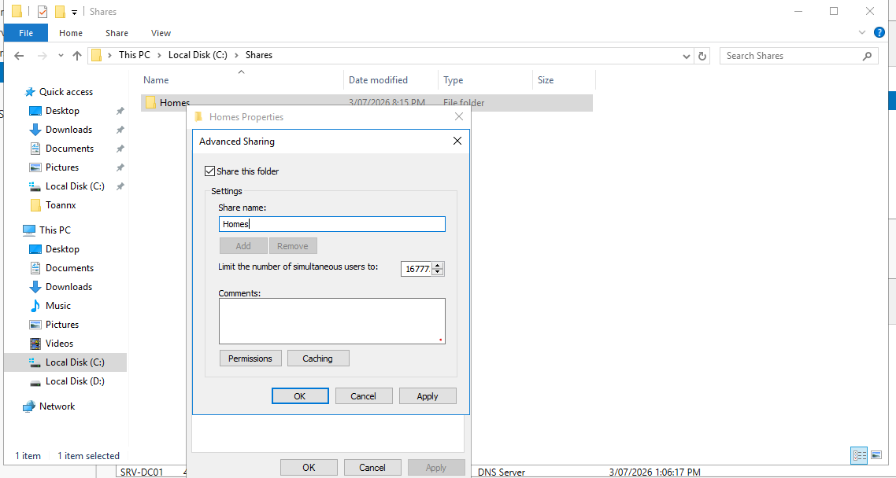

<p align="right"><a href="#top">⬆ Back to Top</a></p>

---

## Step 04 — Configure Share Permissions for Homes

### Purpose

Configure network-level permissions for the `Homes` share. In this lab, broad share permissions are used while access control is reviewed through NTFS permissions.

### Steps

1. Stay in the **Advanced Sharing** window for `Homes`.
2. Select **Permissions**.
3. Select **Everyone**.
4. For this lab, allow:

```text
Full Control
Change
Read
```

5. Select **Apply**.
6. Select **OK**.

### Important Note

This lab uses `Everyone: Full Control` at the share permission level to simplify testing. In a production environment, access should be controlled through approved security groups and least privilege principles.

### Expected Result

The `Homes` share allows network access. NTFS permissions should still be used to control what users can actually access inside the folder.

### Visual Reference

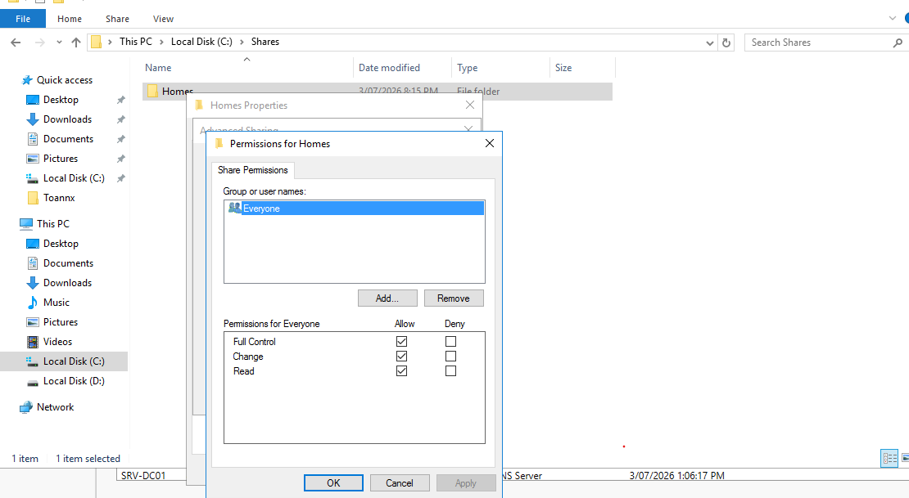

<p align="right"><a href="#top">⬆ Back to Top</a></p>

---

## Step 05 — Review NTFS Security Permissions for Homes

### Purpose

NTFS permissions control the actual file system access on the server. These permissions determine whether users can read, write, create or modify files inside the folder.

### Steps

1. In **File Explorer**, browse to:

```text
C:\Shares
```

2. Right-click the `Homes` folder.
3. Select **Properties**.
4. Open the **Security** tab.
5. Select **Edit** if you need to add or modify permissions.
6. Add the appropriate lab group, for example:

```text
W2K16AD\GG_All_StandardUsers
```

or, for a simple lab test:

```text
W2K16AD\Domain Users
```

7. Allow the required permissions for the lab:

```text
Modify
Read & execute
List folder contents
Read
Write
```

8. Do not grant `Full control` unless your lab specifically requires it.
9. Select **Apply** and **OK**.

### Expected Result

Domain users can create and write files in their Home folder location, while access remains controlled by NTFS permissions.

### Visual Reference

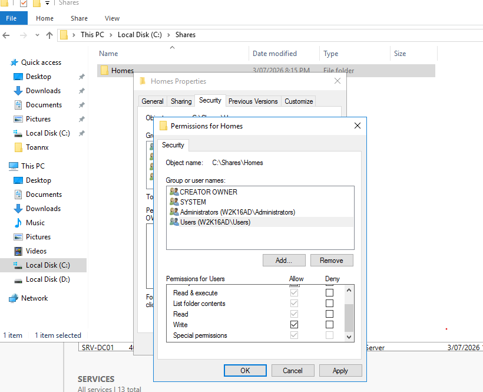

<p align="right"><a href="#top">⬆ Back to Top</a></p>

---

## Step 06 — Configure the User Home Folder in ADUC

### Purpose

Configure the user account so Windows automatically maps the Home folder as drive `H:` when the user signs in.

### Steps

1. On `SRV-DC01`, open **Server Manager**.
2. Select **Tools**.
3. Open **Active Directory Users and Computers**.
4. Browse to:

```text
W2K16AD.local
└── AdelaideTechSolutions
    └── Users
        └── StandardUsers
```

5. Right-click **John Smith**.
6. Select **Properties**.
7. Open the **Account** tab if you need to confirm the logon name.
8. Confirm the user logon name is:

```text
john.smith
```

9. Open the **Profile** tab.
10. In the **Home folder** section, select:

```text
Connect
```

11. Select drive letter:

```text
H:
```

12. In the **To** field, enter:

```text
\\SRV-DC01\Homes\%username%
```

13. Select **Apply**.
14. Select **OK**.

### Expected Result

When `john.smith` signs in to the Windows 11 client, drive `H:` should automatically map to that user's Home folder.

Expected final path:

```text
\\SRV-DC01\Homes\john.smith
```

### Visual Reference

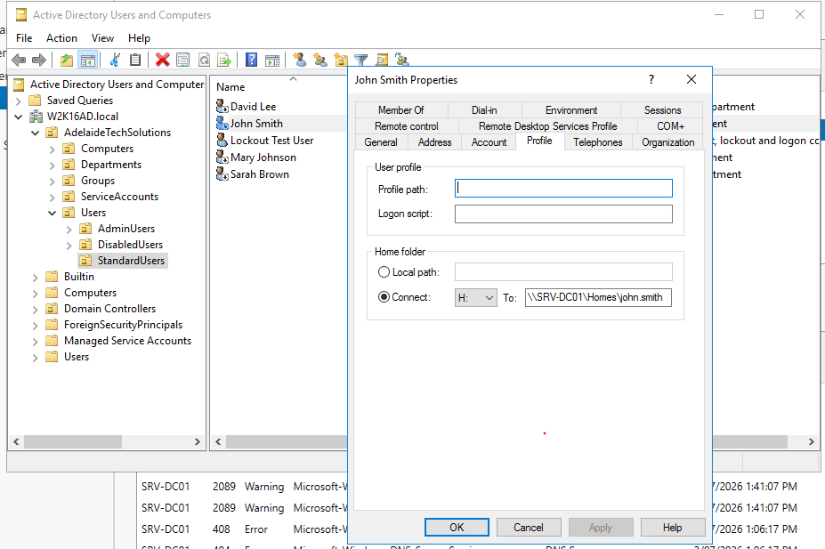

<p align="right"><a href="#top">⬆ Back to Top</a></p>

---

## Step 07 — Sign In to the Windows 11 Client as the Domain User

### Purpose

Test the real user experience from a domain-joined Windows 11 client.

### Steps

1. Go to `W11-CLIENT01`.
2. Sign out of the current session if needed.
3. At the Windows sign-in screen, choose **Other user** if required.
4. Sign in using:

```text
W2K16AD\john.smith
```

or:

```text
john.smith@W2K16AD.local
```

5. Enter the user's password.
6. Wait for Windows to complete the sign-in process.
7. If the user receives `account is disabled`, return to ADUC and enable the account.

### Expected Result

The user signs in successfully to the Windows 11 client using a domain account.

Optional verification command:

```cmd
whoami
```

Expected result:

```text
w2k16ad\john.smith
```

### Visual Reference

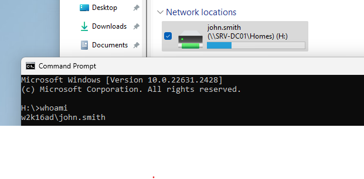

<p align="right"><a href="#top">⬆ Back to Top</a></p>

---

## Step 08 — Verify the H: Drive Mapping

### Purpose

Confirm that the Home folder is automatically mapped as drive `H:` for the signed-in user.

### Steps

1. On `W11-CLIENT01`, open **File Explorer**.
2. Select **This PC**.
3. Look under **Network locations** or **Devices and drives**.
4. Confirm that drive `H:` appears.
5. Open the `H:` drive.
6. Confirm that it opens without an access denied error.

### Expected Result

Drive `H:` appears and points to the user's Home folder on the server.

Expected network location:

```text
\\SRV-DC01\Homes\john.smith
```

If drive `H:` does not appear, run:

```cmd
gpupdate /force
```

Then sign out and sign in again.

### Visual Reference

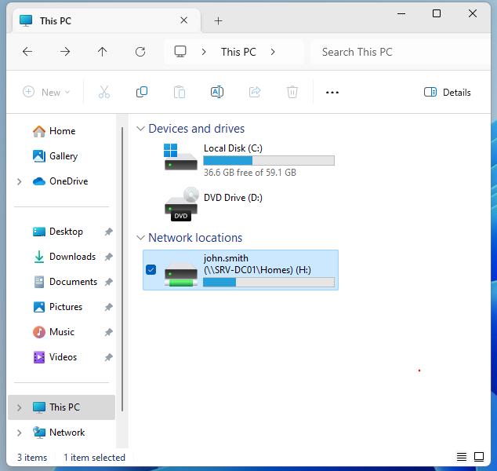

<p align="right"><a href="#top">⬆ Back to Top</a></p>

---

## Step 09 — Create a Test Folder or File in H:

### Purpose

Confirm that the signed-in user can write data to the mapped Home folder.

### Steps

1. On `W11-CLIENT01`, open **File Explorer**.
2. Open:

```text
This PC > H:
```

3. Create a new folder named:

```text
Test-HomeFolder
```

or create a text file named:

```text
access-test.txt
```

4. If creating a text file, add simple lab text such as:

```text
Home folder access test for john.smith
```

5. Save the file.

### Expected Result

The user can create a folder or file inside drive `H:` without receiving an access denied error.

This confirms:

```text
Home folder mapping works
NTFS permissions allow write access
The user's data is being stored on the server
```

### Visual Reference

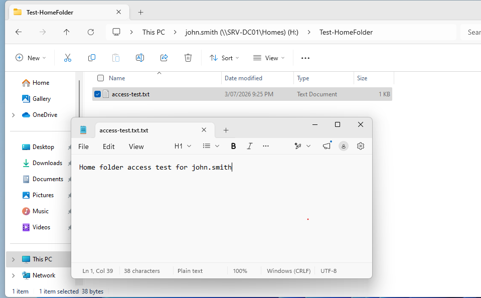

<p align="right"><a href="#top">⬆ Back to Top</a></p>

---

## Step 10 — Verify the User Folder on the Server

### Purpose

Confirm that the file or folder created from the client appears on the server inside the user's Home folder.

### Steps

1. Return to `SRV-DC01`.
2. Open **File Explorer**.
3. Browse to:

```text
C:\Shares\Homes
```

4. Open the user folder:

```text
john.smith
```

5. Confirm that the file or folder created from the client is visible.

Example path:

```text
C:\Shares\Homes\john.smith\Test-HomeFolder
```

### Expected Result

The test folder or file appears on the server. This confirms the full path from client to server is working.

```text
Client H: drive → Network share → Server folder
```

### Visual Reference

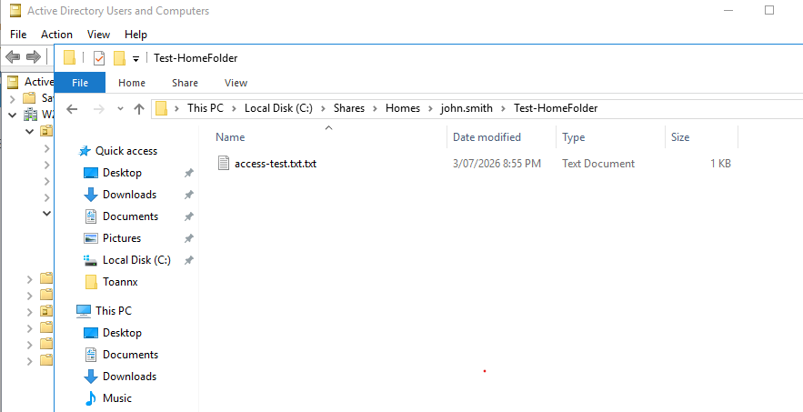

<p align="right"><a href="#top">⬆ Back to Top</a></p>

---

## Step 11 — Create the SharedData Folder

### Purpose

Create a shared folder that can be used by multiple users or groups. This is separate from the user-specific Home folder.

### Steps

1. On `SRV-DC01`, open **File Explorer**.
2. Browse to:

```text
C:\Shares
```

3. Create a new folder named:

```text
SharedData
```

4. Confirm the folder path is:

```text
C:\Shares\SharedData
```

### Expected Result

The `SharedData` folder exists beside the `Homes` folder.

### Visual Reference

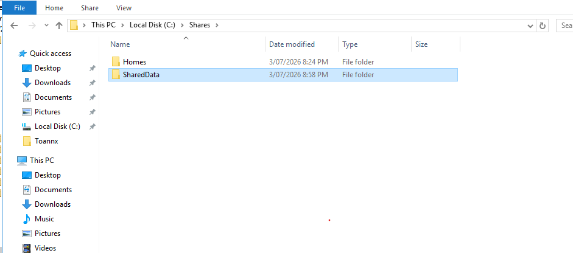

<p align="right"><a href="#top">⬆ Back to Top</a></p>

---

## Step 12 — Share the SharedData Folder

### Purpose

Make `SharedData` available on the network so users can access it from the Windows client.

### Steps

1. In **File Explorer**, browse to:

```text
C:\Shares
```

2. Right-click `SharedData`.
3. Select **Properties**.
4. Open the **Sharing** tab.
5. Select **Advanced Sharing...**.
6. Tick:

```text
Share this folder
```

7. Set the share name to:

```text
SharedData
```

8. Select **Permissions**.
9. For this lab, select **Everyone** and allow:

```text
Full Control
Change
Read
```

10. Select **Apply**.
11. Select **OK**.

### Permission Note

For a production-style design, use AD groups such as:

```text
DL_SharedData_Read
DL_SharedData_Modify
```

Then control the actual access using NTFS permissions on the **Security** tab.

### Expected Result

The folder is available through this network path:

```text
\\SRV-DC01\SharedData
```

### Visual Reference

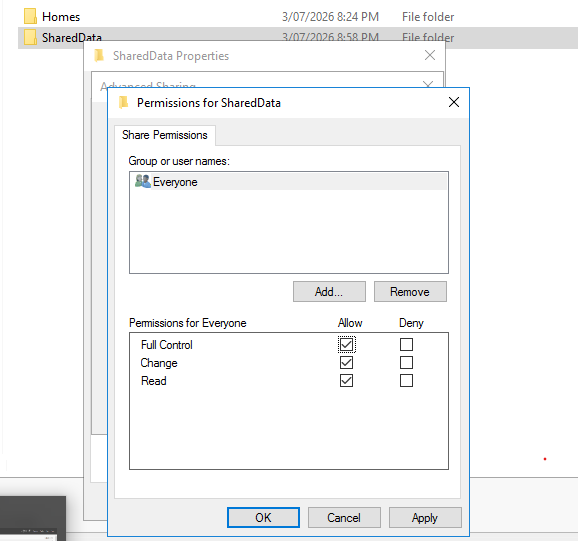

<p align="right"><a href="#top">⬆ Back to Top</a></p>

---

## Step 13 — Test SharedData Access from the Client

### Purpose

Confirm that a domain user can open the shared folder from the Windows 11 client and create a test file.

### Steps

1. On `W11-CLIENT01`, sign in as:

```text
W2K16AD\john.smith
```

2. Open **File Explorer**.
3. In the address bar, enter:

```text
\\SRV-DC01\SharedData
```

4. Press **Enter**.
5. Create a new text file named:

```text
shareddata-access-test.txt
```

6. Add simple lab text such as:

```text
SharedData access test from W11-CLIENT01 by john.smith
```

7. Save the file.

### Expected Result

The user can open `\\SRV-DC01\SharedData` and create the test file.

If the user receives **Access Denied**, return to `SRV-DC01` and review:

```text
SharedData Properties > Sharing > Advanced Sharing > Permissions
SharedData Properties > Security
```

For the lab, confirm the user or group has at least:

```text
Modify
Read & execute
List folder contents
Read
Write
```

### Visual Reference

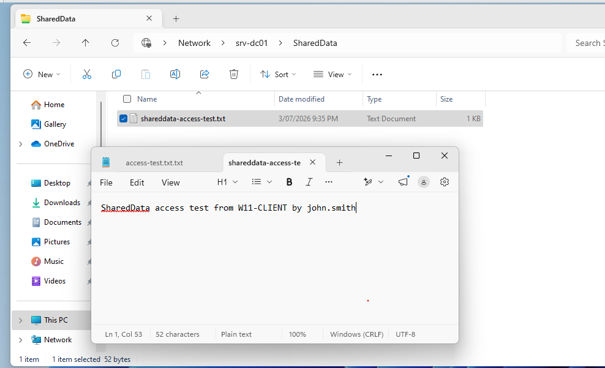

<p align="right"><a href="#top">⬆ Back to Top</a></p>

---

## Step 14 — Verify Network Connections with net use

### Purpose

Use Command Prompt to confirm current network connections and mapped drives from the Windows 11 client.

### Steps

1. On `W11-CLIENT01`, open **Command Prompt**.
2. Run:

```cmd
net use
```

3. Review the output.
4. Confirm that drive `H:` is mapped.
5. Confirm any active connection to `\\SRV-DC01\SharedData` if it is listed.

### Expected Result

Output should show a mapped Home folder drive similar to:

```text
Status   Local   Remote
OK       H:      \\SRV-DC01\Homes\john.smith
```

It may also show the SharedData connection:

```text
OK               \\SRV-DC01\SharedData
```

If `SharedData` is not listed but the folder opens in File Explorer, the access test is still valid.

### Visual Reference

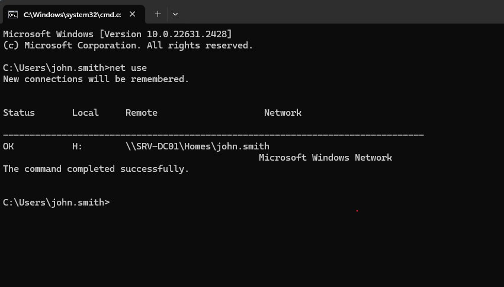

<p align="right"><a href="#top">⬆ Back to Top</a></p>

---

# Visual Evidence Checklist

| No. | File | Evidence |
|---:|---|---|
| 01 | `01-create-shares-folder.png` | Root `C:\Shares` folder created |
| 02 | `02-create-homes-folder.png` | `Homes` folder created |
| 03 | `03-advanced-sharing-homes.png` | `Homes` folder shared |
| 04 | `04-share-permissions-homes.png` | Share permissions reviewed for `Homes` |
| 05 | `05-ntfs-security-homes.png` | NTFS permissions reviewed for `Homes` |
| 06 | `06-aduc-user-profile-home-folder.png` | ADUC Home folder configured for user |
| 07 | `07-client-login-user.png` | Domain user logged in to Windows 11 client |
| 08 | `08-h-drive-mapped-client.png` | `H:` drive mapped on client |
| 09 | `09-create-test-folder-in-h-drive.png` | User created a test folder or file in `H:` |
| 10 | `10-verify-user-folder-on-server.png` | Server-side Home folder data verified |
| 11 | `11-shareddata-folder-created.png` | `SharedData` folder created |
| 12 | `12-shareddata-share-permissions.png` | `SharedData` share permissions reviewed |
| 13 | `13-test-shareddata-access-client.png` | Client access to `SharedData` tested |
| 14 | `14-net-use-verification.png` | Mapped drive and network connection verified |

---

# Real-World Service Desk Scenario

## Example Ticket

```text
User reports that their H: drive is missing or they cannot access the shared department folder.
```

## Support Workflow

| Step | Action |
|---|---|
| 1 | Confirm the user can sign in to the domain. |
| 2 | Check whether the user account is enabled and not locked. |
| 3 | Review the user's Profile tab in ADUC. |
| 4 | Confirm the Home folder path and drive letter. |
| 5 | Check share permissions and NTFS permissions. |
| 6 | Ask the user to sign out and sign in again, or run `gpupdate /force`. |
| 7 | Test access with File Explorer and `net use`. |
| 8 | Document the resolution in the support ticket. |

## Example Case Note

```text
Verified the user account was enabled and able to sign in to the domain. Reviewed the ADUC Profile tab and confirmed H: drive was mapped to \\SRV-DC01\Homes\%username%. Checked share and NTFS permissions on the server. User signed out and signed back in. H: drive appeared successfully and the user confirmed they could create a test file. Ticket resolved.
```

---

# Troubleshooting

## H: Drive Does Not Appear

Check the user Profile tab in ADUC and confirm:

```text
Connect H: to \\SRV-DC01\Homes\%username%
```

Then run on the client:

```cmd
gpupdate /force
```

Sign out and sign in again.

---

## User Receives Account Is Disabled

Enable the user in ADUC:

```text
John Smith > Properties > Account > Account is disabled
```

Remove the tick from **Account is disabled**, then select **Apply** and **OK**.

PowerShell alternative:

```powershell
Enable-ADAccount -Identity john.smith
```

---

## Access Denied When Creating Files

Review both permission layers:

```text
Share permissions
NTFS Security permissions
```

For lab testing, confirm the relevant user or group has:

```text
Modify
Read & execute
List folder contents
Read
Write
```

---

## Cannot Open the Server by Name

Test DNS and connectivity from the client:

```cmd
ping SRV-DC01
nslookup SRV-DC01
```

If name resolution fails, confirm the client DNS server points to the Domain Controller IP.

---

## Mapped Drive Shows Old or Incorrect Connection

Remove old mappings and test again:

```cmd
net use
net use H: /delete
```

Then sign out and sign in again.

---

# Command Reference

| Command | Run on | Purpose |
|---|---|---|
| `whoami` | Client | Confirms the signed-in domain user |
| `net use` | Client | Displays mapped drives and network connections |
| `gpupdate /force` | Client | Refreshes Group Policy and user settings |
| `ping SRV-DC01` | Client | Tests connectivity to the server |
| `nslookup SRV-DC01` | Client | Tests DNS name resolution |
| `Get-ADUser john.smith -Properties Enabled` | Server | Confirms whether the user account is enabled |
| `Enable-ADAccount -Identity john.smith` | Server | Enables the user account |

---

# Completion Checklist

- [x] `C:\Shares` root folder created.
- [x] `C:\Shares\Homes` folder created.
- [x] `Homes` folder shared as `\\SRV-DC01\Homes`.
- [x] Share permissions reviewed for `Homes`.
- [x] NTFS permissions reviewed for `Homes`.
- [x] User Home folder configured in ADUC Profile tab.
- [x] Domain user signed in to `W11-CLIENT01`.
- [x] `H:` drive mapping verified.
- [x] Test folder or file created in `H:`.
- [x] User Home folder data verified on `SRV-DC01`.
- [x] `SharedData` folder created.
- [x] `SharedData` folder shared as `\\SRV-DC01\SharedData`.
- [x] Client access to `SharedData` tested.
- [x] `net use` verification completed.
- [x] Visual evidence added to the lab documentation.

---

# Key Learning Outcomes

After completing this lab, you can explain and demonstrate how to:

- Create a server folder structure for file shares.
- Share a folder using Advanced Sharing.
- Review share permissions and NTFS permissions.
- Configure a Home folder in Active Directory Users and Computers.
- Map a user Home folder automatically to drive `H:`.
- Test mapped drive access from a Windows 11 domain client.
- Verify client-created files on the server.
- Create and test a shared folder using a UNC path.
- Use `net use` to check mapped drives and network connections.
- Document file share support tasks for a Service Desk ticket.

---

## 👤 Author

**Xuan Toan Nguyen**  
IT Support | Service Desk | Desktop Support | System Administration  
Adelaide, South Australia

🥈 Silver Medal — WorldSkills Australia SA Regional Competition 2026, Cloud Computing

- 🔗 LinkedIn: [www.linkedin.com/in/toan-nguyen-it-oz](https://www.linkedin.com/in/toan-nguyen-it-oz)
- 💻 GitHub: [github.com/toannguyenitoz](https://github.com/toannguyenitoz)

---

<p align="center">
  <a href="../09-password-lockout-logon-controls/README.md">⬅ Previous Lab</a> ·
  <a href="../../README.md">🏠 Main README</a> ·
  <a href="../11-rsat-remote-administration/README.md">Next Lab ➜</a> ·
  <a href="#top">⬆ Back to Top</a>
</p>

<p align="center">
  <strong>#ToanNguyenITOz #WindowsServer #ActiveDirectory #FileShare #SMB #ITSupport #ServiceDesk #SystemAdministration</strong>
</p>
