<a id="top"></a>

# 🛠️ Lab 11 — RSAT Remote Administration

<p align="center">
  
  
  
  
  
  
</p>

<p align="center">
  <strong>Step-by-step Windows 11 RSAT user guide for remotely administering Active Directory from a domain-joined client workstation.</strong>
</p>

<p align="center">
  <a href="../10-home-folder-and-file-share/README.md">⬅ Previous Lab</a> ·
  <a href="../../README.md">🏠 Main README</a> ·
  <a href="../12-second-client-computer-management/README.md">Next Lab ➜</a>
</p>

---

## 🎯 Lab Mission

This lab demonstrates how an IT Support, Service Desk or junior System Administrator can manage Active Directory remotely from a Windows 11 domain client using **RSAT — Remote Server Administration Tools**.

Instead of signing directly in to the Domain Controller for every task, this lab uses `W11-CLIENT01` as an admin workstation to:

- Verify domain connectivity
- Install RSAT Active Directory tools
- Open **Active Directory Users and Computers** from the client
- Browse the domain remotely
- Create a test user
- Reset a user password
- Move a user object between OUs
- Verify Active Directory access with PowerShell

> [!NOTE]
> This is a lab environment. In a real workplace, remote administration must follow privileged access management, change control, audit logging and least privilege principles.

---

## 🧱 Lab Environment

| Component | Value |
|---|---|
| Domain | `W2K16AD.local` |
| NetBIOS name | `W2K16AD` |
| Domain Controller | `SRV-DC01` |
| Admin workstation | `W11-CLIENT01` |
| Server IP | `192.168.20.10` |
| Client IP | `192.168.20.101` |
| Root OU | `AdelaideTechSolutions` |
| User OU | `AdelaideTechSolutions > Users > StandardUsers` |
| Disabled users OU | `AdelaideTechSolutions > Users > DisabledUsers` |
| RSAT test user | `rsat.test` |
| RSAT test display name | `RSAT Test` |
| Main GUI tool | `Active Directory Users and Computers` |
| ADUC command | `dsa.msc` |

---

## ✅ Skills Demonstrated

| Area | Skills |
|---|---|
| Windows 11 Administration | Install and verify RSAT tools on a domain client |
| Active Directory Administration | Manage users from a remote workstation |
| ADUC / MMC | Open and use Active Directory Users and Computers remotely |
| Network Troubleshooting | Verify DNS, ping and domain connectivity |
| Service Desk Support | Create user, reset password and move account to another OU |
| PowerShell Administration | Import the AD module and query domain/user information |
| Documentation | Capture evidence and document the remote admin workflow |

---

## 🧩 Before You Start

Complete these earlier labs first:

| Required lab | Purpose |
|---|---|
| Lab 04 — Active Directory Domain Services Setup | Domain Controller is available |
| Lab 05 — Join Windows 11 Client to Domain | Windows 11 client is joined to the domain |
| Lab 06 — Active Directory OU Structure | Required OUs exist |
| Lab 07 — Active Directory User Management | Test users exist |
| Lab 09 — Password, Lockout and Logon Controls | User account status and logon controls are understood |
| Lab 10 — Home Folder and File Share | Client/server access testing is understood |

Confirm these requirements before starting:

- `W11-CLIENT01` is joined to `W2K16AD.local`.
- You can sign in to `W11-CLIENT01` using a domain account with suitable admin permissions.
- The client can resolve and reach `SRV-DC01`.
- RSAT can be installed from Windows Optional Features or PowerShell.

> [!WARNING]
> Use a lab environment only. Do not publish real passwords, personal information, client data or internal business details.

---

# GUI User Guide

Follow these steps in order. This is the main workflow for Lab 11.

---

## Step 01 — Sign In to the Client Using a Domain Account

### Purpose

Before using RSAT, confirm that you are signed in to `W11-CLIENT01` using a domain account. This confirms the workstation is operating as part of the domain environment.

### Steps

1. Go to `W11-CLIENT01`.
2. Sign out of the current local session if required.
3. At the Windows sign-in screen, select **Other user** if required.
4. Sign in using a suitable domain account, for example:

```text
W2K16AD\Administrator
```

or another approved admin account.

5. After signing in, open **Command Prompt**.
6. Run:

```cmd
whoami
```

### Expected Result

The output shows a domain user, for example:

```text
w2k16ad\administrator
```

This confirms the client session is running under a domain identity.

### Visual Reference

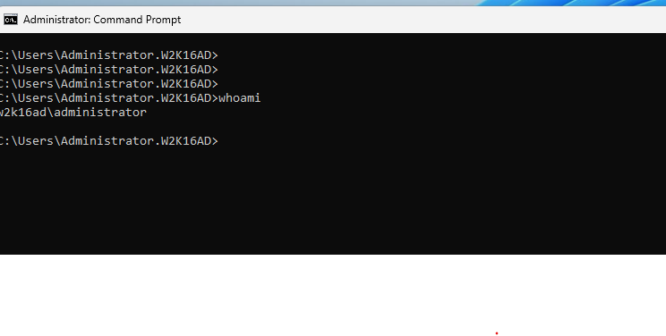

<p align="right"><a href="#top">⬆ Back to Top</a></p>

---

## Step 02 — Verify Client Connectivity to the Domain Controller

### Purpose

RSAT tools require network connectivity and DNS name resolution to communicate with Active Directory. Before installing or opening ADUC, verify that `W11-CLIENT01` can reach `SRV-DC01`.

### Steps

1. On `W11-CLIENT01`, open **Command Prompt**.
2. Check IP configuration:

```cmd
ipconfig /all
```

3. Confirm the DNS server points to the Domain Controller IP:

```text
192.168.20.10
```

4. Test connectivity to the Domain Controller:

```cmd
ping SRV-DC01
```

5. Test DNS name resolution:

```cmd
nslookup SRV-DC01
```

### Expected Result

`ping SRV-DC01` replies from:

```text
192.168.20.10
```

`nslookup SRV-DC01` resolves the server name to:

```text
SRV-DC01.W2K16AD.local
192.168.20.10
```

If DNS shows a timeout but still resolves the correct name and IP, continue the lab and review DNS later if required.

### Visual Reference

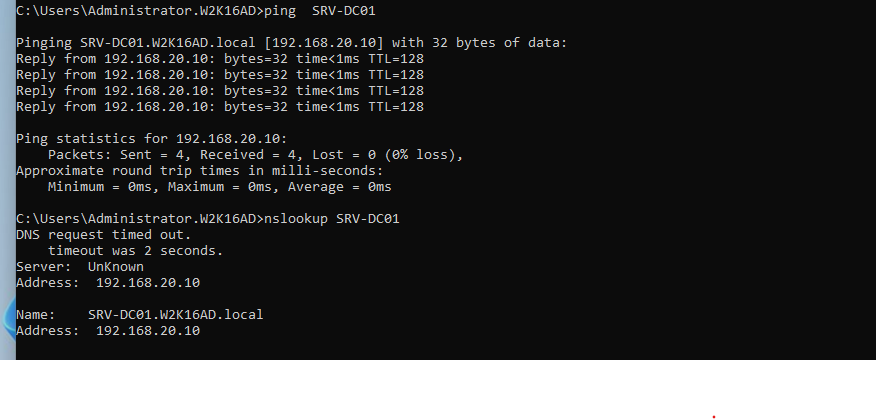

<p align="right"><a href="#top">⬆ Back to Top</a></p>

---

## Step 03 — Check Optional Features for RSAT

### Purpose

Confirm whether the Active Directory RSAT tools are available for installation on the Windows 11 client.

### Steps

1. On `W11-CLIENT01`, open **Settings**.
2. Go to:

```text
Apps > Optional features
```

3. Select **View features**.
4. In the search box, type:

```text
RSAT
```

5. Look for:

```text
RSAT: Active Directory Domain Services and Lightweight Directory Tools
```

### Expected Result

The RSAT Active Directory tools appear in the Optional Features list or are already listed as installed.

### Visual Reference


<p align="right"><a href="#top">⬆ Back to Top</a></p>

---

## Step 04 — Install and Verify RSAT Active Directory Tools

### Purpose

Install RSAT Active Directory tools so the client can run ADUC and the Active Directory PowerShell module.

### Option A — Install RSAT Using GUI

1. Open:

```text
Settings > Apps > Optional features > View features
```

2. Search for:

```text
RSAT
```

3. Select:

```text
RSAT: Active Directory Domain Services and Lightweight Directory Tools
```

4. Select **Next**.
5. Select **Install**.
6. Wait for the installation to complete.

### Option B — Install RSAT Using PowerShell

Open **PowerShell as Administrator** and run:

```powershell
Add-WindowsCapability -Online -Name Rsat.ActiveDirectory.DS-LDS.Tools~~~~0.0.1.0
```

### Verify Installation

Run:

```powershell
Get-WindowsCapability -Name RSAT.ActiveDirectory* -Online
```

### Expected Result

The state should show:

```text
State : Installed
```

### If the Client Has No Internet

Windows may need Internet access to download Optional Features. If `W11-CLIENT01` cannot install RSAT while connected to the lab network, temporarily change the VM network adapter to **NAT**.

Recommended workflow:

1. In VMware, change `W11-CLIENT01` network adapter to **NAT**.
2. Confirm **Connected** and **Connect at power on** are selected.
3. In Windows, run:

```cmd
ipconfig /renew
```

4. Test Internet:

```powershell
Test-NetConnection www.microsoft.com -Port 443
```

5. Install RSAT using GUI or PowerShell.
6. Verify `State : Installed`.
7. Change the VM network adapter back to the domain/lab network.
8. Renew IP settings and test the domain again:

```cmd
ipconfig /flushdns
ipconfig /renew
ping SRV-DC01
nslookup SRV-DC01
```

> [!TIP]
> The NAT step is only used to install RSAT. After RSAT is installed, return the client to the lab/domain network before opening ADUC.

### Visual Reference

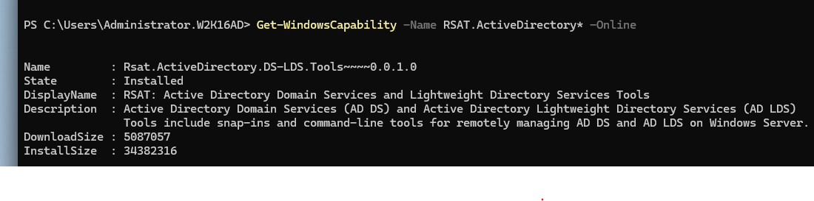

<p align="right"><a href="#top">⬆ Back to Top</a></p>

---

## Step 05 — Open Active Directory Users and Computers from the Client

### Purpose

Open ADUC from `W11-CLIENT01` to confirm RSAT was installed correctly and that the client can launch the Active Directory management console.

### Steps

1. Confirm the client is back on the lab/domain network after RSAT installation.
2. Press:

```text
Win + R
```

3. Enter:

```text
dsa.msc
```

4. Press **Enter**.

### Important Tool Names

Use this command for ADUC:

```text
dsa.msc = Active Directory Users and Computers
```

Do not confuse it with:

```text
dssite.msc = Active Directory Sites and Services
```

This lab uses **Active Directory Users and Computers**.

### Expected Result

The window title should be:

```text
Active Directory Users and Computers
```

The left pane should show:

```text
Saved Queries
W2K16AD.local
```

### Visual Reference

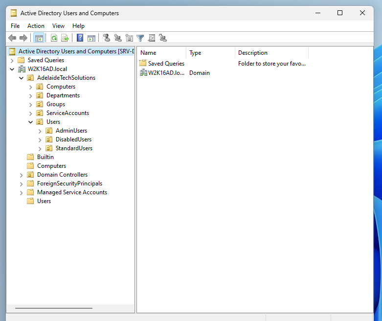

<p align="right"><a href="#top">⬆ Back to Top</a></p>

---

## Step 06 — Confirm ADUC Is Connected to the Domain

### Purpose

Confirm that ADUC opened from the Windows 11 client can browse the domain and display the OU structure created in previous labs.

### Steps

1. In **Active Directory Users and Computers**, expand:

```text
W2K16AD.local
```

2. Expand:

```text
AdelaideTechSolutions
```

3. Confirm the following OUs are visible:

```text
Users
Groups
Computers
DisabledUsers
```

4. Expand **Users** and confirm sub-OUs such as:

```text
StandardUsers
IT
HR
Finance
Sales
```

if they exist in your lab.

### Expected Result

ADUC running on `W11-CLIENT01` can browse `W2K16AD.local` and display the lab OU structure.

### Visual Reference

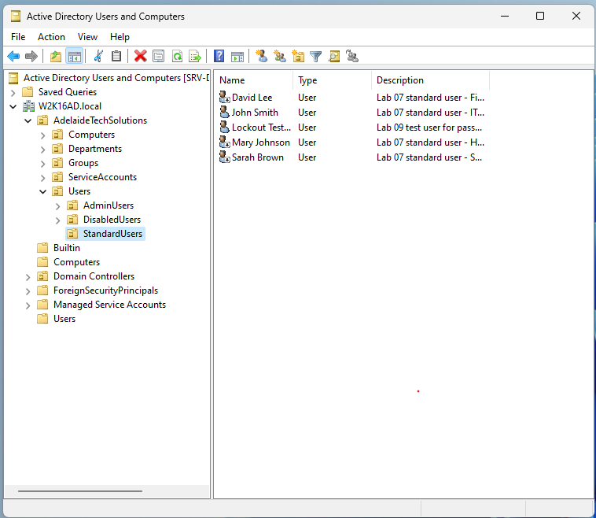

<p align="right"><a href="#top">⬆ Back to Top</a></p>

---

## Step 07 — Create a Test User from the Client

### Purpose

Create a new Active Directory user from the Windows 11 client using ADUC. This proves remote administration is working from the workstation.

### Steps

1. In ADUC on `W11-CLIENT01`, browse to:

```text
W2K16AD.local
└── AdelaideTechSolutions
    └── Users
        └── StandardUsers
```

2. Right-click **StandardUsers**.
3. Select:

```text
New > User
```

4. Enter these values:

| Field | Value |
|---|---|
| First name | `RSAT` |
| Last name | `Test` |
| Full name | `RSAT Test` |
| User logon name | `rsat.test` |

5. Confirm the UPN appears as:

```text
rsat.test@W2K16AD.local
```

6. Select **Next**.
7. Enter a lab password.
8. Configure the account options for the lab. For simple testing, you can use:

```text
Password never expires
```

9. Select **Next**.
10. Select **Finish**.

### Expected Result

A new user named `RSAT Test` is created in the `StandardUsers` OU using ADUC from the client workstation.

### Visual Reference

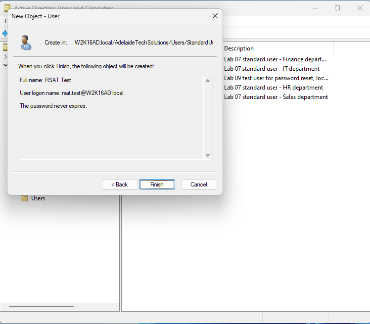

<p align="right"><a href="#top">⬆ Back to Top</a></p>

---

## Step 08 — Confirm the RSAT Test User Was Created

### Purpose

Verify that the new user appears in the correct OU after being created remotely from the client.

### Steps

1. In ADUC, browse to:

```text
W2K16AD.local
└── AdelaideTechSolutions
    └── Users
        └── StandardUsers
```

2. Select the **StandardUsers** OU.
3. Press **F5** or right-click the OU and select **Refresh**.
4. Confirm the user appears:

```text
RSAT Test
```

5. Optionally open the user properties and confirm the logon name:

```text
rsat.test
```

### Expected Result

The user `RSAT Test` is visible in `StandardUsers`.

### Visual Reference

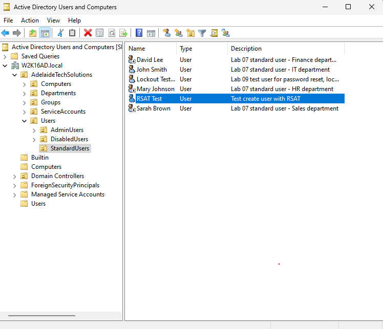

<p align="right"><a href="#top">⬆ Back to Top</a></p>

---

## Step 09 — Reset the User Password from the Client

### Purpose

Perform a common Service Desk task from the client workstation: reset a user's password using ADUC.

### Steps

1. In ADUC on `W11-CLIENT01`, browse to:

```text
W2K16AD.local
└── AdelaideTechSolutions
    └── Users
        └── StandardUsers
```

2. Right-click:

```text
RSAT Test
```

3. Select:

```text
Reset Password...
```

4. Enter a temporary lab password.
5. Confirm the temporary password.
6. For simple lab testing, leave **User must change password at next logon** unticked, or select it if you want to practise the normal Service Desk workflow.
7. Select **OK**.
8. Confirm the success message.

### Security Note

Do not use or publish real passwords in screenshots, documentation or repositories.

### Expected Result

The password for `RSAT Test` is reset successfully using ADUC from the Windows 11 client.

### Visual Reference

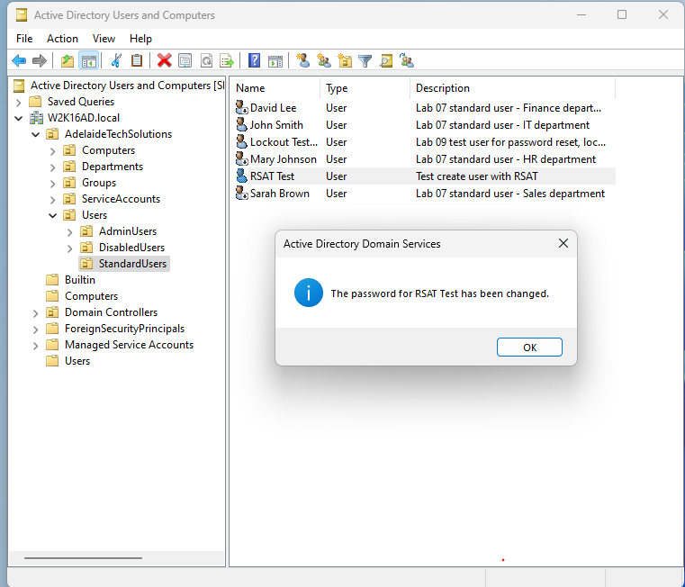

<p align="right"><a href="#top">⬆ Back to Top</a></p>

---

## Step 10 — Move the User to the DisabledUsers OU

### Purpose

Move the test user object from one OU to another using ADUC from the client. This simulates common account administration tasks such as moving inactive, disabled or separated user accounts to a controlled OU.

### Steps

1. In ADUC on `W11-CLIENT01`, browse to:

```text
W2K16AD.local
└── AdelaideTechSolutions
    └── Users
        └── StandardUsers
```

2. Right-click:

```text
RSAT Test
```

3. Select:

```text
Move...
```

4. In the Move window, select the destination OU:

```text
W2K16AD.local
└── AdelaideTechSolutions
    └── Users
        └── DisabledUsers
```

5. Select **OK**.

### Expected Result

The `RSAT Test` user is moved from `StandardUsers` to `DisabledUsers`.

### Visual Reference

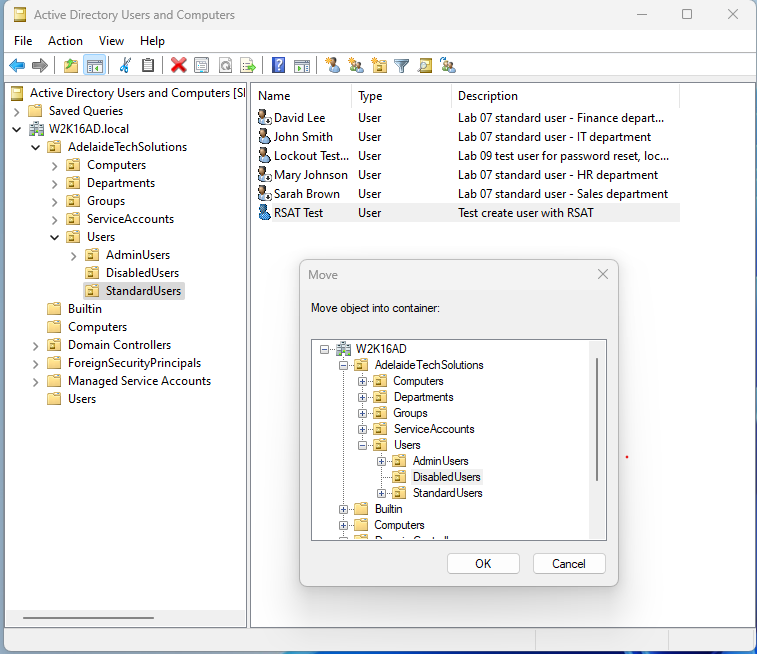

<p align="right"><a href="#top">⬆ Back to Top</a></p>

---

## Step 11 — Verify the User Was Moved

### Purpose

Confirm that the user object is now located in the destination OU.

### Steps

1. In ADUC on `W11-CLIENT01`, browse to:

```text
W2K16AD.local
└── AdelaideTechSolutions
    └── Users
        └── DisabledUsers
```

2. Select **DisabledUsers**.
3. Press **F5** or right-click and select **Refresh**.
4. Confirm the user appears:

```text
RSAT Test
```

### Expected Result

The user `RSAT Test` is visible in the `DisabledUsers` OU.

### Visual Reference

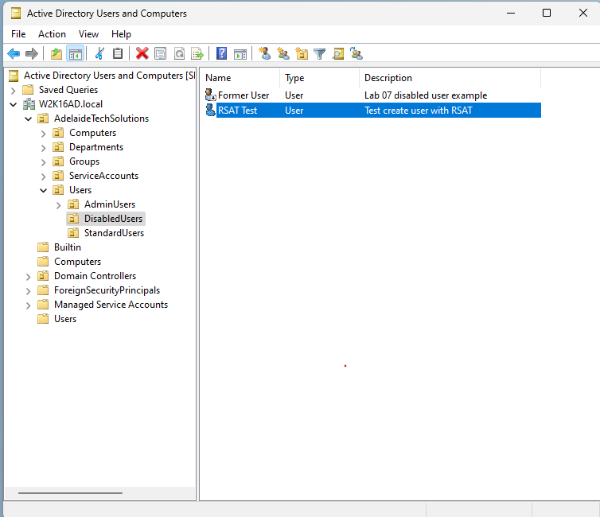

<p align="right"><a href="#top">⬆ Back to Top</a></p>

---

## Step 12 — Verify RSAT Administration with PowerShell

### Purpose

Use PowerShell on `W11-CLIENT01` to confirm that the Active Directory module is available and can query domain information remotely.

### Steps

1. On `W11-CLIENT01`, open **PowerShell**.
2. Import the Active Directory module:

```powershell
Import-Module ActiveDirectory
```

3. Query domain information:

```powershell
Get-ADDomain
```

4. Query the RSAT test user:

```powershell
Get-ADUser rsat.test -Properties DistinguishedName |
Select-Object Name,SamAccountName,Enabled,DistinguishedName
```

### Expected Result

PowerShell returns domain information for:

```text
W2K16AD.local
```

The `RSAT Test` user appears with a DistinguishedName showing the destination OU:

```text
OU=DisabledUsers
```

Example:

```text
CN=RSAT Test,OU=DisabledUsers,OU=Users,OU=AdelaideTechSolutions,DC=W2K16AD,DC=local
```

### Visual Reference

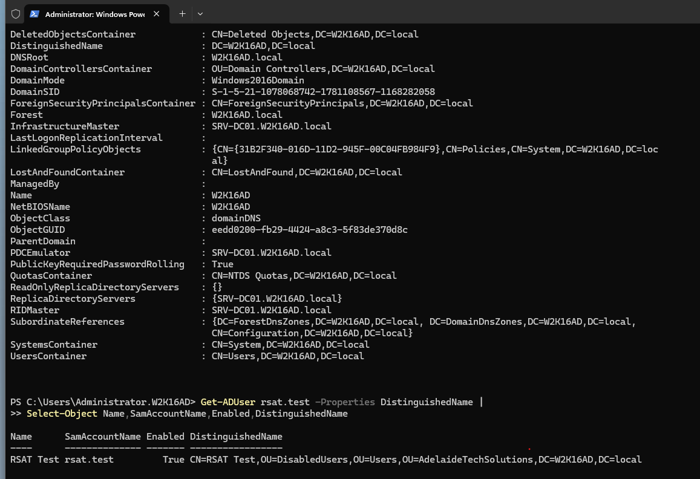

<p align="right"><a href="#top">⬆ Back to Top</a></p>

---

# Visual Evidence Checklist

| No. | File | Evidence |
|---:|---|---|
| 01 | `01-client-domain-login.png` | Domain user signed in to Windows 11 client |
| 02 | `02-client-network-connectivity.png` | Client can ping and resolve `SRV-DC01` |
| 03 | `03-open-optional-features-rsat.png` | RSAT Optional Features search opened |
| 04 | `04-rsat-active-directory-tools-installed.png` | RSAT AD tools installed and verified |
| 05 | `05-open-aduc-from-client.png` | ADUC opened from Windows 11 client |
| 06 | `06-aduc-connected-to-domain.png` | ADUC connected to `W2K16AD.local` |
| 07 | `07-create-rsat-test-user.png` | New user creation started from client |
| 08 | `08-rsat-test-user-created.png` | `RSAT Test` user created successfully |
| 09 | `09-reset-password-from-client.png` | Password reset performed from client |
| 10 | `10-move-user-to-disabledusers-ou.png` | User moved to `DisabledUsers` OU |
| 11 | `11-verify-user-moved-in-aduc.png` | User verified in destination OU |
| 12 | `12-verify-rsat-admin-powershell.png` | RSAT PowerShell administration verified |

---

# Real-World Service Desk Scenario

## Example Ticket

```text
Service Desk needs to manage a user account without logging directly on to the Domain Controller.
```

## Support Workflow

| Step | Action |
|---|---|
| 1 | Sign in to the admin workstation using an approved domain account. |
| 2 | Confirm client connectivity to the Domain Controller. |
| 3 | Confirm RSAT Active Directory tools are installed. |
| 4 | Open ADUC using `dsa.msc`. |
| 5 | Locate the user account or OU. |
| 6 | Perform the approved task, such as password reset or moving the account. |
| 7 | Verify the change in ADUC or PowerShell. |
| 8 | Document the action in the support ticket. |

## Example Case Note

```text
Signed in to the admin workstation using an approved domain account. Verified network connectivity and DNS resolution to SRV-DC01. Opened Active Directory Users and Computers from W11-CLIENT01 using RSAT. Created the RSAT Test user, reset the password and moved the account to the DisabledUsers OU for lab verification. Confirmed the final object location using ADUC and PowerShell. Ticket resolved.
```

---

# Troubleshooting

## ADUC Does Not Open

Confirm RSAT Active Directory tools are installed:

```powershell
Get-WindowsCapability -Name RSAT.ActiveDirectory* -Online
```

Expected result:

```text
State : Installed
```

If the state is `NotPresent`, install RSAT:

```powershell
Add-WindowsCapability -Online -Name Rsat.ActiveDirectory.DS-LDS.Tools~~~~0.0.1.0
```

---

## Start Menu Search Does Not Show ADUC

Use the direct Run command:

```text
Win + R
```

Then enter:

```text
dsa.msc
```

---

## Wrong Active Directory Tool Opens

Use the correct command:

```text
dsa.msc
```

Reference:

| Command | Tool |
|---|---|
| `dsa.msc` | Active Directory Users and Computers |
| `dssite.msc` | Active Directory Sites and Services |
| `gpmc.msc` | Group Policy Management Console |
| `dnsmgmt.msc` | DNS Manager |

---

## RSAT Install Fails Because the Client Has No Internet

Use this workflow:

1. Temporarily change the `W11-CLIENT01` VM network adapter to **NAT**.
2. Renew IP settings:

```cmd
ipconfig /renew
```

3. Test Internet:

```powershell
Test-NetConnection www.microsoft.com -Port 443
```

4. Install RSAT:

```powershell
Add-WindowsCapability -Online -Name Rsat.ActiveDirectory.DS-LDS.Tools~~~~0.0.1.0
```

5. Verify installation:

```powershell
Get-WindowsCapability -Name RSAT.ActiveDirectory* -Online
```

6. Change the VM network adapter back to the lab/domain network.
7. Refresh IP and DNS:

```cmd
ipconfig /flushdns
ipconfig /renew
```

8. Test the domain again:

```cmd
ping SRV-DC01
nslookup SRV-DC01
```

---

## Client Cannot Resolve SRV-DC01

Check DNS on the client:

```cmd
ipconfig /all
```

The DNS server should point to:

```text
192.168.20.10
```

Then test:

```cmd
nslookup SRV-DC01
ping SRV-DC01
```

---

## Access Denied in ADUC

The signed-in account may not have enough permission to create, reset or move objects.

Check:

- Is the user signed in with the correct domain admin or delegated admin account?
- Is the user trying to modify the correct OU?
- Does the account have permission to create, reset or move user objects?

---

## Active Directory PowerShell Module Not Found

Verify RSAT Active Directory tools are installed:

```powershell
Get-WindowsCapability -Name RSAT.ActiveDirectory* -Online
```

Then try:

```powershell
Import-Module ActiveDirectory
Get-Command Get-ADUser
```

---

# Command Reference

| Command | Run on | Purpose |
|---|---|---|
| `whoami` | Client | Confirms signed-in domain user |
| `ipconfig /all` | Client | Reviews IP and DNS configuration |
| `ping SRV-DC01` | Client | Tests connectivity to Domain Controller |
| `nslookup SRV-DC01` | Client | Tests DNS name resolution |
| `dsa.msc` | Client | Opens Active Directory Users and Computers |
| `Get-WindowsCapability -Name RSAT.ActiveDirectory* -Online` | Client | Checks RSAT AD tools installation state |
| `Add-WindowsCapability -Online -Name Rsat.ActiveDirectory.DS-LDS.Tools~~~~0.0.1.0` | Client | Installs RSAT AD DS and LDS tools |
| `Import-Module ActiveDirectory` | Client | Loads the Active Directory PowerShell module |
| `Get-ADDomain` | Client | Shows domain information |
| `Get-ADUser rsat.test -Properties DistinguishedName` | Client | Verifies test user and OU location |

---

# Completion Checklist

- [x] Signed in to `W11-CLIENT01` using a domain account.
- [x] Verified connectivity to `SRV-DC01`.
- [x] Opened Optional Features and searched for RSAT.
- [x] Installed RSAT Active Directory tools.
- [x] Verified RSAT installation state as `Installed`.
- [x] Opened ADUC using `dsa.msc` from the client.
- [x] Confirmed ADUC connected to `W2K16AD.local`.
- [x] Created `RSAT Test` user from the client.
- [x] Verified `RSAT Test` user in ADUC.
- [x] Reset the user password from the client.
- [x] Moved the user to `DisabledUsers` OU.
- [x] Verified the user location in ADUC.
- [x] Verified RSAT administration using PowerShell.
- [x] Visual evidence added to the lab documentation.

---

# Key Learning Outcomes

After completing this lab, you can explain and demonstrate how to:

- Install RSAT Active Directory tools on Windows 11.
- Use NAT temporarily when RSAT installation requires Internet access.
- Return the client to the domain/lab network after installation.
- Open ADUC from a client using `dsa.msc`.
- Browse Active Directory remotely from a workstation.
- Create a user from a remote admin workstation.
- Reset a user password from ADUC on the client.
- Move a user object between OUs.
- Verify AD administration using the Active Directory PowerShell module.
- Avoid unnecessary direct logons to the Domain Controller for routine administration.

---

## 👤 Author

**Xuan Toan Nguyen**  
IT Support | Service Desk | Desktop Support | System Administration  
Adelaide, South Australia

🥈 Silver Medal — WorldSkills Australia SA Regional Competition 2026, Cloud Computing

- 🔗 LinkedIn: [www.linkedin.com/in/toan-nguyen-it-oz](https://www.linkedin.com/in/toan-nguyen-it-oz)
- 💻 GitHub: [github.com/toannguyenitoz](https://github.com/toannguyenitoz)

---

<p align="center">
  <a href="../10-home-folder-and-file-share/README.md">⬅ Previous Lab</a> ·
  <a href="../../README.md">🏠 Main README</a> ·
  <a href="../12-second-client-computer-management/README.md">Next Lab ➜</a> ·
  <a href="#top">⬆ Back to Top</a>
</p>

<p align="center">
  <strong>#ToanNguyenITOz #Windows11 #WindowsServer #RSAT #ActiveDirectory #ITSupport #ServiceDesk #SystemAdministration</strong>
</p>
