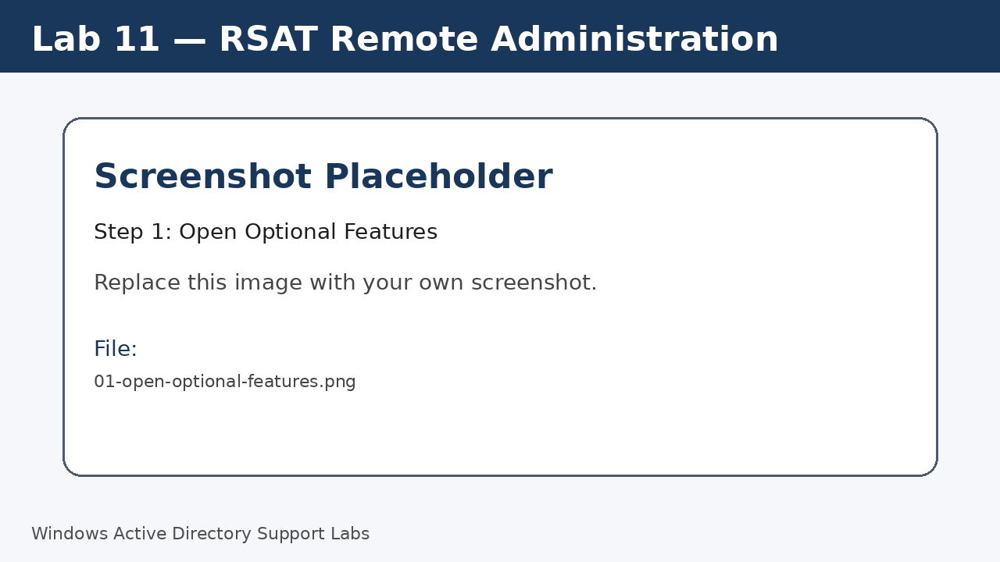
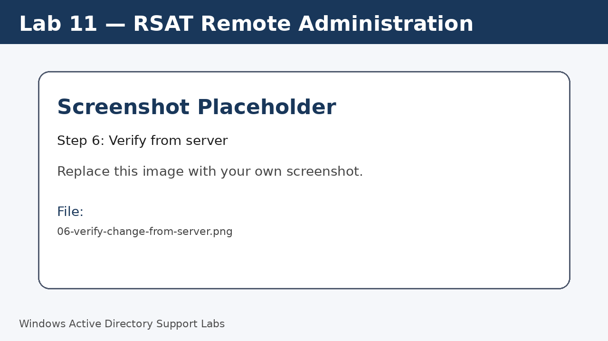

<a id="top"></a>

# Lab 11 — RSAT Remote Administration

<p align="center">
  
  
  
  
  
  
</p>

<p align="center">
  <a href="../10-home-folder-and-file-share/README.md">⬅ Previous Lab</a> | <a href="../../README.md">🏠 Main README</a> | <a href="../12-second-client-computer-management/README.md">Next Lab ➡</a>
</p>

---

## Overview

Use Remote Server Administration Tools from the Windows 11 client to manage Active Directory remotely.

---

## Objectives

- Install RSAT tools on Windows 11.
- Open Active Directory Users and Computers from the client.
- Confirm remote administration access.
- Make a small safe change to an AD object.

---

## Lab Values

| Item | Value |
|---|---|
| Client | `W11-CLIENT01` |
| Tools | RSAT / Active Directory Users and Computers |
| Screenshot folder | `assets/images/lab-11-rsat-remote-administration/` |

---

## Before You Start

- Complete the previous lab unless this is Lab 01.
- Use a lab environment only.
- Do not publish real passwords or private business information.
- Replace placeholder screenshots with your own screenshots after completing each step.

---

## Screenshot Files

| File name | Step |
|---|---|
| 01-open-optional-features.png | Open Optional Features |
| 02-add-rsat-active-directory-tools.png | Add RSAT feature |
| 03-open-aduc-from-client.png | Open Windows Tools |
| 04-browse-domain-from-client.png | Browse the domain |
| 05-update-object-description.png | Manage a test object |
| 06-verify-change-from-server.png | Verify from server |

---

## Step 1 — Open Optional Features

On Windows 11, open **Settings > Apps > Optional features**.

Screenshot file:

```text
assets/images/lab-11-rsat-remote-administration/01-open-optional-features.png
```



[⬆ Back to top](#top)

## Step 2 — Add RSAT feature

Add the RSAT Active Directory tools feature.

Screenshot file:

```text
assets/images/lab-11-rsat-remote-administration/02-add-rsat-active-directory-tools.png
```


[⬆ Back to top](#top)

## Step 3 — Open Windows Tools

Open **Windows Tools** and start **Active Directory Users and Computers**.

Screenshot file:

```text
assets/images/lab-11-rsat-remote-administration/03-open-aduc-from-client.png
```


[⬆ Back to top](#top)

## Step 4 — Browse the domain

Confirm the `corp.local` domain and OU structure are visible from the client.

Screenshot file:

```text
assets/images/lab-11-rsat-remote-administration/04-browse-domain-from-client.png
```


[⬆ Back to top](#top)

## Step 5 — Manage a test object

Open a test user object and update a lab-safe field such as Description.

Screenshot file:

```text
assets/images/lab-11-rsat-remote-administration/05-update-object-description.png
```


[⬆ Back to top](#top)

## Step 6 — Verify from server

On the server, open ADUC and confirm the change is visible.

Screenshot file:

```text
assets/images/lab-11-rsat-remote-administration/06-verify-change-from-server.png
```



[⬆ Back to top](#top)


---

## Completion Checklist

- [ ] RSAT installed.
- [ ] ADUC opened from Windows 11.
- [ ] Domain visible from client.
- [ ] Test object reviewed.
- [ ] Safe change confirmed.

---

## Key Takeaways

- RSAT allows support staff to manage server tools from a workstation.
- Permissions still control what the technician can change.
- Remote administration reduces the need to sign in directly to the server.

---

## Author

**Xuan Toan Nguyen**  
IT Support | Service Desk | Desktop Support | System Administration  
Adelaide, South Australia

- LinkedIn: [www.linkedin.com/in/toan-nguyen-it-oz](https://www.linkedin.com/in/toan-nguyen-it-oz)
- GitHub: [github.com/toannguyenitoz](https://github.com/toannguyenitoz)

---

<p align="center">
  <a href="../10-home-folder-and-file-share/README.md">⬅ Previous Lab</a> | <a href="../../README.md">🏠 Main README</a> | <a href="../12-second-client-computer-management/README.md">Next Lab ➡</a> |
  <a href="#top">⬆ Back to Top</a>
</p>
