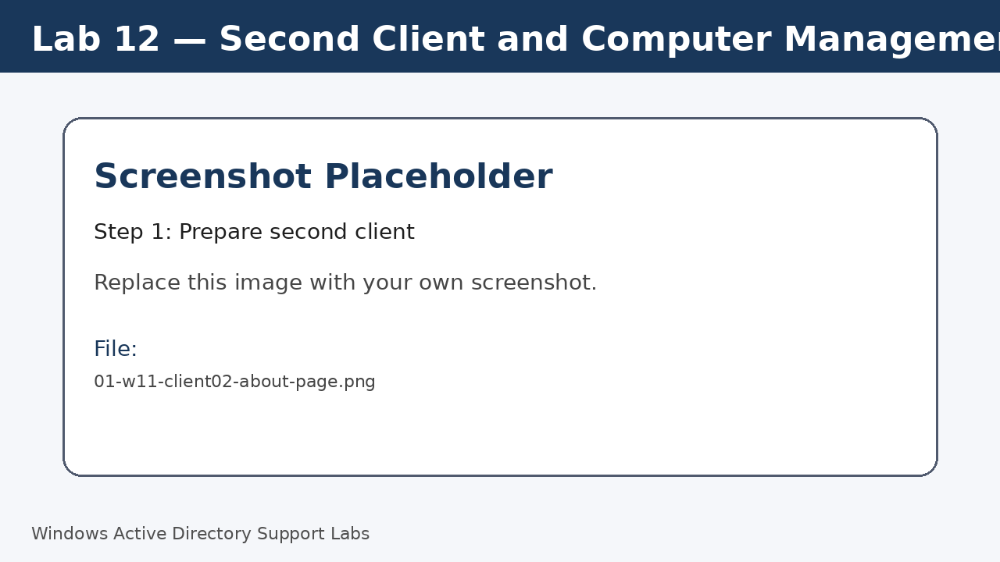
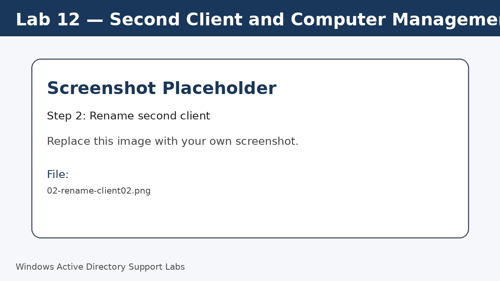
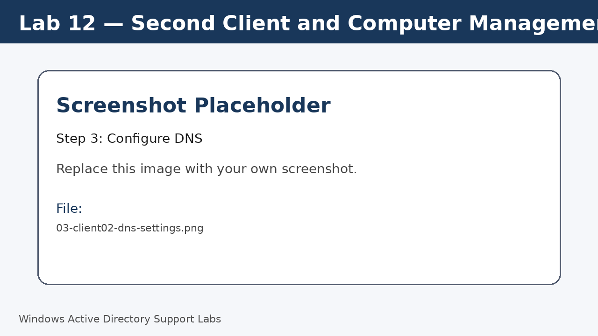
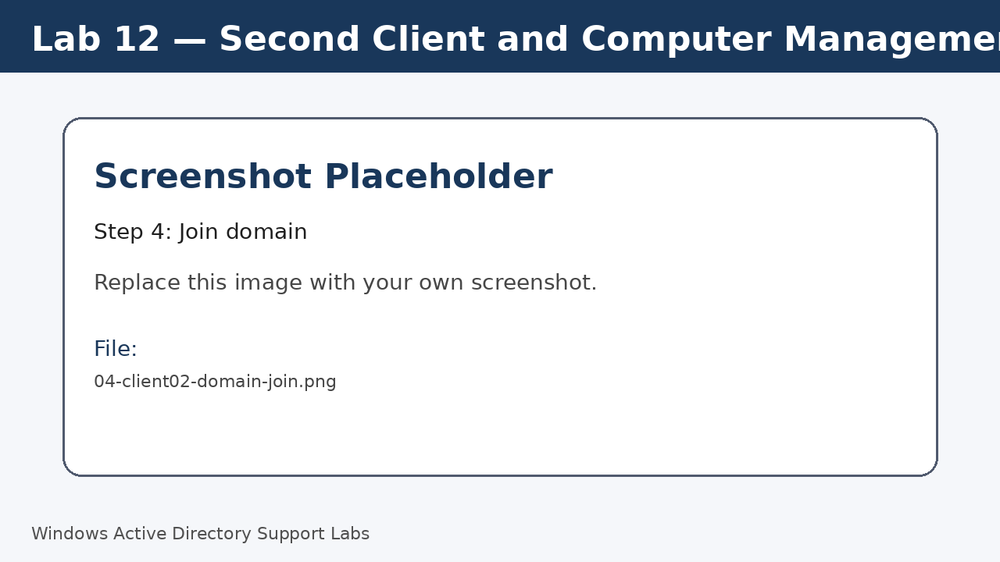
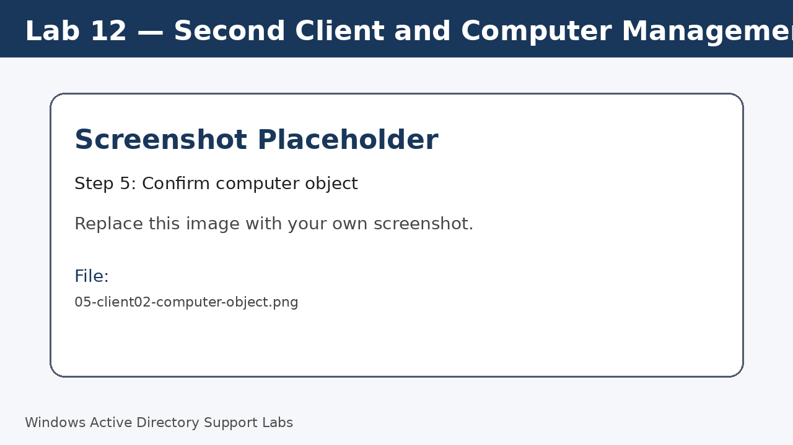

<a id="top"></a>

# Lab 12 — Second Client and Computer Management

<p align="center">
  
  
  
  
  
  
</p>

<p align="center">
  <a href="../11-rsat-remote-administration/README.md">⬅ Previous Lab</a> | <a href="../../README.md">🏠 Main README</a> | <a href="../13-print-server-and-network-printer/README.md">Next Lab ➡</a>
</p>

---

## Overview

Add a second Windows 11 client and practice managing multiple domain computer objects.

---

## Objectives

- Rename a second Windows 11 client.
- Configure DNS for domain access.
- Join the second client to the domain.
- Organize multiple computer objects in Active Directory.

---

## Lab Values

| Item | Value |
|---|---|
| Second client | `W11-CLIENT02` |
| Domain | `corp.local` |
| Screenshot folder | `assets/images/lab-12-second-client-computer-management/` |

---

## Before You Start

- Complete the previous lab unless this is Lab 01.
- Use a lab environment only.
- Do not publish real passwords or private business information.
- Replace placeholder screenshots with your own screenshots after completing each step.

---

## Screenshot Files

| File name | Step |
|---|---|
| 01-w11-client02-about-page.png | Prepare second client |
| 02-rename-client02.png | Rename second client |
| 03-client02-dns-settings.png | Configure DNS |
| 04-client02-domain-join.png | Join domain |
| 05-client02-computer-object.png | Confirm computer object |
| 06-move-client02-to-computers-ou.png | Move computer object |
| 07-two-computers-in-active-directory.png | Verify both clients |

---

## Step 1 — Prepare second client

Start the second Windows 11 client and open the About page.

Screenshot file:

```text
assets/images/lab-12-second-client-computer-management/01-w11-client02-about-page.png
```



[⬆ Back to top](#top)

## Step 2 — Rename second client

Rename the second client to `W11-CLIENT02` and restart.

Screenshot file:

```text
assets/images/lab-12-second-client-computer-management/02-rename-client02.png
```



[⬆ Back to top](#top)

## Step 3 — Configure DNS

Set the DNS server to the domain controller IP.

Run:

```cmd
ipconfig /all
```

Screenshot file:

```text
assets/images/lab-12-second-client-computer-management/03-client02-dns-settings.png
```



[⬆ Back to top](#top)

## Step 4 — Join domain

Join the second client to `corp.local` and restart.

Screenshot file:

```text
assets/images/lab-12-second-client-computer-management/04-client02-domain-join.png
```



[⬆ Back to top](#top)

## Step 5 — Confirm computer object

Open ADUC and confirm `W11-CLIENT02` appears.

Screenshot file:

```text
assets/images/lab-12-second-client-computer-management/05-client02-computer-object.png
```



[⬆ Back to top](#top)

## Step 6 — Move computer object

Move `W11-CLIENT02` to the correct Computers OU.

Screenshot file:

```text
assets/images/lab-12-second-client-computer-management/06-move-client02-to-computers-ou.png
```


[⬆ Back to top](#top)

## Step 7 — Verify both clients

Confirm both Windows 11 clients are visible in the domain.

Run:

```powershell
Get-ADComputer -Filter *
```

Screenshot file:

```text
assets/images/lab-12-second-client-computer-management/07-two-computers-in-active-directory.png
```


[⬆ Back to top](#top)


---

## Completion Checklist

- [ ] Second client renamed.
- [ ] DNS configured.
- [ ] Second client joined to domain.
- [ ] Computer object confirmed.
- [ ] Computer object moved to correct OU.
- [ ] Both clients visible.

---

## Key Takeaways

- Multiple clients allow realistic testing of user and computer support tasks.
- Computer objects should follow the same OU management standard.
- Consistent naming helps identify devices quickly.

---

## Author

**Xuan Toan Nguyen**  
IT Support | Service Desk | Desktop Support | System Administration  
Adelaide, South Australia

- LinkedIn: [www.linkedin.com/in/toan-nguyen-it-oz](https://www.linkedin.com/in/toan-nguyen-it-oz)
- GitHub: [github.com/toannguyenitoz](https://github.com/toannguyenitoz)

---

<p align="center">
  <a href="../11-rsat-remote-administration/README.md">⬅ Previous Lab</a> | <a href="../../README.md">🏠 Main README</a> | <a href="../13-print-server-and-network-printer/README.md">Next Lab ➡</a> |
  <a href="#top">⬆ Back to Top</a>
</p>
