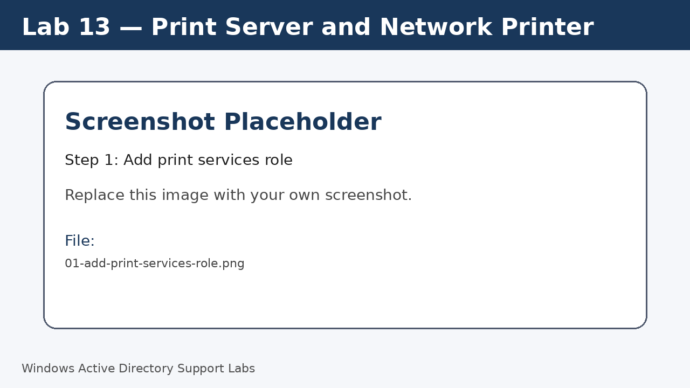
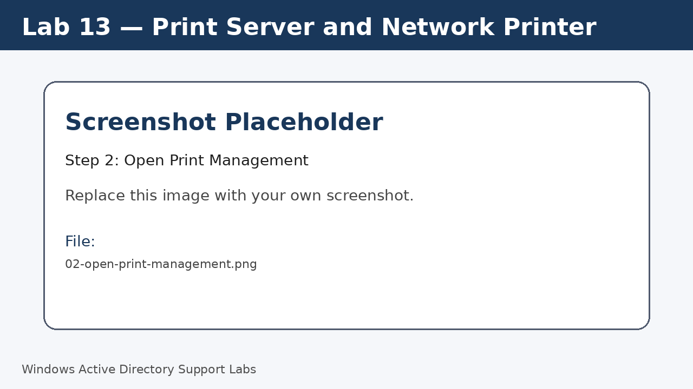
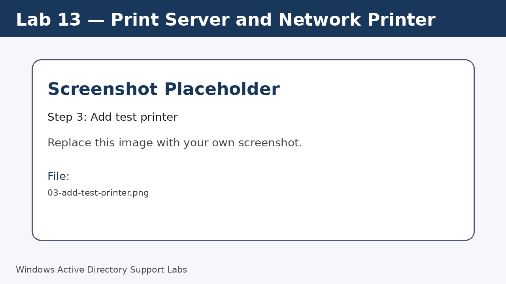
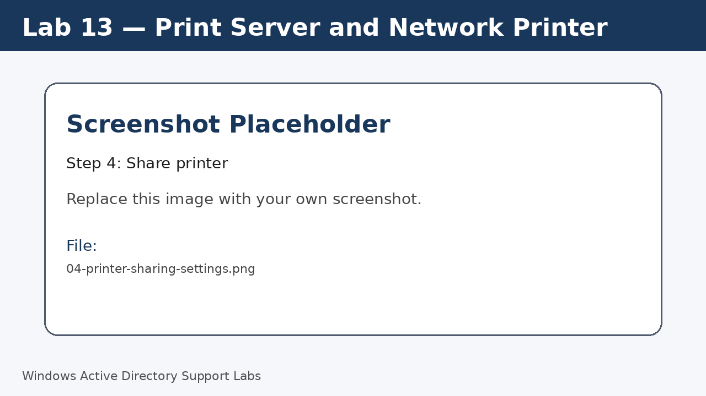
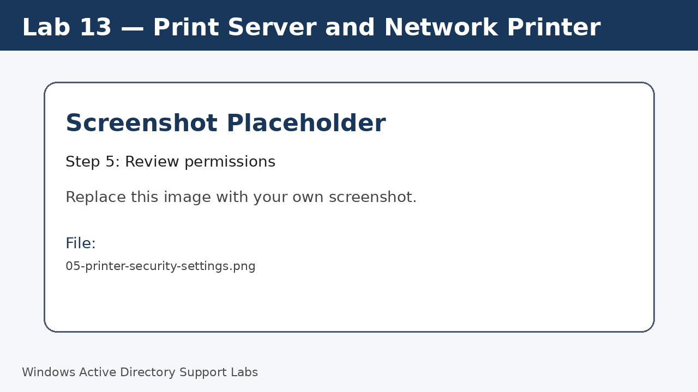

<a id="top"></a>

# Lab 13 — Print Server and Network Printer

<p align="center">
  
  
  
  
  
  
</p>

<p align="center">
  <a href="../12-second-client-computer-management/README.md">⬅ Previous Lab</a> | <a href="../../README.md">🏠 Main README</a> | <a href="../14-remote-desktop-support/README.md">Next Lab ➡</a>
</p>

---

## Overview

Set up a basic print server workflow and practice common printer support checks.

---

## Objectives

- Install print services on the server.
- Create a shared test printer.
- Connect a client to the shared printer.
- Review print queue and printer permissions.
- Practice common print support checks.

---

## Lab Values

| Item | Value |
|---|---|
| Server | `SRV-DC01` |
| Client | `W11-CLIENT01` |
| Screenshot folder | `assets/images/lab-13-print-server-and-network-printer/` |

---

## Before You Start

- Complete the previous lab unless this is Lab 01.
- Use a lab environment only.
- Do not publish real passwords or private business information.
- Replace placeholder screenshots with your own screenshots after completing each step.

---

## Screenshot Files

| File name | Step |
|---|---|
| 01-add-print-services-role.png | Add print services role |
| 02-open-print-management.png | Open Print Management |
| 03-add-test-printer.png | Add test printer |
| 04-printer-sharing-settings.png | Share printer |
| 05-printer-security-settings.png | Review permissions |
| 06-client-add-shared-printer.png | Connect from client |
| 07-print-queue-management.png | Review print queue |

---

## Step 1 — Add print services role

Open Server Manager and add the print services role.

Screenshot file:

```text
assets/images/lab-13-print-server-and-network-printer/01-add-print-services-role.png
```



[⬆ Back to top](#top)

## Step 2 — Open Print Management

Open **Print Management** from Server Manager tools.

Screenshot file:

```text
assets/images/lab-13-print-server-and-network-printer/02-open-print-management.png
```



[⬆ Back to top](#top)

## Step 3 — Add test printer

Add a test printer using a lab-safe printer name and driver.

A physical printer is not required for basic print management practice.

Screenshot file:

```text
assets/images/lab-13-print-server-and-network-printer/03-add-test-printer.png
```



[⬆ Back to top](#top)

## Step 4 — Share printer

Open printer properties and share the printer with a clear name.

Screenshot file:

```text
assets/images/lab-13-print-server-and-network-printer/04-printer-sharing-settings.png
```



[⬆ Back to top](#top)

## Step 5 — Review permissions

Review printer security settings and understand who can print or manage documents.

Screenshot file:

```text
assets/images/lab-13-print-server-and-network-printer/05-printer-security-settings.png
```



[⬆ Back to top](#top)

## Step 6 — Connect from client

On Windows 11, add the shared printer from **Printers & scanners**.

Screenshot file:

```text
assets/images/lab-13-print-server-and-network-printer/06-client-add-shared-printer.png
```


[⬆ Back to top](#top)

## Step 7 — Review print queue

Open the print queue and review pause/resume/cancel options.

Screenshot file:

```text
assets/images/lab-13-print-server-and-network-printer/07-print-queue-management.png
```


[⬆ Back to top](#top)


---

## Completion Checklist

- [ ] Print services installed.
- [ ] Test printer added.
- [ ] Printer shared.
- [ ] Permissions reviewed.
- [ ] Client connected to shared printer.
- [ ] Print queue reviewed.

---

## Key Takeaways

- Printer issues are common in IT support.
- Print queue management helps resolve stuck jobs.
- Shared printers can be centrally managed from the server.

---

## Author

**Xuan Toan Nguyen**  
IT Support | Service Desk | Desktop Support | System Administration  
Adelaide, South Australia

- LinkedIn: [www.linkedin.com/in/toan-nguyen-it-oz](https://www.linkedin.com/in/toan-nguyen-it-oz)
- GitHub: [github.com/toannguyenitoz](https://github.com/toannguyenitoz)

---

<p align="center">
  <a href="../12-second-client-computer-management/README.md">⬅ Previous Lab</a> | <a href="../../README.md">🏠 Main README</a> | <a href="../14-remote-desktop-support/README.md">Next Lab ➡</a> |
  <a href="#top">⬆ Back to Top</a>
</p>
