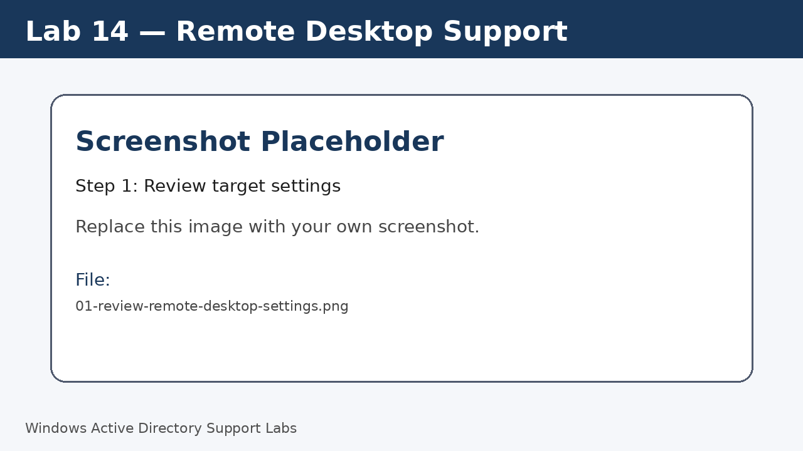
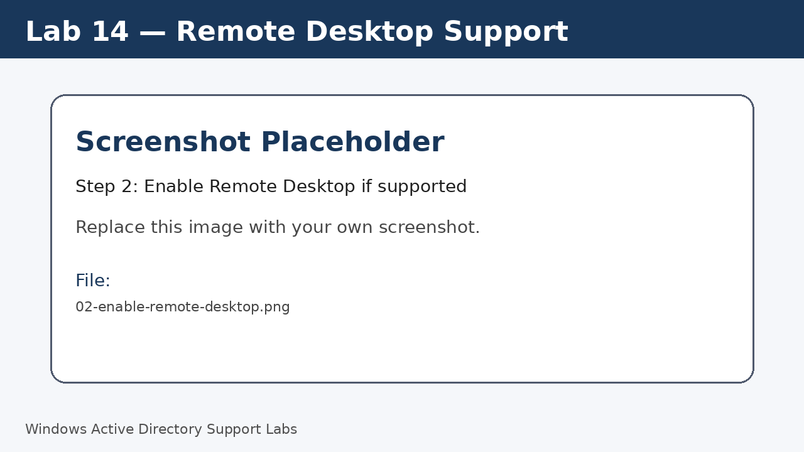
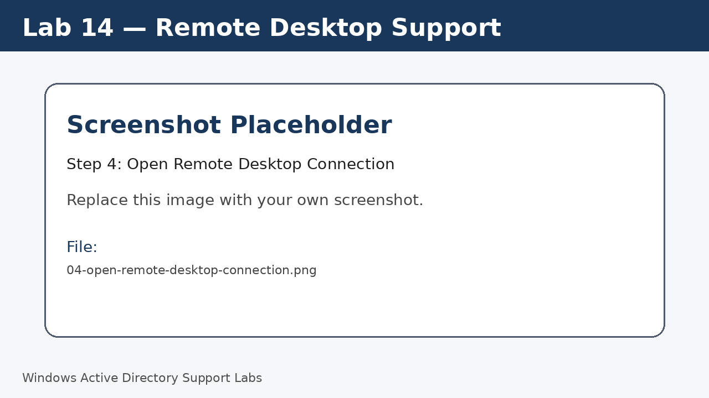
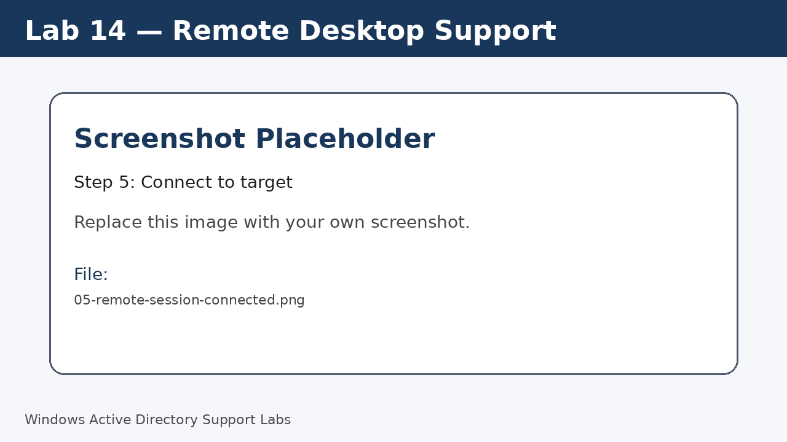
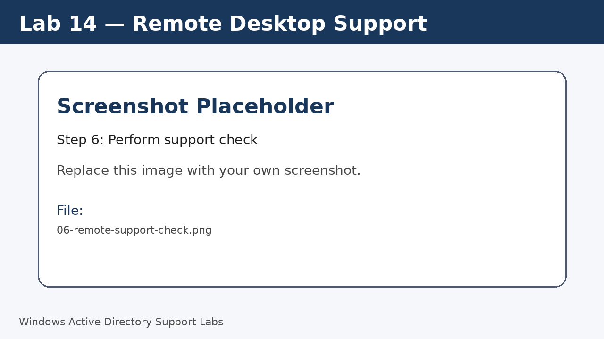
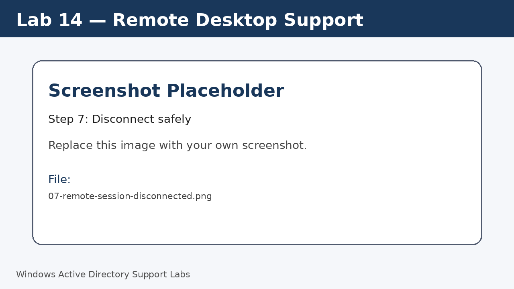

<a id="top"></a>

# Lab 14 — Remote Desktop Support

<p align="center">
  
  
  
  
  
  
</p>

<p align="center">
  <a href="../13-print-server-and-network-printer/README.md">⬅ Previous Lab</a> | <a href="../../README.md">🏠 Main README</a> | <a href="../15-network-troubleshooting-wifi-ip/README.md">Next Lab ➡</a>
</p>

---

## Overview

Practice a professional remote support workflow using Remote Desktop in a controlled lab environment.

---

## Objectives

- Enable or review Remote Desktop on a target computer.
- Confirm target hostname and IP address.
- Connect from a support computer.
- Perform a simple support check.
- Disconnect safely and document the session.

---

## Lab Values

| Item | Value |
|---|---|
| Target | `W11-CLIENT01` or `W11-CLIENT02` |
| Support tool | Remote Desktop Connection |
| Screenshot folder | `assets/images/lab-14-remote-desktop-support/` |

---

## Before You Start

- Complete the previous lab unless this is Lab 01.
- Use a lab environment only.
- Do not publish real passwords or private business information.
- Replace placeholder screenshots with your own screenshots after completing each step.

---

## Screenshot Files

| File name | Step |
|---|---|
| 01-review-remote-desktop-settings.png | Review target settings |
| 02-enable-remote-desktop.png | Enable Remote Desktop if supported |
| 03-confirm-target-hostname-and-ip.png | Confirm target name and IP |
| 04-open-remote-desktop-connection.png | Open Remote Desktop Connection |
| 05-remote-session-connected.png | Connect to target |
| 06-remote-support-check.png | Perform support check |
| 07-remote-session-disconnected.png | Disconnect safely |

---

## Step 1 — Review target settings

On the target Windows 11 computer, open Remote Desktop settings.

Screenshot file:

```text
assets/images/lab-14-remote-desktop-support/01-review-remote-desktop-settings.png
```



[⬆ Back to top](#top)

## Step 2 — Enable Remote Desktop if supported

Enable Remote Desktop on supported Windows editions.

Confirm firewall prompts if shown.

Screenshot file:

```text
assets/images/lab-14-remote-desktop-support/02-enable-remote-desktop.png
```



[⬆ Back to top](#top)

## Step 3 — Confirm target name and IP

Record the hostname and IP address of the target device.

Run:

```cmd
hostname
ipconfig
```

Screenshot file:

```text
assets/images/lab-14-remote-desktop-support/03-confirm-target-hostname-and-ip.png
```


[⬆ Back to top](#top)

## Step 4 — Open Remote Desktop Connection

On the support computer, open Remote Desktop Connection.

Run:

```cmd
mstsc
```

Screenshot file:

```text
assets/images/lab-14-remote-desktop-support/04-open-remote-desktop-connection.png
```



[⬆ Back to top](#top)

## Step 5 — Connect to target

Enter the target hostname or IP address and sign in with an approved lab account.

Screenshot file:

```text
assets/images/lab-14-remote-desktop-support/05-remote-session-connected.png
```



[⬆ Back to top](#top)

## Step 6 — Perform support check

Open Settings or Command Prompt in the remote session and confirm the target device.

Run:

```cmd
hostname
```

Screenshot file:

```text
assets/images/lab-14-remote-desktop-support/06-remote-support-check.png
```



[⬆ Back to top](#top)

## Step 7 — Disconnect safely

Close or disconnect the remote session after testing.

Screenshot file:

```text
assets/images/lab-14-remote-desktop-support/07-remote-session-disconnected.png
```



[⬆ Back to top](#top)


---

## Completion Checklist

- [ ] Remote Desktop setting reviewed.
- [ ] Target hostname confirmed.
- [ ] Target IP confirmed.
- [ ] Remote connection tested.
- [ ] Support check completed.
- [ ] Session disconnected safely.

---

## Key Takeaways

- Remote access should be approved and professional.
- Always be aware of the user experience during a remote session.
- Document what was checked and changed.

---

## Author

**Xuan Toan Nguyen**  
IT Support | Service Desk | Desktop Support | System Administration  
Adelaide, South Australia

- LinkedIn: [www.linkedin.com/in/toan-nguyen-it-oz](https://www.linkedin.com/in/toan-nguyen-it-oz)
- GitHub: [github.com/toannguyenitoz](https://github.com/toannguyenitoz)

---

<p align="center">
  <a href="../13-print-server-and-network-printer/README.md">⬅ Previous Lab</a> | <a href="../../README.md">🏠 Main README</a> | <a href="../15-network-troubleshooting-wifi-ip/README.md">Next Lab ➡</a> |
  <a href="#top">⬆ Back to Top</a>
</p>
