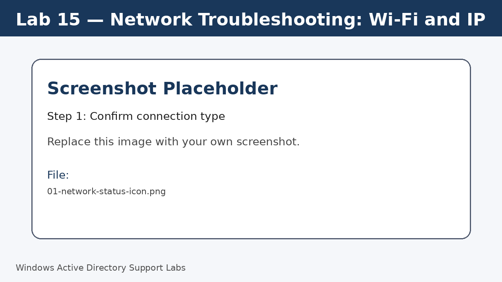
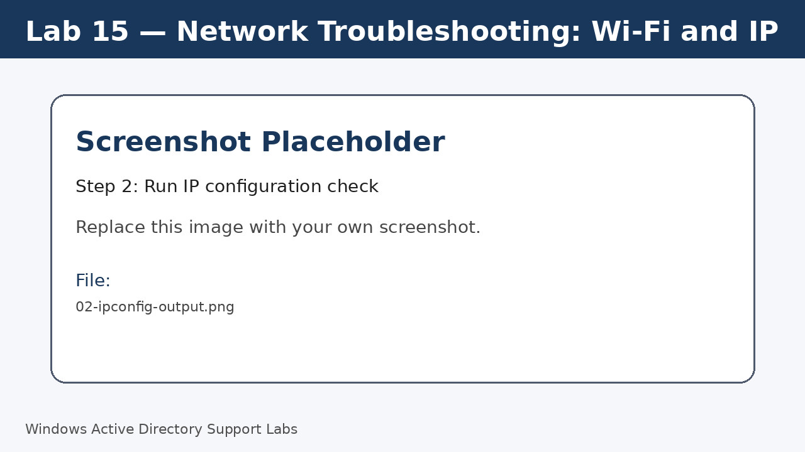
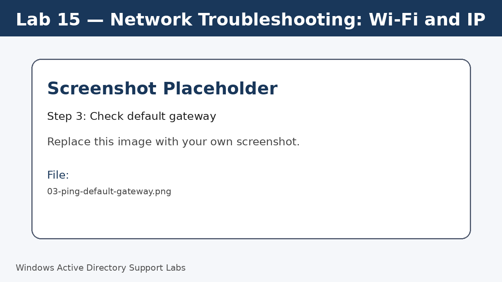
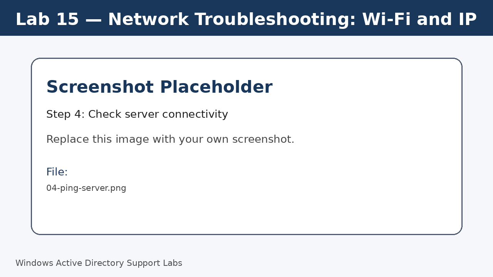
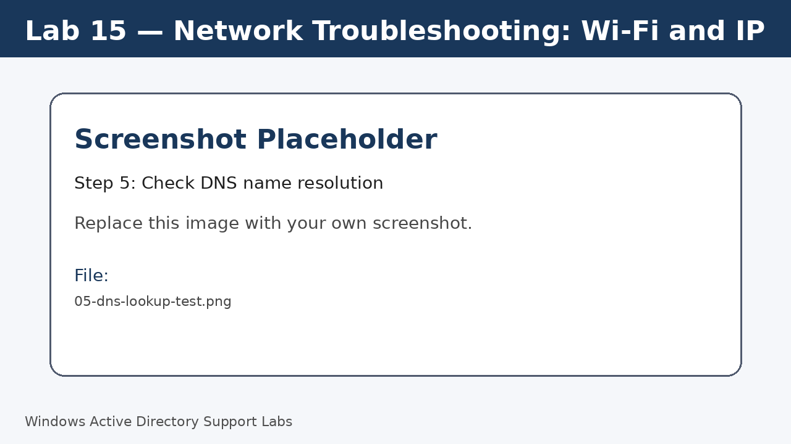
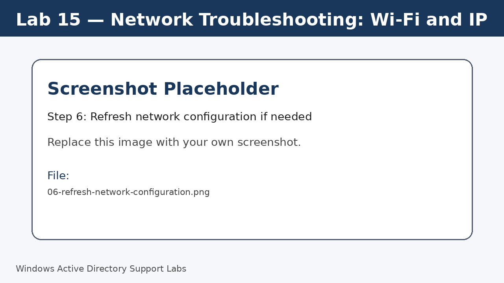
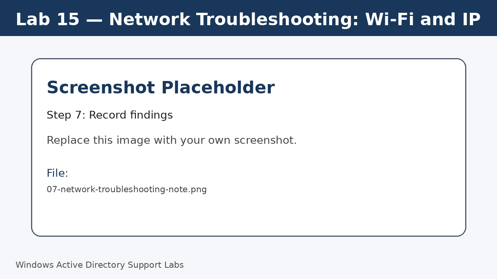

<a id="top"></a>

# Lab 15 — Network Troubleshooting: Wi-Fi and IP

<p align="center">
  
  
  
  
  
  
</p>

<p align="center">
  <a href="../14-remote-desktop-support/README.md">⬅ Previous Lab</a> | <a href="../../README.md">🏠 Main README</a> | <a href="../16-service-desk-documentation/README.md">Next Lab ➡</a>
</p>

---

## Overview

Practice a structured first-line network troubleshooting workflow for Windows devices.

---

## Objectives

- Check connection type and network status.
- Review IP configuration.
- Test local and server connectivity.
- Test DNS name resolution.
- Record findings clearly.

---

## Lab Values

| Item | Value |
|---|---|
| Client | Windows 11 |
| Tools | Command Prompt and Settings |
| Screenshot folder | `assets/images/lab-15-network-troubleshooting-wifi-ip/` |

---

## Before You Start

- Complete the previous lab unless this is Lab 01.
- Use a lab environment only.
- Do not publish real passwords or private business information.
- Replace placeholder screenshots with your own screenshots after completing each step.

---

## Screenshot Files

| File name | Step |
|---|---|
| 01-network-status-icon.png | Confirm connection type |
| 02-ipconfig-output.png | Run IP configuration check |
| 03-ping-default-gateway.png | Check default gateway |
| 04-ping-server.png | Check server connectivity |
| 05-dns-lookup-test.png | Check DNS name resolution |
| 06-refresh-network-configuration.png | Refresh network configuration if needed |
| 07-network-troubleshooting-note.png | Record findings |

---

## Step 1 — Confirm connection type

Check whether the device is using Wi-Fi or Ethernet.

Review the network icon and Windows network settings.

Screenshot file:

```text
assets/images/lab-15-network-troubleshooting-wifi-ip/01-network-status-icon.png
```



[⬆ Back to top](#top)

## Step 2 — Run IP configuration check

Open Command Prompt and review IP details.

Run:

```cmd
ipconfig /all
```

Screenshot file:

```text
assets/images/lab-15-network-troubleshooting-wifi-ip/02-ipconfig-output.png
```



[⬆ Back to top](#top)

## Step 3 — Check default gateway

Identify the default gateway from `ipconfig /all` and test it.

Run:

```cmd
ping <default-gateway-ip>
```

Screenshot file:

```text
assets/images/lab-15-network-troubleshooting-wifi-ip/03-ping-default-gateway.png
```



[⬆ Back to top](#top)

## Step 4 — Check server connectivity

Test connectivity to the domain controller or server.

Run:

```cmd
ping 192.168.20.10
```

Screenshot file:

```text
assets/images/lab-15-network-troubleshooting-wifi-ip/04-ping-server.png
```



[⬆ Back to top](#top)

## Step 5 — Check DNS name resolution

Test whether DNS can resolve the lab domain or server name.

Run:

```cmd
nslookup corp.local
ping SRV-DC01
```

Screenshot file:

```text
assets/images/lab-15-network-troubleshooting-wifi-ip/05-dns-lookup-test.png
```



[⬆ Back to top](#top)

## Step 6 — Refresh network configuration if needed

Use basic refresh commands when troubleshooting client IP or DNS issues.

Run:

```cmd
ipconfig /release
ipconfig /renew
ipconfig /flushdns
```

Screenshot file:

```text
assets/images/lab-15-network-troubleshooting-wifi-ip/06-refresh-network-configuration.png
```



[⬆ Back to top](#top)

## Step 7 — Record findings

Write a short support note explaining what was tested and what worked or failed.

Screenshot file:

```text
assets/images/lab-15-network-troubleshooting-wifi-ip/07-network-troubleshooting-note.png
```



[⬆ Back to top](#top)


---

## Completion Checklist

- [ ] Connection type confirmed.
- [ ] IP configuration checked.
- [ ] Gateway connectivity tested.
- [ ] Server connectivity tested.
- [ ] DNS lookup tested.
- [ ] Findings documented.

---

## Key Takeaways

- Use a process of elimination: device, adapter, IP, gateway, DNS, server.
- DNS issues often look like domain or application issues.
- Clear notes help the next support technician continue quickly.

---

## Author

**Xuan Toan Nguyen**  
IT Support | Service Desk | Desktop Support | System Administration  
Adelaide, South Australia

- LinkedIn: [www.linkedin.com/in/toan-nguyen-it-oz](https://www.linkedin.com/in/toan-nguyen-it-oz)
- GitHub: [github.com/toannguyenitoz](https://github.com/toannguyenitoz)

---

<p align="center">
  <a href="../14-remote-desktop-support/README.md">⬅ Previous Lab</a> | <a href="../../README.md">🏠 Main README</a> | <a href="../16-service-desk-documentation/README.md">Next Lab ➡</a> |
  <a href="#top">⬆ Back to Top</a>
</p>
