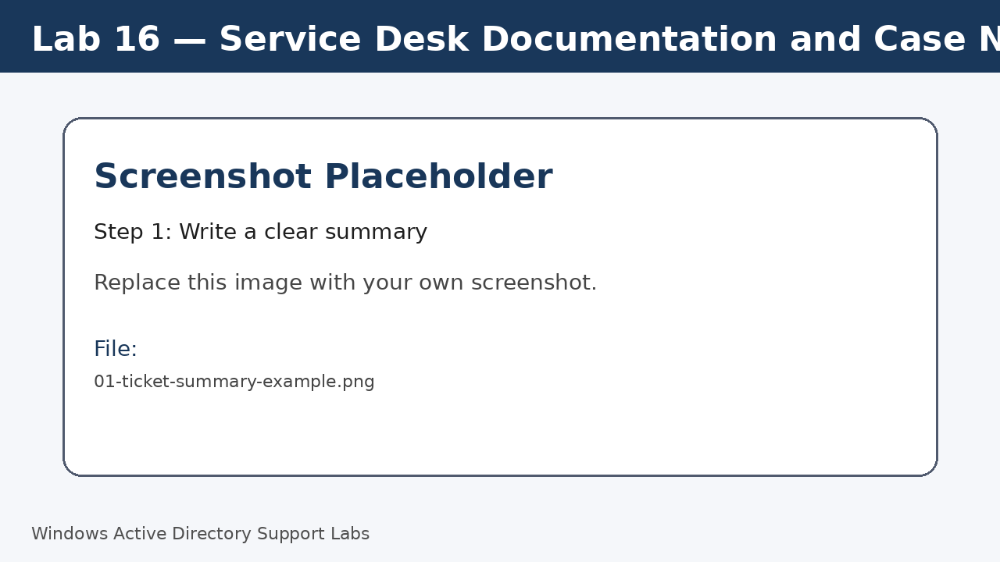
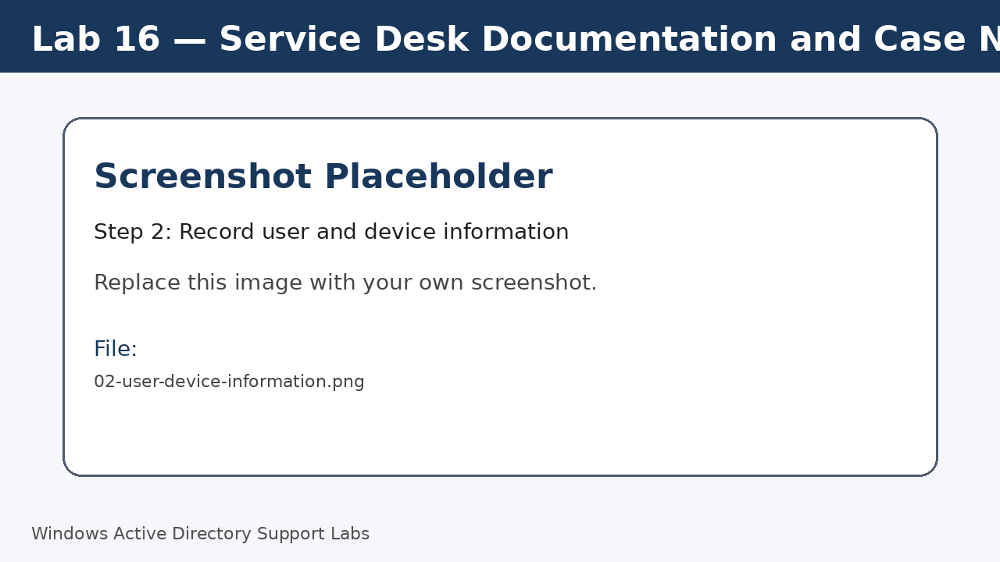
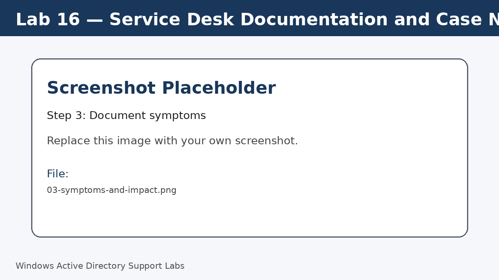
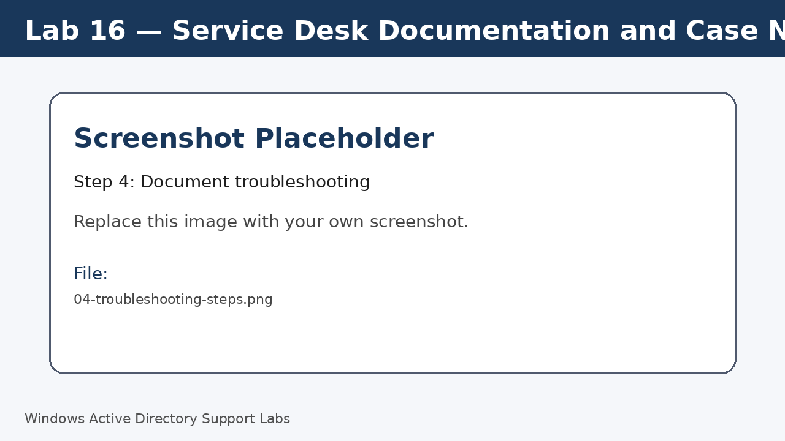
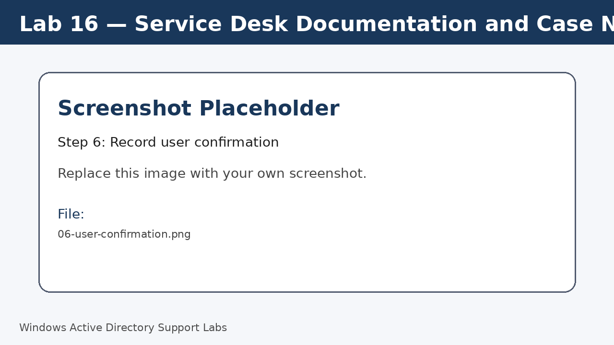
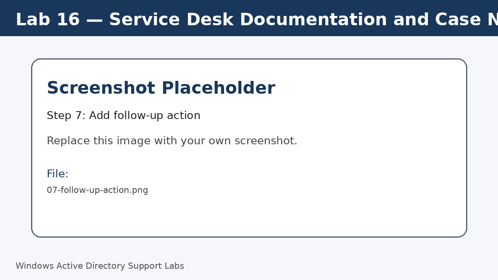

<a id="top"></a>

# Lab 16 — Service Desk Documentation and Case Notes

<p align="center">
  
  
  
  
  
  
</p>

<p align="center">
  <a href="../15-network-troubleshooting-wifi-ip/README.md">⬅ Previous Lab</a> | <a href="../../README.md">🏠 Main README</a>
</p>

---

## Overview

Write professional support notes for incidents, requests and follow-up actions.

---

## Objectives

- Write clear case summaries.
- Document symptoms, impact and troubleshooting steps.
- Record actions taken and user confirmation.
- Create follow-up notes for unresolved work.

---

## Lab Values

| Item | Value |
|---|---|
| Documentation style | Clear, factual, concise |
| Audience | Service Desk and resolver groups |
| Screenshot folder | `assets/images/lab-16-service-desk-documentation/` |

---

## Before You Start

- Complete the previous lab unless this is Lab 01.
- Use a lab environment only.
- Do not publish real passwords or private business information.
- Replace placeholder screenshots with your own screenshots after completing each step.

---

## Screenshot Files

| File name | Step |
|---|---|
| 01-ticket-summary-example.png | Write a clear summary |
| 02-user-device-information.png | Record user and device information |
| 03-symptoms-and-impact.png | Document symptoms |
| 04-troubleshooting-steps.png | Document troubleshooting |
| 05-resolution-note.png | Document resolution |
| 06-user-confirmation.png | Record user confirmation |
| 07-follow-up-action.png | Add follow-up action |

---

## Step 1 — Write a clear summary

Create a short issue summary that identifies the exact problem.

Avoid vague summaries such as 'not working'.

Screenshot file:

```text
assets/images/lab-16-service-desk-documentation/01-ticket-summary-example.png
```



[⬆ Back to top](#top)

## Step 2 — Record user and device information

Include user, device, location or system name if relevant.

Screenshot file:

```text
assets/images/lab-16-service-desk-documentation/02-user-device-information.png
```



[⬆ Back to top](#top)

## Step 3 — Document symptoms

Write what the user reported and when the issue started.

Screenshot file:

```text
assets/images/lab-16-service-desk-documentation/03-symptoms-and-impact.png
```



[⬆ Back to top](#top)

## Step 4 — Document troubleshooting

List checks completed in order.

Include important command results without unnecessary detail.

Screenshot file:

```text
assets/images/lab-16-service-desk-documentation/04-troubleshooting-steps.png
```



[⬆ Back to top](#top)

## Step 5 — Document resolution

Describe the fix or workaround applied.

Screenshot file:

```text
assets/images/lab-16-service-desk-documentation/05-resolution-note.png
```


[⬆ Back to top](#top)

## Step 6 — Record user confirmation

State whether the user confirmed the issue was resolved.

Screenshot file:

```text
assets/images/lab-16-service-desk-documentation/06-user-confirmation.png
```



[⬆ Back to top](#top)

## Step 7 — Add follow-up action

If not resolved, record who owns the next action and what must happen next.

Screenshot file:

```text
assets/images/lab-16-service-desk-documentation/07-follow-up-action.png
```



[⬆ Back to top](#top)


---

## Completion Checklist

- [ ] Clear summary written.
- [ ] User and device information recorded.
- [ ] Symptoms documented.
- [ ] Troubleshooting steps documented.
- [ ] Resolution documented.
- [ ] Follow-up action recorded if required.
- [ ] Final note reviewed for clarity.

---

## Key Takeaways

- Good case notes reduce repeat questions and speed up resolution.
- Write facts, not guesses.
- A useful ticket should let another technician understand the issue without calling the user again.

---

## Author

**Xuan Toan Nguyen**  
IT Support | Service Desk | Desktop Support | System Administration  
Adelaide, South Australia

- LinkedIn: [www.linkedin.com/in/toan-nguyen-it-oz](https://www.linkedin.com/in/toan-nguyen-it-oz)
- GitHub: [github.com/toannguyenitoz](https://github.com/toannguyenitoz)

---

<p align="center">
  <a href="../15-network-troubleshooting-wifi-ip/README.md">⬅ Previous Lab</a> | <a href="../../README.md">🏠 Main README</a> |
  <a href="#top">⬆ Back to Top</a>
</p>
